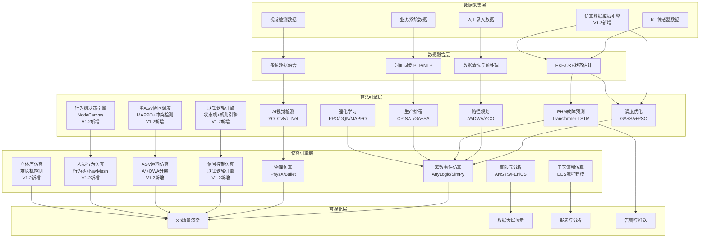

# 动车组检修数字孪生仿真系统架构文档

---

## 文档控制信息

| 项目 | 内容 |
|------|------|
| 项目名称 | 动车组检修数字孪生仿真系统 |
| 文档名称 | 系统架构设计文档 |
| 文档版本 | V1.2 |
| 编写日期 | 2026-04-20 |
| 文档状态 | 评审修订版 |
| 密级 | 内部公开 |
| 编写单位 | 数字孪生技术研发中心 |

### 版本变更记录

| 版本号 | 日期 | 修订人 | 修订内容 |
|--------|------|--------|----------|
| V0.1.0 | 2026-01-15 | 架构组 | 初始框架搭建 |
| V0.5.0 | 2026-02-28 | 架构组 | 完成核心子系统设计 |
| V0.8.0 | 2026-03-20 | 架构组 | 完善数据架构与接口设计 |
| V1.0.0 | 2026-04-20 | 架构组 | 完成全部章节，发布评审版本 |
| V1.2 | 2026-04-20 | 架构组 | 补充股道信号控制模拟架构、AGV运输仿真架构、检修人员作业仿真架构、立体库仿真架构、仿真数据模拟子系统；更新技术选型、数据架构、接口设计、部署架构 |

### 评审记录

| 评审轮次 | 日期 | 评审人 | 评审意见 | 处理结果 |
|----------|------|--------|----------|----------|
| 第一轮 | 2026-04-25 | 技术委员会 | 待评审 | -- |

---

## 目录

- [1 文档概述](#1-文档概述)
- [2 系统总体架构](#2-系统总体架构)
- [3 核心子系统架构](#3-核心子系统架构)
  - [3.1 段厂仿真子系统](#31-段厂仿真子系统)
  - [3.2 检修作业数字孪生子系统](#32-检修作业数字孪生子系统)
  - [3.3 设备运行数字孪生子系统](#33-设备运行数字孪生子系统)
  - [3.4 车辆部件级检修仿真子系统](#34-车辆部件级检修仿真子系统)
  - [3.5 仿真数据模拟子系统（V1.2新增）](#35-仿真数据模拟子系统v12新增)
- [4 技术选型](#4-技术选型)
- [5 算法模型选型与架构](#5-算法模型选型与架构)
- [6 数据架构](#6-数据架构)
- [7 接口设计](#7-接口设计)
- [8 部署架构](#8-部署架构)
- [9 性能架构](#9-性能架构)
- [10 安全架构](#10-安全架构)
- [11 系统集成](#11-系统集成)
- [附录](#附录)

---

## 1 文档概述

### 1.1 项目背景

随着中国高速铁路网络的持续扩展和动车组保有量的不断增长，动车组的安全运营与高效检修已成为铁路运输管理的核心议题。截至2025年底，全国动车组保有量已突破4000标准组，日均检修作业量庞大，对检修效率、检修质量和安全管理提出了更高要求。

当前动车组检修面临以下挑战：

1. **检修效率有待提升**：传统检修模式依赖人工经验，检修流程标准化程度不足，一二级修作业周期较长，影响动车组运用效率。
2. **检修质量管控难度大**：检修作业环节多、工序复杂，关键工序（如磨耗件更换、空心轴探伤、齿轮箱油脂加注等）的质量管控高度依赖作业人员技能水平，存在人为误差风险。
3. **段厂调度管理复杂**：动车组进出段、转线、入库等调车作业涉及多股道、多库线协调，传统调度方式难以实现全局最优。
4. **设备管理数字化程度低**：检修设备运行状态监测手段有限，故障预警能力不足，设备维护以事后维修和定期维修为主，缺乏预测性维护能力。
5. **检修人员培训成本高**：传统培训方式周期长、成本高、实操机会有限，难以快速培养合格的检修人员。

数字孪生技术为解决上述问题提供了全新的技术路径。通过构建动车组检修段厂的数字孪生体，实现物理世界与数字世界的实时映射与交互，可以有效提升检修管理水平、优化资源配置、降低运营成本。

本系统旨在基于Unity 3D引擎构建一套完整的动车组检修数字孪生仿真平台，覆盖段厂仿真、检修作业数字孪生和设备运行数字孪生三大核心领域，为动车组检修管理提供数字化、智能化、可视化的技术支撑。

### 1.2 系统定位

动车组检修数字孪生仿真系统是基于Unity 3D引擎构建的综合性数字孪生仿真平台，定位于：

1. **设计辅助平台**：提供段厂布局设计验证、检修工艺方案预演、设备配置方案仿真验证等设计辅助能力，支持在虚拟环境中对段厂规划方案、检修工艺方案和设备配置方案进行仿真验证与优化，降低设计变更风险，提升方案科学性。

2. **生产调度辅助平台**：提供段厂运用调度优化、检修作业排程优化、资源配置优化等生产调度辅助能力，通过智能算法与仿真推演相结合，实现调车作业全局优化、检修台位高效利用和人员/物料/设备的精准调度，提升段厂整体运营效率。

3. **运维辅助平台**：提供设备运行监控、故障预警、预测性维护等运维辅助能力，建立检修设备的数字孪生模型，实现设备3D可视化监控、运行状态实时监测、故障智能预警和设备维护管理，为设备全生命周期管理提供数据驱动决策支持。

4. **检修作业数字孪生平台**：构建检修作业过程的数字孪生体，实现检修工艺流程的结构化建模、检修作业过程的实时仿真、AI智能识别集成和检修质量全流程追溯，为检修作业标准化和质量管控提供技术支撑。

5. **培训与决策支持平台**（远期规划）：基于VR/AR技术构建沉浸式检修培训环境，为检修人员技能培训提供高效手段；通过数据分析和仿真推演，为管理层提供决策支持。

系统在整体技术架构上遵循"平台化、模块化、可扩展"的设计理念，支持与现有检修管理系统、ERP系统、PHM系统等的深度集成，形成完整的动车组检修数字化生态。

### 1.3 建设目标

#### 1.3.1 总体目标

构建一套功能完善、性能优异、安全可靠的动车组检修数字孪生仿真系统，实现检修段厂、检修作业和检修设备的全方位数字化孪生，提升检修管理水平和运营效率。

#### 1.3.2 具体目标

| 目标领域 | 具体指标 | 目标值 |
|----------|----------|--------|
| 段厂仿真 | 段厂3D场景还原度 | >=95% |
| 段厂仿真 | 调车仿真精度 | 位置误差 <=0.5m |
| 段厂仿真 | 资源调度优化效率 | 提升 >=15% |
| 检修作业孪生 | 检修工艺覆盖率 | 一二级修100%覆盖 |
| 检修作业孪生 | AI识别准确率 | >=98% |
| 检修作业孪生 | 质量追溯完整率 | 100% |
| 设备运行孪生 | 设备状态采集实时性 | 延迟 <=1s |
| 设备运行孪生 | 故障预警准确率 | >=90% |
| 系统性能 | 3D场景帧率 | >=60 FPS |
| 系统性能 | 并发用户数 | >=50 |
| 系统性能 | 系统可用性 | >=99.9% |
| 安全性 | 数据安全等级 | 等保三级 |

### 1.4 适用范围

本文档适用于动车组检修数字孪生仿真系统的设计、开发、测试和部署全过程，主要面向以下人员：

- **系统架构师**：用于指导系统架构设计和技术选型
- **开发工程师**：用于指导各模块的开发实现
- **测试工程师**：用于指导系统测试方案设计
- **运维工程师**：用于指导系统部署和运维
- **项目经理**：用于项目立项和进度管控
- **技术评审人员**：用于技术方案评审

### 1.5 术语与缩略语

| 术语/缩略语 | 全称 | 说明 |
|-------------|------|------|
| EMU | Electric Multiple Unit | 动车组 |
| DT | Digital Twin | 数字孪生 |
| URP | Universal Render Pipeline | 通用渲染管线 |
| HDRP | High Definition Render Pipeline | 高清渲染管线 |
| MQTT | Message Queuing Telemetry Transport | 物联网消息传输协议 |
| gRPC | gRPC Remote Procedure Call | 远程过程调用框架 |
| PHM | Prognostics and Health Management | 故障预测与健康管理 |
| ERP | Enterprise Resource Planning | 企业资源计划 |
| LOD | Level of Detail | 多层次细节 |
| RBAC | Role-Based Access Control | 基于角色的访问控制 |
| IoT | Internet of Things | 物联网 |
| VR | Virtual Reality | 虚拟现实 |
| AR | Augmented Reality | 增强现实 |
| ONNX | Open Neural Network Exchange | 开放神经网络交换格式 |
| CI/CD | Continuous Integration/Continuous Deployment | 持续集成/持续部署 |
| K8s | Kubernetes | 容器编排平台 |
| OPC UA | Open Platform Communications Unified Architecture | 开放平台通信统一架构 |
| SCADA | Supervisory Control and Data Acquisition | 数据采集与监视控制系统 |
| WMS | Warehouse Management System | 仓储管理系统 |
| TLS | Transport Layer Security | 传输层安全协议 |
| JWT | JSON Web Token | JSON网络令牌 |
| GPU | Graphics Processing Unit | 图形处理单元 |
| NAS | Network Attached Storage | 网络附加存储 |

### 1.6 参考文档

| 文档编号 | 文档名称 | 版本 |
|----------|----------|------|
| TB/T 3139 | 动车组一级修作业标准 | 2023版 |
| TB/T 3140 | 动车组二级修作业标准 | 2023版 |
| GB/T 37025 | 信息安全技术 物联网数据传输安全技术要求 | 2023版 |
| GB/T 35273 | 信息安全技术 个人信息安全规范 | 2020版 |
| GB/T 22239 | 信息安全技术 网络安全等级保护基本要求 | 2019版 |
| CRH系列 | 动车组检修规程 | 各车型版本 |
| Unity Doc | Unity 2022 LTS 官方文档 | 2022.3 |
| .NET Doc | .NET 8 官方文档 | 8.0 |

---

## 2 系统总体架构

### 2.1 设计原则

本系统架构设计遵循以下核心原则：

#### 2.1.1 平台化原则

系统采用平台化设计思想，构建统一的数字孪生基础平台，各功能子系统在统一平台基础上构建，实现技术底座的复用和功能模块的灵活组合。平台提供通用的3D渲染引擎、数据服务、通信服务和AI服务，各子系统通过标准接口接入平台。

#### 2.1.2 模块化原则

系统采用高内聚、低耦合的模块化设计，各功能模块职责明确、接口清晰。模块之间通过定义良好的接口进行交互，支持独立开发、独立测试、独立部署和独立升级。模块化设计确保系统具有良好的可维护性和可扩展性。

#### 2.1.3 可扩展性原则

系统架构支持水平和垂直两个方向的扩展。水平方向通过增加服务实例实现性能扩展，垂直方向通过增加功能模块实现能力扩展。系统预留标准化的扩展接口，支持未来新车型、新检修工艺、新设备类型的快速接入。

#### 2.1.4 高可用性原则

系统采用冗余设计和故障转移机制，确保关键服务的高可用性。通过负载均衡、服务熔断、限流降级等手段保障系统在异常情况下的稳定运行。系统设计可用性目标为99.9%，即年度非计划停机时间不超过8.76小时。

#### 2.1.5 安全性原则

系统遵循等保三级安全标准，从网络安全、数据安全、应用安全三个维度构建全方位的安全防护体系。实施最小权限原则、纵深防御策略和安全审计机制，确保系统和数据的安全。

#### 2.1.6 实时性原则

系统支持实时数据采集、实时数据处理和实时数据展示。通过边缘计算、消息队列、WebSocket推送等技术手段，确保从设备数据采集到前端展示的端到端延迟控制在可接受范围内。

#### 2.1.7 标准化原则

系统遵循行业标准和国际标准，包括数据交换标准、通信协议标准、接口规范标准等。采用RESTful API、MQTT、OPC UA等标准协议，确保系统与外部系统的互操作性。

#### 2.1.8 易用性原则

系统提供直观友好的用户界面，支持3D可视化交互操作。通过合理的界面布局、清晰的操作引导和完善的帮助文档，降低用户学习成本，提升使用体验。

### 2.2 分层架构总览

系统采用五层架构设计，从下至上依次为设备层、数据层、平台层、应用层和展示层。各层之间通过标准接口进行交互，实现关注点分离和职责解耦。

#### 2.2.1 系统架构图（Mermaid）

```mermaid
graph TB
    subgraph 展示层["展示层 (Presentation Layer)"]
        A1["3D可视化引擎 Unity URP/HDRP"]
        A2["Web管理门户 React + WebGL"]
        A3["VR/AR客户端 Unity XR"]
        A4["移动端APP Android/iOS"]
        A5["大屏监控 DataV"]
    end

    subgraph 应用层["应用层 (Application Layer)"]
        B1["段厂仿真子系统"]
        B2["检修作业孪生子系统"]
        B3["设备运行孪生子系统"]
        B4["AI智能分析子系统"]
        B5["培训管理子系统"]
        B6["报表与决策支持子系统"]
    end

    subgraph 平台层["平台层 (Platform Layer)"]
        C1["数字孪生引擎"]
        C2["仿真引擎"]
        C3["规则引擎"]
        C4["消息服务"]
        C5["AI推理服务"]
        C6["权限认证服务"]
        C7["日志审计服务"]
    end

    subgraph 数据层["数据层 (Data Layer)"]
        D1["关系数据库 PostgreSQL"]
        D2["时序数据库 TimescaleDB"]
        D3["缓存服务 Redis"]
        D4["对象存储 MinIO"]
        D5["消息队列 RabbitMQ/Kafka"]
        D6["图数据库 Neo4j"]
    end

    subgraph 设备层["设备层 (Device Layer)"]
        E1["IoT传感器"]
        E2["PLC控制器"]
        E3["视频监控"]
        E4["AI边缘计算盒"]
        E5["RFID读写器"]
        E6["检修设备"]
    end

    展示层 --> 应用层
    应用层 --> 平台层
    平台层 --> 数据层
    数据层 --> 设备层
```



#### 2.2.2 系统架构图（ASCII）

```
+=============================================================================+
|                         展 示 层 (Presentation Layer)                      |
|  +------------+ +------------+ +------------+ +------------+ +----------+ |
|  | 3D可视化   | | Web管理    | | VR/AR      | | 移动端     | | 大屏监控 | |
|  | Unity      | | React      | | Unity XR   | | APP        | | DataV    | |
|  | URP/HDRP   | | +WebGL     | |            | |            | |          | |
|  +-----+------+ +-----+------+ +-----+------+ +-----+------+ +----+-----+ |
|        |              |              |              |             |        |
+--------+--------------+--------------+--------------+-------------+--------+
|                         应 用 层 (Application Layer)                      |
|  +----------------+ +----------------+ +----------------+ +----------+    |
|  | 段厂仿真       | | 检修作业       | | 设备运行       | | AI智能   |    |
|  | 子系统         | | 孪生子系统     | | 孪生子系统     | | 分析     |    |
|  +--------+-------+ +--------+-------+ +--------+-------+ +----+-----+    |
|  +----------------+ +----------------+                                  |
|  | 培训管理       | | 报表与决策     |                                  |
|  | 子系统         | | 支持子系统     |                                  |
|  +--------+-------+ +--------+-------+                                  |
|           |                  |                                           |
+-----------+------------------+-------------------------------------------+
|                         平 台 层 (Platform Layer)                        |
|  +----------+ +----------+ +----------+ +----------+ +----------+        |
|  | 数字孪生 | | 仿真引擎 | | 规则引擎 | | 消息服务 | | AI推理   |        |
|  | 引擎     | |          | |          | |          | | 服务     |        |
|  +----------+ +----------+ +----------+ +----------+ +----------+        |
|  +----------+ +----------+ +----------+ +----------+                     |
|  | 权限认证 | | 日志审计 | | 任务调度 | | 报警服务 |                     |
|  | 服务     | | 服务     | | 服务     | |          |                     |
|  +----------+ +----------+ +----------+ +----------+                     |
+---------------------------------------------------------------------------+
|                         数 据 层 (Data Layer)                             |
|  +----------+ +----------+ +----------+ +----------+ +----------+        |
|  |PostgreSQL| |Timescale | |  Redis   | |  MinIO   | |RabbitMQ/ |        |
|  |关系数据库| | DB时序库 | |  缓存    | |对象存储  | |  Kafka   |        |
|  +----------+ +----------+ +----------+ +----------+ +----------+        |
|  +----------+                                                          |
|  |  Neo4j   |                                                          |
|  | 图数据库 |                                                          |
|  +----------+                                                          |
+---------------------------------------------------------------------------+
|                         设 备 层 (Device Layer)                           |
|  +----------+ +----------+ +----------+ +----------+ +----------+        |
|  | IoT传感  | | PLC控制  | | 视频监控 | | AI边缘   | | RFID读   |        |
|  | 器       | | 器       | | 摄像头   | | 计算盒   | | 写器     |        |
|  +----------+ +----------+ +----------+ +----------+ +----------+        |
|  +----------+                                                          |
|  | 检修设备 |                                                          |
|  +----------+                                                          |
+===========================================================================+
```

### 2.3 架构详细说明

#### 2.3.1 设备层（Device Layer）

设备层是系统的数据源头，负责物理世界数据的采集和设备控制指令的下发。该层直接与动车组检修段厂的各类物理设备和传感器交互。

**核心职责：**

1. **数据采集**：通过各类传感器和采集设备，实时采集段厂内设备运行数据、环境数据和作业过程数据。
2. **协议转换**：将不同设备和传感器的私有协议转换为标准协议（MQTT/OPC UA），实现异构设备的统一接入。
3. **边缘预处理**：在边缘节点对原始数据进行预处理（滤波、压缩、聚合），减少数据传输量。
4. **指令下发**：接收上层下发的控制指令，通过PLC或其他控制设备执行。

**主要设备类型：**

| 设备类别 | 具体设备 | 采集数据类型 | 通信协议 |
|----------|----------|-------------|----------|
| 传感器 | 温度传感器、振动传感器、压力传感器、位移传感器 | 温度、振动频率、压力值、位移量 | MQTT/Modbus |
| 控制器 | PLC（西门子S7/AB ControlLogix） | 设备状态、控制参数 | OPC UA/Modbus TCP |
| 视频设备 | 工业摄像头、红外热成像仪 | 视频流、热成像数据 | RTSP/ONVIF |
| AI边缘设备 | AI推理盒（NVIDIA Jetson系列） | AI识别结果、分析数据 | MQTT/gRPC |
| 识别设备 | RFID读写器、二维码扫描器 | 车组标识、部件标识、人员标识 | MQTT/TCP |
| 检修设备 | 不落轮镟床、轮对踏面诊断装置、洗车机、地面电源、三层平台 | 设备运行参数、作业数据 | OPC UA/Modbus |
| 定位设备 | UWB定位基站、蓝牙信标 | 人员位置、设备位置 | MQTT/UDP |

**数据采集频率要求：**

| 数据类型 | 采集频率 | 传输频率 | 存储策略 |
|----------|----------|----------|----------|
| 设备运行状态 | 1次/秒 | 实时推送 | 时序数据库 |
| 振动/温度数据 | 10次/秒 | 聚合后1次/秒 | 时序数据库 |
| 视频数据 | 25帧/秒 | 按需传输 | 对象存储 |
| AI识别结果 | 事件触发 | 实时推送 | 关系数据库 |
| 定位数据 | 1次/秒 | 实时推送 | 时序数据库 |
| 环境数据 | 1次/分钟 | 聚合后1次/5分钟 | 时序数据库 |

#### 2.3.2 数据层（Data Layer）

数据层是系统的数据中枢，负责数据的存储、管理和分发。该层采用多类型数据库混合存储策略，根据数据特征选择最优的存储方案。

**核心职责：**

1. **数据存储**：根据数据类型和访问模式，选择合适的存储引擎进行数据持久化。
2. **数据缓存**：对热点数据进行缓存，提升数据访问性能。
3. **消息路由**：通过消息队列实现数据的异步传输和系统解耦。
4. **数据分发**：将处理后的数据分发给需要的消费方。

**存储引擎选型：**

| 存储引擎 | 用途 | 存储内容 | 数据特征 |
|----------|------|----------|----------|
| PostgreSQL | 关系数据存储 | 段厂信息、设备台账、检修记录、用户权限 | 结构化、事务性 |
| TimescaleDB | 时序数据存储 | 传感器数据、设备运行数据、环境监测数据 | 时序性、高吞吐 |
| Redis | 缓存与实时数据 | 会话信息、实时设备状态、热点数据、分布式锁 | 高速读写、临时性 |
| MinIO | 对象存储 | 3D模型文件、图片、视频、文档、日志文件 | 大文件、非结构化 |
| Neo4j | 图数据存储 | 设备关联关系、检修工艺流程图、故障传播路径 | 关系型、图结构 |

**数据分区策略：**

```
PostgreSQL 分区策略：
+-- 按时间分区（检修记录表、操作日志表）
|   +-- 按月自动分区
|   +-- 保留策略：在线数据3年，归档数据永久
+-- 按段厂分区（设备台账表、布局配置表）
|   +-- 按段厂编号Hash分区
+-- 按类型分区（报警记录表）
    +-- 按报警级别List分区

TimescaleDB 分区策略：
+-- Hypertable自动分区
|   +-- chunk_time_interval: 1天（高频数据）
|   +-- chunk_time_interval: 7天（中频数据）
|   +-- chunk_time_interval: 30天（低频数据）
+-- 数据保留策略
|   +-- 原始数据：保留90天
|   +-- 分钟聚合：保留1年
|   +-- 小时聚合：保留3年
|   +-- 天聚合：永久保留
+-- 压缩策略
    +-- 7天后自动压缩
    +-- 压缩后空间节省约90%
```

#### 2.3.3 平台层（Platform Layer）

平台层是系统的核心能力层，提供数字孪生、仿真计算、规则处理、消息通信、AI推理等基础服务能力，为上层应用提供通用技术支撑。

**核心服务组件：**

**1. 数字孪生引擎（Digital Twin Engine）**

数字孪生引擎是系统的核心组件，负责物理实体与数字模型之间的映射、同步和交互。

```
数字孪生引擎架构：
+-------------------------------------------------+
|                  数字孪生引擎                     |
|  +---------------+  +---------------+           |
|  | 模型管理器     |  | 实体管理器     |           |
|  | - 3D模型加载   |  | - 实体创建     |           |
|  | - 模型版本管理 |  | - 实体生命周期 |           |
|  | - LOD管理     |  | - 属性管理     |           |
|  | - 材质管理    |  | - 关系管理     |           |
|  +-------+-------+  +-------+-------+           |
|  +---------------+  +---------------+           |
|  | 同步引擎       |  | 交互引擎       |           |
|  | - 状态同步     |  | - 选择/拾取    |           |
|  | - 数据映射     |  | - 属性编辑     |           |
|  | - 变更检测     |  | - 场景导航     |           |
|  | - 冲突解决     |  | - 标注/测量    |           |
|  +-------+-------+  +-------+-------+           |
|  +---------------+  +---------------+           |
|  | 事件总线       |  | 脚本引擎       |           |
|  | - 事件发布     |  | - Lua脚本     |           |
|  | - 事件订阅     |  | - 行为树      |           |
|  | - 事件过滤     |  | - 状态机      |           |
|  | - 事件持久化   |  | - 时间轴      |           |
|  +---------------+  +---------------+           |
+-------------------------------------------------+
```

**2. 仿真引擎（Simulation Engine）**

仿真引擎提供离散事件仿真和连续仿真能力，支持段厂运营仿真和检修作业过程仿真。

```
仿真引擎架构：
+-------------------------------------------------+
|                    仿真引擎                       |
|  +------------------------------------------+   |
|  |              仿真调度器                    |   |
|  |  - 事件队列管理                           |   |
|  |  - 时间步进控制                           |   |
|  |  - 仿真速度调节（0.1x ~ 100x）            |   |
|  |  - 仿真暂停/恢复/回放                     |   |
|  +------------------------------------------+   |
|  +------------+ +------------+ +------------+  |
|  | 调车仿真   | | 流程仿真   | | 资源仿真   |  |
|  | 模块       | | 模块       | | 模块       |  |
|  | - 路径规划 | | - 工序编排 | | - 人员调度 |  |
|  | - 冲突检测 | | - 时间估算 | | - 设备分配 |  |
|  | - 信号控制 | | - 并行优化 | | - 台位管理 |  |
|  +------------+ +------------+ +------------+  |
+-------------------------------------------------+
```

**3. 规则引擎（Rule Engine）**

规则引擎负责业务规则的配置、管理和执行，支持检修工艺规则、安全规则、报警规则等。

```
规则引擎架构：
+-------------------------------------------------+
|                    规则引擎                       |
|  +------------+ +------------+ +------------+  |
|  | 规则编辑器 | | 规则解析器 | | 规则执行器 |  |
|  | - 可视化   | | - 语法检查 | | - Rete算法 |  |
|  |   编辑     | | - 规则编译 | | - 前向推理 |  |
|  | - 规则测试 | | - 依赖分析 | | - 冲突消解 |  |
|  +------------+ +------------+ +------------+  |
|  规则类型：                                      |
|  - 检修工艺规则（工序顺序、工时标准）              |
|  - 安全规则（安全距离、防护要求）                  |
|  - 报警规则（阈值报警、趋势报警）                  |
|  - 调度规则（优先级、约束条件）                    |
+-------------------------------------------------+
```

**4. 消息服务（Message Service）**

消息服务提供统一的消息通信能力，支持发布/订阅、点对点、请求/响应等多种通信模式。

```
消息服务架构：
+-------------------------------------------------+
|                    消息服务                       |
|  +------------+ +------------+ +------------+  |
|  | MQTT适配器 | | WS适配器   | | gRPC适配器 |  |
|  | - IoT数据  | | - 实时推送 | | - 服务调用 |  |
|  | - 遥测数据 | | - 双向通信 | | - 高性能   |  |
|  +------------+ +------------+ +------------+  |
|  +------------------------------------------+   |
|  |              消息路由中心                  |   |
|  |  - 主题管理                              |   |
|  |  - 消息过滤                              |   |
|  |  - 消息转换                              |   |
|  |  - 消息持久化                            |   |
|  +------------------------------------------+   |
+-------------------------------------------------+
```

**5. AI推理服务（AI Inference Service）**

AI推理服务提供统一的AI模型推理能力，支持多种AI框架和硬件加速。

```
AI推理服务架构：
+-------------------------------------------------+
|                  AI推理服务                       |
|  +------------+ +------------+ +------------+  |
|  | 模型管理   | | 推理引擎   | | 结果处理   |  |
|  | - 模型仓库 | | - ONNX RT  | | - 后处理   |  |
|  | - 版本管理 | | - TensorRT | | - 置信度   |  |
|  | - A/B测试  | | - OpenVINO | |   过滤     |  |
|  +------------+ +------------+ +------------+  |
|  AI能力：                                        |
|  - 目标检测（磨耗件识别、工具识别）                |
|  - 图像分类（缺陷识别、状态分类）                  |
|  - OCR识别（铭牌识别、表计读数）                   |
|  - 姿态估计（作业人员动作识别）                    |
|  - 异常检测（设备运行异常检测）                    |
+-------------------------------------------------+
```

**6. 权限认证服务（Auth Service）**

权限认证服务提供统一的身份认证和权限管理能力。

```
权限认证服务架构：
+-------------------------------------------------+
|                  权限认证服务                     |
|  +------------+ +------------+ +------------+  |
|  | 身份认证   | | 权限管理   | | 审计日志   |  |
|  | - 用户名   | | - RBAC     | | - 登录日志 |  |
|  | - LDAP     | | - 资源权限 | | - 操作日志 |  |
|  | - SSO      | | - 数据权限 | | - 异常日志 |  |
|  | - MFA      | | - 动态权限 | |            |  |
|  +------------+ +------------+ +------------+  |
+-------------------------------------------------+
```

**7. 日志审计服务（Log & Audit Service）**

日志审计服务提供统一的日志收集、存储、查询和分析能力。

```
日志审计服务架构：
+-------------------------------------------------+
|                 日志审计服务                      |
|  +------------+ +------------+ +------------+  |
|  | 日志采集   | | 日志存储   | | 日志分析   |  |
|  | - ELK Stack| | - 分级存储 | | - 全文检索 |  |
|  | - 结构化   | | - 索引管理 | | - 统计分析 |  |
|  |   日志     | | - 生命周期 | | - 异常检测 |  |
|  +------------+ +------------+ +------------+  |
+-------------------------------------------------+
```

#### 2.3.4 应用层（Application Layer）

应用层包含系统的核心业务功能，由多个子系统组成，每个子系统负责特定的业务领域。

**子系统列表：**

| 子系统名称 | 功能描述 | 优先级 |
|------------|----------|--------|
| 段厂仿真子系统 | 段厂布局管理、调车仿真、检修流程仿真、资源调度 | P0 |
| 检修作业数字孪生子系统 | 检修工艺建模、作业过程仿真、AI识别集成、质量追溯 | P0 |
| 设备运行数字孪生子系统 | 设备3D监控、状态监测、故障预警、维护管理 | P0 |
| AI智能分析子系统 | 数据分析、趋势预测、智能决策 | P1 |
| 培训管理子系统 | VR/AR培训、考试管理、培训档案 | P1 |
| 报表与决策支持子系统 | 统计报表、数据看板、决策分析 | P1 |

#### 2.3.5 展示层（Presentation Layer）

展示层负责系统的用户交互和数据可视化，支持多种终端形态。

**展示渠道：**

| 展示渠道 | 技术方案 | 适用场景 | 性能要求 |
|----------|----------|----------|----------|
| 3D可视化客户端 | Unity URP/HDRP (桌面端) | 段厂3D浏览、检修仿真、设备监控 | 60 FPS |
| Web管理门户 | React + Unity WebGL | 系统管理、报表查看、移动办公 | 兼容主流浏览器 |
| VR培训客户端 | Unity XR (Meta Quest 3 / HTC Vive) | 沉浸式检修培训（可选/远期） | 90 FPS |
| AR辅助客户端 | Unity AR (HoloLens 2 / 手机AR) | 现场检修辅助（可选/远期） | 60 FPS |
| 移动端APP | Android/iOS原生 + Unity嵌入 | 移动巡检、消息推送 | 流畅交互 |
| 大屏监控 | Unity + DataV | 指挥中心大屏展示 | 4K/60 FPS |

### 2.4 架构设计决策

#### 2.4.1 为什么选择Unity作为3D引擎

| 决策因素 | Unity优势 | 替代方案对比 |
|----------|-----------|-------------|
| 工业级3D渲染 | URP/HDRP渲染管线成熟，支持PBR材质、实时光照 | Unreal Engine渲染质量更高但学习成本大 |
| 多平台支持 | 一次开发支持Windows/WebGL/VR/AR/Mobile | Web方案（Three.js）渲染能力有限 |
| C#生态 | 与.NET后端无缝集成，共享代码库 | Unreal使用C++，与后端集成复杂 |
| 数字孪生生态 | 丰富的工业插件和Asset Store资源 | 其他引擎工业生态较弱 |
| 团队技术栈 | 团队Unity经验丰富，开发效率高 | 切换引擎需大量培训 |
| 成本 | Unity Pro授权成本可控 | Unreal基于收入分成，商业授权成本不确定 |

#### 2.4.2 为什么选择.NET 8作为后端框架

| 决策因素 | .NET 8优势 | 替代方案对比 |
|----------|------------|-------------|
| 性能 | 性能优异，与Java/Go相当 | Java生态成熟但启动慢 |
| 与Unity集成 | 共享C#代码库，NuGet包复用 | Java/Go需额外序列化层 |
| 跨平台 | 支持Linux/Windows/Docker部署 | .NET Framework仅限Windows |
| 异步支持 | async/await原生支持，高并发性能好 | Python异步支持较弱 |
| 云原生 | 容器镜像小，启动快，K8s友好 | Java容器镜像大，启动慢 |

#### 2.4.3 为什么选择PostgreSQL作为主数据库

| 决策因素 | PostgreSQL优势 | 替代方案对比 |
|----------|----------------|-------------|
| 功能丰富 | 支持JSON、GIS、全文检索等高级功能 | MySQL功能相对简单 |
| 扩展性 | TimescaleDB时序扩展、PostGIS空间扩展 | MySQL需额外中间件 |
| 性能 | 复杂查询性能优异，MVCC并发控制 | MySQL在高并发写入场景有优势 |
| 开源免费 | 完全开源，无授权费用 | Oracle授权费用高昂 |
| 社区活跃 | 社区活跃，插件生态丰富 | 商业数据库生态封闭 |

---

## 3 核心子系统架构

### 3.1 段厂仿真子系统

段厂仿真子系统是数字孪生仿真平台的核心子系统之一，负责动车组检修段厂的数字化建模和运营仿真。该子系统提供段厂布局管理、动车组调车仿真、一二级修流程仿真和资源调度仿真四大核心功能。

#### 3.1.1 段厂布局管理

段厂布局管理模块负责检修段厂物理空间的数字化建模，包括股道、库线、检修台位、建筑物、道路等基础设施的三维建模和属性管理。

**功能架构：**

```
段厂布局管理
+-- 基础设施建模
|   +-- 股道管理
|   |   +-- 股道创建与编辑（编号、长度、坡度、曲线参数）
|   |   +-- 股道连接关系管理（道岔、渡线）
|   |   +-- 股道属性配置（到发线、存车线、检修线、洗车线等）
|   |   +-- 股道容量管理（最大停放车组数）
|   +-- 库线管理
|   |   +-- 库线创建与编辑（编号、长度、库房关联）
|   |   +-- 库线类型配置（检查库、修配库、油漆库等）
|   |   +-- 库线设备关联（三层平台、地面电源、安全连锁）
|   |   +-- 库线环境参数（照明、温湿度）
|   +-- 检修台位管理
|   |   +-- 台位创建与编辑（编号、位置、尺寸）
|   |   +-- 台位类型配置（一级修台位、二级修台位、临修台位）
|   |   +-- 台位设备关联（举升设备、工具柜、防护设施）
|   |   +-- 台位状态管理（空闲/占用/维修/预留）
|   +-- 建筑物管理
|   |   +-- 建筑物3D建模（库房、办公楼、信号楼等）
|   |   +-- 建筑物属性管理（名称、面积、楼层）
|   |   +-- 建筑物内部布局（房间、通道、设施）
|   +-- 场地设施管理
|       +-- 道路与交通设施
|       +-- 管线设施（电力、给排水、压缩空气）
|       +-- 安全设施（消防、监控、围栏）
+-- 布局可视化
|   +-- 2D平面图编辑器
|   |   +-- 拖拽式布局编辑
|   |   +-- 自动对齐与吸附
|   |   +-- 布局约束检查
|   |   +-- 布局导入/导出（CAD/DWG）
|   +-- 3D场景浏览
|   |   +-- 自由视角漫游
|   |   +-- 跟随视角（跟随车组/人员）
|   |   +-- 鸟瞰视角
|   |   +-- 剖面视图
|   +-- 布局分析
|       +-- 空间利用率分析
|       +-- 动线分析
|       +-- 布局方案对比
+-- 布局配置管理
    +-- 布局版本管理
    +-- 布局方案保存/加载
    +-- 布局变更记录
    +-- 布局导入/导出
```

**股道数据模型：**

```json
{
  "track": {
    "id": "TRACK-GD-001",
    "name": "1道",
    "type": "ARRIVAL_DEPARTURE",
    "length": 650.0,
    "gradient": 0.0,
    "curveRadius": null,
    "speedLimit": 15,
    "capacity": 8,
    "status": "NORMAL",
    "connections": [
      {
        "targetTrackId": "TRACK-GD-002",
        "switchId": "SW-001",
        "connectionType": "DIVERGENT"
      }
    ],
    "equipment": [
      {
        "equipmentId": "EQ-PS-001",
        "type": "GROUND_POWER",
        "position": { "distance": 100.0, "side": "LEFT" }
      }
    ],
    "geometry": {
      "type": "LINE",
      "startPoint": { "x": 100.0, "y": 0.0, "z": 0.0 },
      "endPoint": { "x": 750.0, "y": 0.0, "z": 0.0 }
    }
  }
}
```

**道岔数据模型：**

```json
{
  "switch": {
    "id": "SW-001",
    "name": "1号道岔",
    "type": "SINGLE_NORMAL",
    "normalPosition": "STRAIGHT",
    "reversePosition": "DIVERGENT",
    "currentPosition": "STRAIGHT",
    "isElectric": true,
    "isLocked": false,
    "linkedTracks": {
      "mainTrack": "TRACK-GD-001",
      "straightTrack": "TRACK-GD-002",
      "divergentTrack": "TRACK-GD-003"
    },
    "position": { "x": 200.0, "y": 0.0, "z": 0.0 },
    "interlocking": {
      "relatedSignals": ["SIG-001", "SIG-002"],
      "conflictingSwitches": ["SW-002"]
    }
  }
}
```

#### 3.1.2 动车组调车仿真

动车组调车仿真模块负责模拟动车组在段厂内的调车作业过程，包括进出段、转线、入库等操作的三维可视化仿真。

**功能架构：**

```
调车仿真模块
+-- 调车计划管理
|   +-- 调车计划编制
|   |   +-- 手动编制（拖拽式操作）
|   |   +-- 自动编制（基于检修计划自动生成）
|   |   +-- 计划冲突检测
|   +-- 调车计划审批
|   |   +-- 审批流程配置
|   |   +-- 计划合理性检查
|   |   +-- 审批记录管理
|   +-- 调车计划下发
|       +-- 计划分解与下发
|       +-- 执行状态跟踪
|       +-- 计划变更管理
+-- 调车仿真引擎
|   +-- 路径规划
|   |   +-- 基于图搜索的最短路径算法（Dijkstra/A*）
|   |   +-- 考虑道岔状态的路径规划
|   |   +-- 避障路径规划
|   |   +-- 多车组路径协调
|   +-- 运动仿真
|   |   +-- 动车组运动学模型
|   |   |   +-- 牵引特性曲线
|   |   |   +-- 制动特性曲线
|   |   |   +-- 阻力模型（坡道、曲线、风阻）
|   |   |   +-- 重量模型（空车/重车）
|   |   +-- 速度控制仿真
|   |   |   +-- 限速区间管理
|   |   |   +-- 加减速曲线
|   |   |   +-- 精确停车控制
|   |   +-- 运动状态计算
|   |       +-- 位置更新（每帧）
|   |       +-- 速度/加速度计算
|   |       +-- 行程时间估算
|   +-- 信号仿真
|   |   +-- 信号机状态管理
|   |   +-- 进路控制仿真
|   |   +-- 信号连锁仿真
|   |   +-- 信号故障仿真
|   +-- 冲突检测
|       +-- 车组间距检测
|       +-- 进路冲突检测
|       +-- 道岔冲突检测
|       +-- 台位占用冲突检测
+-- 调车过程可视化
|   +-- 3D动画展示
|   |   +-- 车组移动动画（平滑插值）
|   |   +-- 道岔转换动画
|   |   +-- 信号机变化动画
|   |   +-- 环境效果（灯光、声音）
|   +-- 调车信息叠加显示
|   |   +-- 车组编号标签
|   |   +-- 速度/位置信息
|   |   +-- 调车计划进度
|   |   +-- 实时轨迹显示
|   +-- 多视角切换
|       +-- 跟随视角（跟随当前车组）
|       +-- 俯瞰视角（全局视图）
|       +-- 司机室视角（第一人称）
|       +-- 自由视角（用户控制）
+-- 调车统计分析
    +-- 调车作业统计（次数、时间、里程）
    +-- 调车效率分析
    +-- 调车瓶颈识别
    +-- 调车方案优化建议
```

**调车仿真核心算法：**

```
路径规划算法流程：
1. 构建段厂轨道拓扑图
   - 节点：道岔点、台位中心点、段厂出入口
   - 边：股道段（含长度、限速、坡度属性）
   - 权重：综合考虑距离、时间、能耗

2. 路径搜索（A*算法）
   输入：起点、终点、约束条件（可用股道、禁用道岔）
   输出：最优路径（股道序列 + 道岔操作序列）

   A*启发函数：f(n) = g(n) + h(n)
   - g(n)：从起点到当前节点的实际代价
   - h(n)：当前节点到终点的估计代价（欧几里得距离/轨道距离）

3. 路径可行性验证
   - 道岔可达性检查
   - 股道占用检查
   - 信号开放条件检查
   - 安全间距检查

4. 多车组路径协调
   - 时间窗分配
   - 死锁检测与避免
   - 优先级调度
```

**动车组运动学模型参数：**

| 参数 | CRH380A | CRH380B | CR400AF | CR400BF |
|------|---------|---------|---------|---------|
| 编组长度 (m) | 203 | 200 | 209 | 211 |
| 编组重量 (t) | 380 | 380 | 350 | 360 |
| 最高调车速度 (km/h) | 15 | 15 | 15 | 15 |
| 起动加速度 (m/s^2) | 0.5 | 0.5 | 0.5 | 0.5 |
| 制动减速度 (m/s^2) | 0.8 | 0.8 | 0.8 | 0.8 |
| 最小转弯半径 (m) | 150 | 150 | 150 | 150 |

#### 3.1.3 股道信号控制模拟架构（V1.2新增）

股道信号控制模拟模块负责模拟段厂内信号机、道岔、轨道电路等信号设备的状态管理与联锁逻辑，为调车仿真提供信号安全保障。

**功能架构：**

```
股道信号控制模拟模块
+-- 信号机状态管理
|   +-- 信号机类型管理
|   |   +-- 进站信号机（段厂入口）
|   |   +-- 出站信号机（段厂出口）
|   |   +-- 调车信号机（库线/股道入口）
|   |   +-- 防护信号机（道岔区段防护）
|   +-- 信号机状态模型
|   |   +-- 灯光状态（红/绿/黄/双黄/蓝白）
|   |   +-- 显示模式（正常/引导/调车/关闭）
|   |   +-- 状态转换规则
|   |   +-- 故障降级策略
|   +-- 信号机3D可视化
|       +-- 灯光颜色实时渲染
|       +-- 灯光照射效果
|       +-- 信号机状态标签
+-- 道岔控制仿真
|   +-- 道岔状态模型
|   |   +-- 定位/反位状态
|   |   +-- 四开（故障）状态
|   |   +-- 挤岔检测
|   |   +-- 转换时间模拟（3-5秒）
|   +-- 道岔控制逻辑
|   |   +-- 单操控制（手动单操）
|   |   +-- 进路联动控制（随进路自动转换）
|   |   +-- 锁闭/解锁管理
|   |   +-- 道岔位置表示
|   +-- 道岔3D可视化
|       +-- 道岔转辙动画
|       +-- 道岔状态颜色编码
|       +-- 道岔编号标注
+-- 联锁逻辑引擎
|   +-- 联锁规则管理
|   |   +-- 进路联锁规则（敌对进路互锁）
|   |   +-- 道岔联锁规则（道岔位置一致性）
|   |   +-- 区段联锁规则（轨道区段占用互锁）
|   |   +-- 信号联锁规则（信号开放条件检查）
|   +-- 联锁逻辑实现
|   |   +-- 规则引擎模式（Drools/自定义规则引擎）
|   |   |   - 联锁规则以声明式规则定义
|   |   |   - 支持规则的热加载与版本管理
|   |   |   - 规则冲突检测与优先级管理
|   |   +-- 状态机模式（补充验证）
|   |   |   - 进路状态机：建立->锁闭->开放->使用->解锁
|   |   |   - 信号状态机：关闭->开放->引导->关闭
|   |   |   - 道岔状态机：定位->转换中->反位->锁闭
|   |   +-- 混合模式（推荐方案）
|   |       - 核心联锁逻辑采用状态机保证确定性
|   |       - 业务规则（特殊进路、临时限速等）采用规则引擎
|   |       - 状态机与规则引擎协同工作
|   +-- 联锁表管理
|       +-- 联锁表配置（进路-道岔-信号-区段关系）
|       +-- 联锁表版本管理
|       +-- 联锁表在线更新
+-- 进路办理流程
|   +-- 进路建立
|   |   +-- 进路选择（始端/终端信号机）
|   |   +-- 进路预排（道岔预转换）
|   |   +-- 联锁条件检查
|   |   +-- 进路锁闭
|   |   +-- 信号开放
|   +-- 进路取消
|   |   +-- 接近区段检查
|   |   +-- 进路解锁条件验证
|   |   +-- 进路人工解锁（延时解锁）
|   |   +-- 进路自动解锁（正常解锁）
|   +-- 进路变更
|   |   +-- 运行中进路变更
|   |   +-- 进路降级处理
|   +-- 特殊进路处理
|       +-- 引导进路办理
|       +-- 敌对进路检查
|       +-- 变通进路处理
+-- 轨道电路状态管理
    +-- 区段状态模型
    |   +-- 空闲/占用/故障状态
    |   +-- 分路不良检测
    |   +-- 状态变化事件
    +-- 区段占用检测
    |   +-- 基于车组位置的逻辑占用
    |   +-- 基于仿真模型的物理占用
    |   +-- 占用出清延时
    +-- 轨道电路3D可视化
        +-- 区段占用颜色标识
        +-- 区段状态实时更新
        +-- 区段编号标注
```

**联锁逻辑实现方式对比与选型：**

| 实现方式 | 优点 | 缺点 | 适用场景 | 本系统选型 |
|----------|------|------|----------|-----------|
| 纯规则引擎 | 规则灵活配置、易维护、支持热更新 | 非确定性执行、调试复杂、性能依赖规则数量 | 规则频繁变化的业务场景 | 辅助方案 |
| 纯状态机 | 确定性执行、逻辑清晰、易于验证 | 状态爆炸风险、扩展性较差 | 状态转换明确的控制场景 | 核心方案 |
| 混合模式（状态机+规则引擎） | 兼顾确定性与灵活性 | 架构复杂度较高 | 复杂联锁系统 | **推荐方案** |

**信号系统与调车仿真联动机制：**

```
联动架构：

[调车仿真引擎] <====双向联动====> [信号控制模拟模块]
       |                                    |
       | 1. 调车计划 -> 进路办理请求          |
       | 2. 进路状态 -> 路径约束更新          |
       | 3. 车组位置 -> 轨道区段占用更新       |
       | 4. 信号状态 -> 车组速度控制          |
       | 5. 道岔状态 -> 路径拓扑更新          |
       v                                    v
[车组运动仿真]                     [联锁逻辑引擎]
       |                                    |
       +-- 车组进入区段 --> 占用状态更新 -----+
       +-- 信号红灯 ------> 制动减速 ---------+
       +-- 进路锁闭 ------> 禁止道岔操作 -----+
       +-- 道岔转换 ------> 路径重新规划 -----+
       +-- 区段出清 ------> 解锁进路 ---------+
```

**进路办理流程状态机：**

```
进路状态机：
                    +-- [联锁检查失败] --> 进路取消
                    |
[进路请求] --> [预排] --> [联锁检查] --> [道岔转换] --> [进路锁闭] --> [信号开放] --> [进路使用中]
                  ^                                                        |
                  |              [车组通过+区段出清]                         |
                  +---------------- [进路自动解锁] <------------------------+
                                                                   |
                                                            [人工取消请求]
                                                                   |
                                                            [延时解锁] --> [进路取消]
```

**信号控制数据模型：**

```json
{
  "signalControl": {
    "routeId": "RT-001",
    "routeName": "I道入库进路",
    "entrySignal": "SIG-I-ENTRY",
    "exitSignal": "SIG-I-EXIT",
    "switchSequence": ["SW-001:REVERSE", "SW-003:NORMAL"],
    "trackSections": ["TS-001", "TS-002", "TS-003"],
    "routeState": "LOCKED",
    "signalState": "GREEN",
    "interlockCheck": {
      "conflictingRoutes": [],
      "switchPositions": "MATCHED",
      "sectionClear": true,
      "allConditionsMet": true
    }
  }
}
```

#### 3.1.4 一二级修流程仿真

一二级修流程仿真模块负责模拟动车组一二级修的完整检修流程，支持检修作业的时间推演和资源冲突分析。

**功能架构：**

```
一二级修流程仿真模块
+-- 检修流程建模
|   +-- 一级修流程定义
|   |   +-- 接触网断电 -> 防溜设置 -> 车底检查
|   |   +-- 转向架检查 -> 轮对踏面诊断 -> 制动盘检查
|   |   +-- 车顶设备检查 -> 受电弓检查 -> 牵引变流器检查
|   |   +-- 车内设施检查 -> 司机室检查 -> 客室检查
|   |   +-- 动态试验 -> 制动试验 -> 供电试验
|   |   +-- 撤除防护 -> 接触网送电 -> 调车出库
|   +-- 二级修流程定义
|   |   +-- 一级修全部项目
|   |   +-- 转向架专项检修（轮对测量、一系悬挂检查）
|   |   +-- 制动系统专项检修（制动盘测量、闸片更换）
|   |   +-- 牵引系统专项检修（牵引电机检查、齿轮箱检查）
|   |   +-- 辅助系统检修（空调检修、供风系统检修）
|   |   +-- 车体检修（车体清洁、外门检修、车窗检查）
|   +-- 流程参数配置
|       +-- 工序时间标准
|       +-- 人员配置标准
|       +-- 设备需求标准
|       +-- 工序依赖关系
+-- 检修仿真引擎
|   +-- 离散事件仿真
|   |   +-- 事件队列管理
|   |   +-- 时间推进策略
|   |   +-- 随机事件处理（故障发现、资源延迟）
|   |   +-- 仿真统计收集
|   +-- 并行工序优化
|   |   +-- 工序依赖图分析
|   |   +-- 关键路径识别
|   |   +-- 并行度优化
|   |   +-- 资源约束下的并行调度
|   +-- 仿真场景管理
|       +-- 正常场景仿真
|       +-- 异常场景仿真（设备故障、人员缺勤）
|       +-- 极端场景仿真（高峰期、冬季）
|       +-- What-if分析
+-- 检修过程可视化
|   +-- 检修甘特图
|   |   +-- 车组检修进度甘特图
|   |   +-- 台位占用甘特图
|   |   +-- 人员分配甘特图
|   +-- 3D检修过程动画
|   |   +-- 检修人员移动动画
|   |   +-- 检修作业过程动画
|   |   +-- 设备使用过程动画
|   |   +-- 工具使用过程动画
|   +-- 检修状态实时展示
|       +-- 当前工序高亮
|       +-- 完成进度百分比
|       +-- 异常状态标记
|       +-- 资源使用状态
+-- 检修效率分析
    +-- 检修周期分析
    +-- 台位利用率分析
    +-- 人员工作效率分析
    +-- 检修瓶颈识别
    +-- 优化建议生成
```

**一级修标准工时（参考）：**

| 工序编号 | 工序名称 | 标准工时(min) | 人员数量 | 所需设备 | 前置工序 |
|----------|----------|---------------|----------|----------|----------|
| W1-01 | 接触网断电 | 10 | 1 | -- | -- |
| W1-02 | 防溜设置 | 5 | 2 | 铁鞋/手闸 | W1-01 |
| W1-03 | 车底检查 | 30 | 2 | 检修地沟/三层平台 | W1-02 |
| W1-04 | 转向架检查 | 20 | 2 | 手电/检查镜 | W1-02 |
| W1-05 | 轮对踏面诊断 | 15 | 1 | 轮对踏面诊断装置 | W1-02 |
| W1-06 | 制动盘检查 | 15 | 2 | -- | W1-04 |
| W1-07 | 车顶设备检查 | 25 | 2 | 三层平台 | W1-01 |
| W1-08 | 受电弓检查 | 15 | 1 | 三层平台 | W1-07 |
| W1-09 | 牵引变流器检查 | 10 | 1 | 三层平台 | W1-07 |
| W1-10 | 车内设施检查 | 30 | 2 | -- | W1-02 |
| W1-11 | 司机室检查 | 15 | 1 | -- | W1-02 |
| W1-12 | 客室检查 | 15 | 1 | -- | W1-10 |
| W1-13 | 动态试验 | 20 | 2 | 试验设备 | W1-03~W1-12 |
| W1-14 | 制动试验 | 15 | 2 | 试验设备 | W1-13 |
| W1-15 | 供电试验 | 10 | 1 | 地面电源 | W1-13 |
| W1-16 | 撤除防护 | 5 | 2 | -- | W1-14,W1-15 |
| W1-17 | 接触网送电 | 10 | 1 | -- | W1-16 |
| W1-18 | 调车出库 | 15 | 1 | -- | W1-17 |

#### 3.1.5 资源调度仿真

资源调度仿真模块负责模拟检修段厂内人员、设备、台位等资源的调度过程，支持调度方案的优化和评估。

**功能架构：**

```
资源调度仿真模块
+-- 资源建模
|   +-- 人员资源
|   |   +-- 人员基本信息（姓名、工号、岗位、技能等级）
|   |   +-- 人员技能矩阵（可执行的工序列表）
|   |   +-- 人员排班信息（班次、休息日、请假）
|   |   +-- 人员位置追踪（UWB定位）
|   |   +-- 人员工作效率模型
|   +-- 设备资源
|   |   +-- 设备基本信息（名称、编号、类型、规格）
|   |   +-- 设备能力参数（处理能力、精度）
|   |   +-- 设备可用状态（空闲/使用中/维修/故障）
|   |   +-- 设备预约管理
|   |   +-- 设备位置信息
|   +-- 台位资源
|   |   +-- 台位基本信息（编号、位置、类型）
|   |   +-- 台位可用状态
|   |   +-- 台位预约管理
|   |   +-- 台位能力参数
|   +-- 物料资源
|       +-- 备品备件库存
|       +-- 工具借用管理
|       +-- 物料需求预测
+-- 调度算法
|   +-- 约束满足调度
|   |   +-- 硬约束（技能匹配、安全要求、设备可用性）
|   |   +-- 软约束（人员偏好、负载均衡、就近分配）
|   |   +-- 约束传播与回溯
|   +-- 优化算法
|   |   +-- 遗传算法（多目标优化）
|   |   +-- 模拟退火算法
|   |   +-- 粒子群优化算法
|   |   +-- 混合启发式算法
|   +-- 实时调度
|       +-- 事件驱动调度（故障、紧急任务）
|       +-- 动态重调度
|       +-- 调度方案增量更新
+-- 调度仿真
|   +-- 调度方案生成
|   |   +-- 自动生成（基于优化算法）
|   |   +-- 手动调整（拖拽式操作）
|   |   +-- 方案对比评估
|   +-- 调度执行仿真
|   |   +-- 正常执行仿真
|   |   +-- 异常场景仿真
|   |   +-- 执行偏差分析
|   +-- 调度效果评估
|       +-- 资源利用率统计
|       +-- 检修周期评估
|       +-- 成本分析
|       +-- 瓶颈分析
+-- 调度可视化
    +-- 资源甘特图
    +-- 资源负载热力图
    +-- 资源分布地图
    +-- 调度方案3D预览
```

#### 3.1.6 AGV运输仿真架构（V1.2新增）

AGV运输仿真模块负责模拟段厂内自动导引运输车（AGV）的运行调度过程，包括路径规划、多车调度、任务管理和充电调度，并与调车仿真联动实现段厂内物流运输的全流程仿真。

**功能架构：**

```
AGV运输仿真模块
+-- AGV路径规划（A*+DWA分层架构）
|   +-- 全局路径规划层
|   |   +-- 基于A*的全局路径搜索
|   |   +-- 段厂道路网络拓扑建模
|   |   +-- 路径代价计算（距离、时间、能耗）
|   |   +-- 路径平滑处理（贝塞尔曲线/样条插值）
|   |   +-- 动态路径重规划（障碍物/道路封锁）
|   +-- 局部路径规划层
|   |   +-- DWA（动态窗口法）局部避障
|   |   +-- 速度空间采样与最优速度选择
|   |   +-- 动态障碍物检测与规避
|   |   +-- 安全距离保持策略
|   +-- 路径规划接口
|       +-- 路径下发至AGV仿真模型
|       +-- 路径执行状态反馈
|       +-- 路径偏移检测与纠正
+-- 多AGV调度系统
|   +-- 冲突检测引擎
|   |   +-- 节点冲突检测（同一时间到达同一节点）
|   |   +-- 边冲突检测（相向行驶在同一路段）
|   |   +-- 追尾冲突检测（同向行驶间距不足）
|   |   +-- 交叉路口冲突检测
|   +-- 死锁预防机制
|   |   +-- 基于图论的环形等待检测
|   |   +-- 资源预约机制（时间窗预约）
|   |   +-- 优先级抢占策略
|   |   +-- 死锁恢复策略（后退/绕行）
|   +-- 多AGV协同调度
|   |   +-- 基于优先级的任务分配
|   |   +-- 基于MAPPO的多智能体强化学习调度
|   |   +-- 集中式+分布式混合调度架构
|   |   +-- 调度方案实时优化
|   +-- AGV状态管理
|       +-- 位置/速度/朝向状态
|       +-- 任务执行状态
|       +-- 电量/充电状态
|       +-- 故障/离线状态
+-- 任务管理系统
|   +-- 任务生成
|   |   +-- 检修物料配送任务（自动触发）
|   |   +-- 备件运输任务（工单触发）
|   |   +-- 工具配送任务
|   |   +-- 废料回收任务
|   |   +-- 手动创建任务
|   +-- 任务分配
|   |   +-- 任务-AGV匹配算法（匈牙利算法）
|   |   +-- 多任务合并优化
|   |   +-- 任务优先级管理
|   |   +-- 任务超时处理
|   +-- 任务执行监控
|   |   +-- 任务进度实时跟踪
|   |   +-- 任务异常处理
|   |   +-- 任务完成确认
|   +-- 任务统计分析
|       +-- 任务完成率统计
|       +-- 任务执行时间分析
|       +-- AGV利用率分析
+-- 充电调度系统
|   +-- 电量监控
|   |   +-- AGV电量实时监测
|   |   +-- 低电量预警（阈值可配置）
|   |   +-- 电量消耗模型
|   +-- 充电桩管理
|   |   +-- 充电桩位置管理
|   |   +-- 充电桩状态管理（空闲/充电中/故障）
|   |   +-- 充电功率配置
|   +-- 充电调度策略
|   |   +-- 基于电量的主动充电调度
|   |   +-- 充电排队管理（优先级排队）
|   |   +-- 充电任务与运输任务协调
|   |   +-- 谷电时段优先充电策略
+-- 与调车仿真联动
    +-- 空间联动
    |   +-- AGV与车组共享道路区域的冲突检测
    |   +-- 车组移动时的AGV避让策略
    |   +-- 道岔区域的AGV-车组协调
    +-- 时间联动
    |   +-- 调车计划驱动的AGV任务预排
    |   +-- 检修时间窗与AGV配送时间同步
    +-- 事件联动
        +-- 车组到位触发物料配送
        +-- 检修完成触发废料回收
        +-- 紧急调车触发AGV紧急避让
```

**AGV分层路径规划架构：**

```
分层路径规划架构：

[任务目标点] --> [全局路径规划（A*）] --> [全局路径]
                                              |
                                              v
[动态障碍物] --> [局部路径规划（DWA）] --> [局部路径修正]
                                              |
                                              v
                                       [AGV运动控制]
                                              |
                                              v
                                       [AGV 3D模型驱动]

全局规划层（低频，1Hz）：
- 输入：起点、终点、道路网络拓扑
- 算法：A* + 路径平滑
- 输出：全局路径（路径点序列）
- 触发条件：新任务分配 / 路径被阻断

局部规划层（高频，10Hz）：
- 输入：全局路径、当前速度、障碍物信息
- 算法：DWA动态窗口法
- 输出：线速度、角速度
- 触发条件：每帧更新
```

**多AGV冲突检测与消解策略：**

| 冲突类型 | 检测方法 | 消解策略 | 优先级 |
|----------|----------|----------|--------|
| 节点冲突 | 时间窗预约检查 | 低优先级AGV等待 | P0 |
| 边冲突（对向） | 路段占用检查 | 一方退让至最近等待区 | P0 |
| 追尾冲突 | 安全距离检查 | 后车减速等待 | P1 |
| 交叉路口冲突 | 路口预约机制 | 按优先级顺序通过 | P0 |
| 死锁 | 环形等待图检测 | 优先级最低的AGV后退 | P2 |

**AGV仿真数据模型：**

```json
{
  "agvSimulation": {
    "agvId": "AGV-001",
    "agvType": "FLATBED_2T",
    "state": "EXECUTING_TASK",
    "position": {"x": 125.3, "y": 0, "z": 45.6},
    "orientation": 45.0,
    "speed": 1.5,
    "batteryLevel": 78.5,
    "currentTask": {
      "taskId": "TASK-20260420-001",
      "taskType": "MATERIAL_DELIVERY",
      "pickupPoint": "WH-01",
      "deliveryPoint": "BAY-03",
      "progress": 0.65
    },
    "assignedPath": ["N-01", "N-05", "N-12", "N-18", "N-22"],
    "estimatedArrival": "2026-04-20T10:45:00+08:00"
  }
}
```

### 3.2 检修作业数字孪生子系统

检修作业数字孪生子系统是系统的核心业务子系统，负责检修工艺流程的结构化建模、检修作业过程的实时数字孪生、AI智能识别集成和检修质量全流程追溯。

#### 3.2.1 检修工艺流程建模

检修工艺流程建模模块负责将动车组检修工艺规程转化为结构化的数字模型，支持工艺卡片的创建、编辑、版本管理和发布。

**功能架构：**

```
检修工艺流程建模模块
+-- 工艺模型管理
|   +-- 工艺树管理
|   |   +-- 车型工艺树（按车型组织）
|   |   +-- 修程工艺树（按一级修/二级修组织）
|   |   +-- 部件工艺树（按系统/部件组织）
|   |   +-- 工艺树导入/导出
|   +-- 工艺卡片管理
|   |   +-- 工艺卡片创建/编辑
|   |   +-- 工艺卡片版本管理
|   |   +-- 工艺卡片审批发布
|   |   +-- 工艺卡片查询检索
|   +-- 工艺参数管理
|       +-- 工艺参数定义
|       +-- 参数标准值设置
|       +-- 参数上下限设置
|       +-- 参数测量方法定义
+-- 工序建模
|   +-- 工序定义
|   |   +-- 工序基本信息（编号、名称、描述）
|   |   +-- 工序类型（检查/测量/更换/试验/清洁）
|   |   +-- 工序标准工时
|   |   +-- 工序人员要求（技能等级、人数）
|   |   +-- 工序设备要求
|   |   +-- 工序物料清单（BOM）
|   |   +-- 工序安全要求
|   +-- 工步定义
|   |   +-- 工步基本信息（编号、名称、描述）
|   |   +-- 工步操作说明（文字+图片+视频）
|   |   +-- 工步质量标准
|   |   +-- 工步注意事项
|   |   +-- 工步检验要求
|   +-- 工序关系建模
|   |   +-- 顺序关系（串行）
|   |   +-- 并行关系（可同时执行）
|   |   +-- 条件关系（满足条件才可执行）
|   |   +-- 互斥关系（不可同时执行）
|   +-- 工序资源建模
|       +-- 工具清单
|       +-- 备件清单
|       +-- 耗材清单
|       +-- 辅助设备清单
+-- 工艺可视化
|   +-- 工艺流程图
|   |   +-- 流程图自动生成
|   |   +-- 流程图交互编辑
|   |   +-- 关键路径高亮
|   |   +-- 并行工序分组显示
|   +-- 工艺3D动画
|   |   +-- 拆装过程3D动画
|   |   +-- 检查过程3D动画
|   |   +-- 测量过程3D动画
|   |   +-- 动画时间轴控制
|   +-- 工艺文档生成
|       +-- 工艺卡片PDF生成
|       +-- 作业指导书生成
|       +-- 培训教材生成
+-- 工艺版本管理
    +-- 版本创建与发布
    +-- 版本差异对比
    +-- 版本回退
    +-- 变更审批流程
```

**结构化工艺卡片数据模型：**

```json
{
  "processCard": {
    "id": "PC-CRH380A-L1-BRK-001",
    "version": "V3.2",
    "status": "PUBLISHED",
    "trainModel": "CRH380A",
    "maintenanceLevel": "LEVEL_1",
    "system": "BRAKE_SYSTEM",
    "component": "BRAKE_DISC",
    "title": "制动盘状态检查",
    "description": "检查动车组制动盘外观状态，确认无裂纹、无异常磨损",
    "procedures": [
      {
        "id": "PROC-001",
        "name": "制动盘外观检查",
        "type": "INSPECTION",
        "standardTime": 5,
        "requiredPersonnel": 1,
        "requiredSkillLevel": "L2",
        "requiredTools": ["手电筒", "检查镜"],
        "safetyRequirements": [
          "接触网已断电",
          "防溜已设置",
          "穿戴防护手套"
        ],
        "steps": [
          {
            "id": "STEP-001",
            "sequence": 1,
            "description": "目视检查制动盘摩擦面",
            "detail": "使用手电筒照射制动盘摩擦面，检查是否有裂纹、烧伤、异常磨损痕迹",
            "media": [
              { "type": "IMAGE", "url": "/media/brake-disc-inspection-01.jpg" },
              { "type": "VIDEO", "url": "/media/brake-disc-inspection-01.mp4" }
            ],
            "qualityStandard": "制动盘摩擦面无裂纹、无烧伤、无深度划痕",
            "inspectionMethod": "目视检查",
            "acceptanceCriteria": "正常/异常"
          },
          {
            "id": "STEP-002",
            "sequence": 2,
            "description": "测量制动盘厚度",
            "detail": "使用制动盘测量专用量具，在制动盘圆周方向均匀选取4个测量点进行厚度测量",
            "media": [
              { "type": "IMAGE", "url": "/media/brake-disc-measurement-01.jpg" }
            ],
            "qualityStandard": "制动盘剩余厚度 >= 27mm（CRH380A标准）",
            "inspectionMethod": "量具测量",
            "acceptanceCriteria": {
              "type": "RANGE",
              "min": 27.0,
              "max": 30.0,
              "unit": "mm"
            }
          },
          {
            "id": "STEP-003",
            "sequence": 3,
            "description": "记录检查结果",
            "detail": "将检查结果录入检修作业系统，异常情况需拍照留存并上报",
            "media": [],
            "qualityStandard": "数据录入准确、完整",
            "inspectionMethod": "系统录入",
            "acceptanceCriteria": "必填项全部填写"
          }
        ]
      }
    ],
    "dependencies": {
      "predecessors": ["PC-CRH380A-L1-SAF-001"],
      "successors": ["PC-CRH380A-L1-BRK-002"]
    }
  }
}
```

#### 3.2.2 检修作业过程仿真

检修作业过程仿真模块实现检修作业的工步级数字孪生，将实际检修作业过程实时映射到3D数字孪生体中。

**功能架构：**

```
检修作业过程仿真模块
+-- 作业任务管理
|   +-- 任务派工
|   |   +-- 基于检修计划自动派工
|   |   +-- 手动派工（班组长分配）
|   |   +-- 任务优先级管理
|   |   +-- 任务到期提醒
|   +-- 任务执行
|   |   +-- 任务开始确认
|   |   +-- 工步执行跟踪
|   |   +-- 工步结果录入
|   |   +-- 异常情况上报
|   |   +-- 任务完成确认
|   +-- 任务监控
|       +-- 任务进度实时监控
|       +-- 任务超时预警
|       +-- 任务质量监控
|       +-- 任务统计报表
+-- 作业过程数字孪生
|   +-- 人员行为孪生
|   |   +-- 人员位置实时映射（UWB定位）
|   |   +-- 人员动作识别（AI视频分析）
|   |   +-- 人员作业轨迹回放
|   |   +-- 人员效率分析
|   +-- 工具使用孪生
|   |   +-- 智能工具箱管理（RFID工具识别）
|   |   +-- 工具使用过程记录
|   |   +-- 工具校准提醒
|   |   +-- 工具遗漏检测
|   +-- 部件状态孪生
|   |   +-- 部件拆卸/安装过程记录
|   |   +-- 部件状态变更跟踪
|   |   +-- 部件测量数据记录
|   |   +-- 部件更换记录
|   +-- 环境状态孪生
|       +-- 作业区域环境监测
|       +-- 安全状态监测
|       +-- 作业环境异常预警
+-- 作业过程可视化
|   +-- 3D作业场景
|   |   +-- 检修人员3D模型（带骨骼动画）
|   |   +-- 动车组3D模型（可拆卸部件）
|   |   +-- 检修工具3D模型
|   |   +-- 作业环境3D模型
|   +-- 作业信息叠加
|   |   +-- 当前工步提示
|   |   +-- 操作指引箭头
|   |   +-- 质量标准提示
|   |   +-- 安全警示标识
|   +-- 多视角展示
|   |   +-- 全局视角（多台位同时展示）
|   |   +-- 局部视角（聚焦当前作业区域）
|   |   +-- 第一人称视角（作业人员视角）
|   |   +-- 自由视角
|   +-- 时间轴控制
|       +-- 实时模式（同步现实）
|       +-- 回放模式（历史回放）
|       +-- 快进/慢放
|       +-- 关键帧跳转
+-- 作业过程分析
    +-- 作业时间分析（标准工时 vs 实际工时）
    +-- 作业质量分析（一次合格率、返修率）
    +-- 作业效率分析（人员利用率、设备利用率）
    +-- 作业异常分析（异常类型、频率、原因）
```

#### 3.2.3 AI智能识别集成

AI智能识别集成模块将AI视觉识别能力嵌入检修作业流程，实现关键检修环节的智能辅助和质量管控。系统覆盖8个关键检修环节的AI识别。

**8个关键AI识别环节：**

| 序号 | 识别环节 | 识别内容 | AI技术 | 准确率目标 |
|------|----------|----------|---------|-----------|
| 1 | 磨耗件更换识别 | 闸片、碳滑条等磨耗件更换前后对比 | 目标检测 + 图像分割 | >=98% |
| 2 | 空心轴探伤识别 | 探伤结果自动判读，缺陷识别 | 图像分类 + 异常检测 | >=99% |
| 3 | 齿轮箱油脂加注识别 | 油脂加注量、加注完成确认 | 目标检测 + OCR | >=97% |
| 4 | 轮对踏面故障识别 | 踏面擦伤、剥离、裂纹等缺陷 | 图像分类 + 语义分割 | >=98% |
| 5 | 受电弓状态识别 | 滑板磨损、弓角状态、悬挂状态 | 目标检测 + 图像分割 | >=97% |
| 6 | 螺栓紧固识别 | 螺栓紧固状态、扭矩标记对齐 | 目标检测 + 姿态估计 | >=96% |
| 7 | 制动盘状态识别 | 制动盘裂纹、热裂纹、异常磨损 | 图像分类 + 语义分割 | >=98% |
| 8 | 车底异物检测 | 车底悬挂异物、管路异常 | 目标检测 + 异常检测 | >=95% |

**AI识别系统架构：**

```
AI智能识别系统
+-- 边缘计算层
|   +-- AI边缘推理盒（NVIDIA Jetson Orin）
|   |   +-- 视频流接入（RTSP）
|   |   +-- 图像预处理（解码、缩放、增强）
|   |   +-- 模型推理（TensorRT加速）
|   |   +-- 结果后处理（NMS、置信度过滤）
|   |   +-- 结果上传（MQTT）
|   +-- 多路视频管理
|   |   +-- 视频源管理（最多16路/盒）
|   |   +-- 视频流切换
|   |   +-- ROI区域配置
|   |   +-- 视频录制
|   +-- 边缘模型管理
|       +-- 模型版本管理
|       +-- 模型热更新
|       +-- 模型性能监控
+-- 云端AI服务层
|   +-- 模型训练平台
|   |   +-- 数据标注平台
|   |   |   +-- 图像标注工具
|   |   |   +-- 标注质量控制
|   |   |   +-- 标注任务管理
|   |   |   +-- 数据增强策略
|   |   +-- 模型训练
|   |   |   +-- 训练框架（PyTorch）
|   |   |   +-- 训练环境管理（GPU集群）
|   |   |   +-- 超参数调优
|   |   |   +-- 分布式训练
|   |   |   +-- 训练监控（TensorBoard）
|   |   +-- 模型评估
|   |   |   +-- 精度评估（mAP、F1-Score）
|   |   |   +-- 性能评估（推理延迟、吞吐量）
|   |   |   +-- 鲁棒性评估
|   |   |   +-- A/B测试
|   |   +-- 模型部署
|   |       +-- 模型导出（ONNX）
|   |       +-- 模型优化（量化、剪枝）
|   |       +-- 模型转换（TensorRT）
|   |       +-- 模型发布
|   +-- AI推理服务
|       +-- 推理API服务
|       +-- 批量推理服务
|       +-- 结果存储服务
|       +-- 告警触发服务
+-- 业务集成层
|   +-- 检修流程集成
|   |   +-- 工步触发AI识别
|   |   +-- AI结果自动回填
|   |   +-- 异常自动上报
|   |   +-- 质量判定辅助
|   +-- 结果审核流程
|   |   +-- 自动通过（高置信度）
|   |   +-- 人工复核（低置信度）
|   |   +-- 审核记录
|   |   +-- 审核统计分析
|   +-- 持续学习
|       +-- 误报/漏报反馈
|       +-- 数据回流
|       +-- 模型迭代训练
|       +-- 模型效果追踪
+-- 可视化层
    +-- AI识别结果实时展示
    |   +-- 识别框叠加显示
    |   +-- 置信度显示
    |   +-- 缺陷标注显示
    |   +-- 历史对比显示
    +-- AI分析看板
    |   +-- 识别统计（数量、类型、趋势）
    |   +-- 准确率监控
    |   +-- 模型性能监控
    |   +-- 异常趋势分析
    +-- AI报警管理
        +-- 实时报警推送
        +-- 报警处理流程
        +-- 报警统计分析
        +-- 报警知识库
```

**AI模型技术规格：**

| 模型名称 | 基础架构 | 输入尺寸 | 参数量 | 推理延迟(Jetson Orin) | 模型格式 |
|----------|----------|----------|--------|----------------------|----------|
| 磨耗件检测模型 | YOLOv8 + SAM | 640x640 | 25M | <=30ms | TensorRT FP16 |
| 空心轴探伤模型 | ResNet50 + Attention | 512x512 | 28M | <=20ms | TensorRT FP16 |
| 油脂加注识别模型 | YOLOv8 + OCR | 640x640 | 30M | <=35ms | TensorRT FP16 |
| 轮对踏面检测模型 | YOLOv8 + Seg | 1024x1024 | 40M | <=50ms | TensorRT FP16 |
| 受电弓检测模型 | YOLOv8 + Pose | 640x640 | 28M | <=30ms | TensorRT FP16 |
| 螺栓紧固检测模型 | YOLOv8 + Keypoint | 640x640 | 22M | <=25ms | TensorRT FP16 |
| 制动盘检测模型 | EfficientNet + Seg | 512x512 | 20M | <=20ms | TensorRT FP16 |
| 异物检测模型 | YOLOv8 | 640x640 | 25M | <=30ms | TensorRT FP16 |

#### 3.2.4 检修质量追溯

检修质量追溯模块实现检修作业全流程的数据记录和质量追溯，支持从车组到工序到工步到人员的完整追溯链。

**功能架构：**

```
检修质量追溯模块
+-- 追溯数据采集
|   +-- 作业过程数据
|   |   +-- 作业人员信息（工号、姓名、岗位）
|   |   +-- 作业时间信息（开始时间、结束时间、耗时）
|   |   +-- 作业位置信息（台位、部位）
|   |   +-- 作业过程视频
|   |   +-- 作业过程照片
|   +-- 检修结果数据
|   |   +-- 测量数据（数值、单位、标准范围）
|   |   +-- 检查结果（合格/不合格/待确认）
|   |   +-- 更换记录（旧件信息、新件信息）
|   |   +-- 试验数据（试验参数、试验结果）
|   |   +-- AI识别结果（识别类型、置信度、图像）
|   +-- 质量控制数据
|   |   +-- 自检记录
|   |   +-- 互检记录
|   |   +-- 专检记录
|   |   +-- 质检员签名
|   |   +-- 质量判定结果
|   +-- 物料追溯数据
|       +-- 备件批次号
|       +-- 备件供应商信息
|       +-- 备件检验记录
|       +-- 工具校准记录
|       +-- 耗材使用记录
+-- 追溯链管理
|   +-- 正向追溯（车组 -> 检修记录）
|   |   +-- 按车组编号查询检修历史
|   |   +-- 按部件查询检修历史
|   |   +-- 按时间范围查询检修记录
|   |   +-- 按修程类型查询检修记录
|   +-- 反向追溯（问题 -> 责任方）
|   |   +-- 按质量问题追溯作业人员
|   |   +-- 按备件故障追溯供应商
|   |   +-- 按设备故障追溯维护记录
|   |   +-- 按异常事件追溯过程记录
|   +-- 关联追溯
|       +-- 同批次备件使用追踪
|       +-- 同工序质量趋势分析
|       +-- 同人员作业质量分析
|       +-- 同设备检修质量分析
+-- 追溯可视化
|   +-- 检修时间轴
|   |   +-- 车组全生命周期检修时间轴
|   |   +-- 单次检修作业时间轴
|   |   +-- 部件更换历史时间轴
|   +-- 追溯关系图
|   |   +-- 检修作业关系图谱
|   |   +-- 物料流转关系图谱
|   |   +-- 质量问题传播图谱
|   +-- 追溯报表
|       +-- 车组检修履历报告
|       +-- 部件检修履历报告
|       +-- 质量统计分析报告
|       +-- 质量趋势分析报告
+-- 质量分析
    +-- 质量指标统计
    |   +-- 一次交验合格率
    |   +-- 返修率
    |   +-- 质量问题发生率
    |   +-- AI识别准确率
    +-- 质量趋势分析
    |   +-- 质量指标趋势图
    |   +-- 质量问题分类统计
    |   +-- 质量问题原因分析（鱼骨图）
    |   +-- 质量改进效果评估
    +-- 质量预警
        +-- 质量指标下降预警
        +-- 批量质量问题预警
        +-- 人员技能异常预警
        +-- 备件质量异常预警
```

#### 3.2.5 VR/AR检修培训（第三阶段/远期功能）

> **说明**：VR/AR检修培训模块作为系统的第三阶段/远期功能进行规划，当前阶段优先实现设计辅助、生产调度辅助和运维辅助等核心功能。VR/AR相关功能将在系统核心功能稳定运行后，根据实际需求和资源情况逐步实施。

VR/AR检修培训模块基于虚拟现实和增强现实技术，构建沉浸式检修培训环境，支持检修人员的技能培训和考核评估。

**功能架构：**

```
VR/AR检修培训模块
+-- VR培训系统
|   +-- 培训场景管理
|   |   +-- 检修场景库
|   |   |   +-- 车底检查培训场景
|   |   |   +-- 车顶检查培训场景
|   |   |   +-- 转向架检修培训场景
|   |   |   +-- 制动系统检修培训场景
|   |   |   +-- 牵引系统检修培训场景
|   |   |   +-- 辅助系统检修培训场景
|   |   +-- 场景参数配置
|   |   |   +-- 天气/光照条件
|   |   |   +-- 噪声环境
|   |   |   +-- 时间（白天/夜晚）
|   |   +-- 场景难度分级
|   |       +-- 初级（引导模式，步骤提示）
|   |       +-- 中级（标准模式，部分提示）
|   |       +-- 高级（考核模式，无提示）
|   +-- 交互式培训
|   |   +-- 工具使用培训
|   |   |   +-- 工具3D模型展示
|   |   |   +-- 工具操作方法演示
|   |   |   +-- 工具使用练习
|   |   |   +-- 工具使用考核
|   |   +-- 拆装操作培训
|   |   |   +-- 拆装步骤引导
|   |   |   +-- 拆装操作练习
|   |   |   +-- 力矩控制练习
|   |   |   +-- 拆装顺序考核
|   |   +-- 检查操作培训
|   |   |   +-- 检查要点提示
|   |   |   +-- 缺陷识别训练
|   |   |   +-- 测量操作练习
|   |   |   +-- 检查结果判定考核
|   |   +-- 故障处理培训
|   |       +-- 常见故障场景库
|   |       +-- 故障诊断流程训练
|   |       +-- 应急处置训练
|   |       +-- 故障处理考核
|   +-- 培训管理
|       +-- 培训计划管理
|       +-- 培训课程管理
|       +-- 培训记录管理
|       +-- 培训效果评估
+-- AR辅助系统
|   +-- AR检修辅助
|   |   +-- 工序指引叠加
|   |   |   +-- 当前工步提示
|   |   |   +-- 操作位置标注
|   |   |   +-- 工具选择提示
|   |   |   +-- 注意事项提示
|   |   +-- 部件信息叠加
|   |   |   +-- 部件名称标注
|   |   |   +-- 部件参数显示
|   |   |   +-- 部件状态显示
|   |   |   +-- 历史检修记录
|   |   +-- 测量辅助
|   |       +-- AR测量工具
|   |       +-- 标准值对比
|   |       +-- 测量结果记录
|   +-- AR远程协作
|   |   +-- 远程专家连线
|   |   +-- AR标注共享
|   |   +-- 实时画面传输
|   |   +-- 协作记录保存
|   +-- AR设备管理
|       +-- AR眼镜管理（HoloLens 2）
|       +-- AR内容管理
|       +-- AR设备监控
+-- 培训考核系统
    +-- 考试管理
    |   +-- 考试计划编制
    |   +-- 考试题目管理
    |   +-- 考试过程监控
    |   +-- 考试防作弊
    +-- 成绩管理
    |   +-- 自动评分
    |   +-- 成绩统计
    |   +-- 能力评估报告
    |   +-- 证书管理
    +-- 培训档案
        +-- 个人培训档案
        +-- 技能矩阵管理
        +-- 培训需求分析
        +-- 培训效果追踪
```

**VR培训硬件配置要求（可选配置/远期）：**

| 设备类型 | 推荐型号 | 最低配置 | 用途 |
|----------|----------|----------|------|
| VR头显 | Meta Quest 3 | Meta Quest 2 | 沉浸式培训 |
| VR头显 | HTC Vive Pro 2 | HTC Vive Pro | 高精度操作培训 |
| 位置追踪 | Valve Index Tracker | -- | 精确手部/工具追踪 |
| 触觉反馈 | bHaptics TactSuit | -- | 力矩反馈模拟 |
| 计算主机 | NVIDIA RTX 4080 | NVIDIA RTX 3060 | VR渲染 |
| AR眼镜 | HoloLens 2 | -- | 现场辅助 |

#### 3.2.6 检修人员作业仿真架构（V1.2新增）

检修人员作业仿真模块负责模拟检修人员在段厂内的作业行为，包括人员移动、操作动作、多人协同和人员-设备交互，为检修流程仿真提供人员行为层面的数字孪生支撑。

**功能架构：**

```
检修人员作业仿真模块
+-- 虚拟人员行为状态机
|   +-- 人员状态定义
|   |   +-- 空闲状态（IDLE）
|   |   +-- 移动状态（MOVING）
|   |   +-- 作业状态（WORKING）
|   |   +-- 等待状态（WAITING）
|   |   +-- 休息状态（RESTING）
|   |   +-- 协作状态（COLLABORATING）
|   +-- 状态转换规则
|   |   +-- 任务触发转换（空闲->移动->作业）
|   |   +-- 资源等待转换（作业->等待->作业）
|   |   +-- 休息调度转换（作业->休息->作业）
|   |   +-- 异常中断转换（任意状态->空闲）
|   +-- 行为决策引擎
|       +-- 基于行为树（Behavior Tree）的行为决策
|       +-- 任务优先级评估
|       +-- 资源可用性检查
|       +-- 协作需求评估
+-- 路径规划引擎
|   +-- 导航网格构建（NavMesh）
|   |   +-- 段厂3D场景NavMesh烘焙
|   |   +-- 多层NavMesh（地面/平台/库房）
|   |   +-- 动态障碍物区域标记
|   |   +-- NavMesh分区加载
|   +-- 全局路径搜索
|   |   +-- A*算法全局路径规划
|   |   +-- 楼梯/电梯/坡道路径支持
|   |   +-- 多楼层路径规划
|   |   +-- 禁行区域绕行
|   +-- 局部避障
|   |   +-- RVO（Reciprocal Velocity Obstacles）人群避障
|   |   +-- 动态障碍物实时避让
|   |   +-- 人员间距保持
|   +-- 路径平滑与动画
|       +-- 路径点平滑处理
|       +-- 转弯减速模拟
|       +-- 步行动画驱动
+-- 动作库系统
|   +-- 基础动作库
|   |   +-- 行走/跑步/攀爬
|   |   +-- 站立/蹲下/弯腰
|   |   +-- 手臂伸展/抓取/释放
|   |   +-- 搬运/推拉
|   +-- 检修专用动作库
|   |   +-- 工具使用动作（扳手/螺丝刀/检测仪）
|   |   +-- 部件拆装动作
|   |   +-- 测量检查动作
|   |   +-- 登高作业动作
|   |   +-- 车底作业动作
|   +-- 动作混合与过渡
|   |   +-- 动作混合树（Blend Tree）
|   |   +-- 动作过渡平滑（CrossFade）
|   |   +-- IK（反向动力学）适配
|   +-- 动作触发机制
|       +-- 工序驱动自动触发
|       +-- 位置触发（到达作业点触发动作）
|       +-- 设备状态触发
+-- 多人协同框架
|   +-- 协同任务管理
|   |   +-- 协同任务定义（需要多人配合的工序）
|   |   +-- 角色分配（主操作手/副操作手/监护人）
|   |   +-- 任务同步机制
|   |   +-- 协同进度跟踪
|   +-- 人员间通信模拟
|   |   +-- 语音通信模拟（对讲机）
|   |   +-- 手势信号模拟
|   |   +-- 状态同步消息
|   +-- 协同约束管理
|       +-- 时序约束（工序执行顺序）
|       +-- 空间约束（安全距离/作业空间）
|       +-- 资源约束（共享工具/设备）
+-- 人员-设备交互系统
    +-- 交互检测
    |   +-- 接近检测（人员接近设备触发区）
    |   +-- 可达性分析（人员能否触达作业点）
    |   +-- 交互区域定义（设备交互热点）
    +-- 交互行为模拟
    |   +-- 设备操作模拟（按钮/开关/手柄）
    |   +-- 工具使用模拟（工具-设备交互）
    |   +-- 物料搬运模拟（取放物料）
    |   +-- 安全联锁模拟（操作前安全确认）
    +-- 交互状态管理
        +-- 交互状态机（接近->准备->操作->完成）
        +-- 交互结果反馈
        +-- 交互日志记录
```

**人员行为AI实现方式：**

| 实现方式 | 优点 | 缺点 | 适用场景 | 本系统选型 |
|----------|------|------|----------|-----------|
| 有限状态机（FSM） | 实现简单、确定性高、易于调试 | 状态爆炸、扩展性差 | 简单行为逻辑 | 基础状态管理 |
| 行为树（Behavior Tree） | 层次化组织、复用性强、易于扩展 | 复杂条件判断较繁琐 | 复杂决策逻辑 | **推荐方案（主决策引擎）** |
| GOAP（目标导向行动规划） | 灵活的目标驱动、自动规划 | 计算开销大 | 动态环境下的自主决策 | 辅助方案 |
| 强化学习 | 自适应学习、处理复杂策略 | 训练成本高、不可解释 | 大规模人员调度优化 | 远期探索 |

**推荐实现方案：行为树 + 状态机混合架构**

```
人员行为AI架构：

[任务分配器] --> [行为树根节点]
                      |
                      +-- [Sequence: 执行检修任务]
                      |     +-- [Condition: 有待执行任务?]
                      |     +-- [Selector: 前往作业点]
                      |     |     +-- [Sequence: 步行导航]
                      |     |     |     +-- [Task: 计算路径（A*）]
                      |     |     |     +-- [Task: 路径跟随]
                      |     |     |     +-- [Condition: 到达目标?]
                      |     |     +-- [Task: 等待电梯/楼梯]
                      |     +-- [Sequence: 执行作业]
                      |     |     +-- [Task: 获取工具/物料]
                      |     |     +-- [Task: 播放作业动画]
                      |     |     +-- [Task: 更新作业进度]
                      |     |     +-- [Condition: 作业完成?]
                      |     +-- [Task: 归还工具/物料]
                      |
                      +-- [Selector: 异常处理]
                      |     +-- [Condition: 低电量/疲劳?]
                      |     |     +-- [Task: 前往休息区]
                      |     +-- [Condition: 被更高优先级任务抢占?]
                      |           +-- [Task: 中断当前作业]
                      |
                      +-- [Selector: 协同作业]
                            +-- [Condition: 需要协同?]
                            +-- [Task: 等待协同人员到位]
                            +-- [Task: 执行协同动作]

底层状态机（控制具体动作执行）：
[IDLE] <--> [MOVING] <--> [WORKING] <--> [COLLABORATING]
  ^              |              |              |
  +--------------+--------------+--------------+
                 [WAITING] <--> [RESTING]
```

**人员仿真数据模型：**

```json
{
  "personnelSimulation": {
    "personnelId": "P-001",
    "name": "张工",
    "skillLevel": "L3",
    "state": "WORKING",
    "position": {"x": 230.5, "y": 0, "z": 120.8},
    "currentTask": {
      "taskId": "WI-001",
      "procedureCode": "PROC-BRK-001",
      "procedureName": "制动盘状态检查",
      "stepIndex": 3,
      "progress": 0.6
    },
    "equipment": ["手电筒", "检查镜"],
    "collaborators": ["P-002"],
    "fatigueLevel": 0.3,
    "path": [
      {"x": 200, "y": 0, "z": 100},
      {"x": 215, "y": 0, "z": 110},
      {"x": 230.5, "y": 0, "z": 120.8}
    ]
  }
}
```

### 3.3 设备运行数字孪生子系统

设备运行数字孪生子系统负责检修设备的3D建模、实时监控、状态监测、故障预警和维护管理，实现设备全生命周期的数字化管理。

#### 3.3.1 检修设备3D建模与实时监控

**功能架构：**

```
设备3D建模与实时监控模块
+-- 设备3D建模
|   +-- 建模标准规范
|   |   +-- 建模精度标准（LOD分级）
|   |   +-- 材质规范（PBR材质标准）
|   |   +-- 命名规范
|   |   +-- 文件格式规范（FBX/GLTF）
|   |   +-- 面数/贴图限制
|   +-- 建模工作流
|   |   +-- 资料收集（设备图纸、照片、参数）
|   |   +-- 高精度建模（Blender/Maya）
|   |   +-- 拓扑优化
|   |   +-- UV展开与贴图制作
|   |   +-- 骨骼绑定与动画
|   |   +-- 模型导入Unity
|   |   +-- 材质调整与优化
|   |   +-- 模型验收
|   +-- 设备模型库
|       +-- 不落轮镟床模型
|       +-- 轮对踏面诊断装置模型
|       +-- 洗车机模型
|       +-- 地面电源模型
|       +-- 三层平台模型
|       +-- 架车机模型
|       +-- 牵引设备模型
|       +-- 通用工具模型
+-- 实时监控
|   +-- 设备运行状态监控
|   |   +-- 运行/停止状态
|   |   +-- 运行参数实时显示
|   |   |   +-- 电流、电压、功率
|   |   |   +-- 温度、压力、流量
|   |   |   +-- 转速、位移、振动
|   |   |   +-- 运行时长、累计工作量
|   |   +-- 运行状态3D映射
|   |   |   +-- 运动部件实时驱动
|   |   |   +-- 状态颜色编码
|   |   |   +-- 参数数值叠加显示
|   |   |   +-- 运行动画同步
|   |   +-- 多设备同时监控
|   |       +-- 多设备分屏显示
|   |       +-- 设备组总览视图
|   |       +-- 设备状态一览表
|   +-- 设备环境监控
|   |   +-- 温湿度监控
|   |   +-- 粉尘浓度监控
|   |   +-- 噪声监控
|   |   +-- 照明监控
|   +-- 监控告警
|       +-- 实时告警推送
|       +-- 告警分级（紧急/重要/一般/提示）
|       +-- 告警确认与处理
|       +-- 告警统计分析
+-- 设备信息管理
    +-- 设备台账
    |   +-- 设备基本信息
    |   +-- 设备技术参数
    |   +-- 设备附件清单
    |   +-- 设备文档资料
    +-- 设备位置管理
    |   +-- 设备在段厂中的3D定位
    |   +-- 设备与台位/股道关联
    |   +-- 设备布局图管理
    +-- 设备档案管理
        +-- 设备采购信息
        +-- 设备安装调试记录
        +-- 设备改造升级记录
        +-- 设备报废记录
```

**设备3D建模精度标准：**

| LOD级别 | 面数上限 | 贴图分辨率 | 用途 | 视距范围 |
|---------|----------|-----------|------|----------|
| LOD0 | <=500,000 | 4K | 近距离细节查看 | 0-5m |
| LOD1 | <=100,000 | 2K | 正常交互距离 | 5-20m |
| LOD2 | <=20,000 | 1K | 中远距离展示 | 20-50m |
| LOD3 | <=2,000 | 512px | 远距离展示 | >50m |
| Billboard | 替代为面片 | 256px | 超远距离 | >100m |

#### 3.3.2 设备状态监测与故障预警

**功能架构：**

```
设备状态监测与故障预警模块
+-- 状态监测
|   +-- 振动监测
|   |   +-- 振动加速度采集（三轴）
|   |   +-- 振动速度/位移计算
|   |   +-- 频谱分析（FFT）
|   |   +-- 包络分析（轴承故障特征频率）
|   |   +-- 振动趋势分析
|   +-- 温度监测
|   |   +-- 轴承温度监测
|   |   +-- 电机绕组温度监测
|   |   +-- 液压油温度监测
|   |   +-- 温升速率分析
|   |   +-- 温度趋势分析
|   +-- 电气监测
|   |   +-- 电流/电压监测
|   |   +-- 功率因数监测
|   |   +-- 绝缘电阻监测
|   |   +-- 谐波分析
|   |   +-- 电能质量分析
|   +-- 油液监测
|   |   +-- 油液颗粒度分析
|   |   +-- 油液化学成分分析
|   |   +-- 油液金属含量分析
|   |   +-- 油液老化程度评估
|   +-- 运行参数监测
|       +-- 压力/流量监测
|       +-- 位移/位置监测
|       +-- 转速监测
|       +-- 负载率监测
+-- 故障预警
|   +-- 阈值预警
|   |   +-- 绝对阈值预警（固定上下限）
|   |   +-- 相对阈值预警（基于基线偏移）
|   |   +-- 速率阈值预警（变化速率超限）
|   |   +-- 复合阈值预警（多条件组合）
|   +-- 趋势预警
|   |   +-- 线性回归趋势分析
|   |   +-- 指数平滑趋势分析
|   |   +-- 灰色预测模型
|   |   +-- 剩余使用寿命（RUL）预测
|   +-- 智能预警
|   |   +-- 基于机器学习的异常检测
|   |   |   +-- 孤立森林（Isolation Forest）
|   |   |   +-- 自编码器（Autoencoder）
|   |   |   +-- LSTM异常检测
|   |   |   +-- 时序异常检测
|   |   +-- 基于知识图谱的故障推理
|   |   |   +-- 故障模式库
|   |   |   +-- 故障传播路径
|   |   |   +-- 因果推理
|   |   |   +-- 故障定位
|   |   +-- 融合预警
|   |       +-- 多参数融合分析
|   |       +-- 多模型融合决策
|   |       +-- 预警置信度评估
|   +-- 预警管理
|       +-- 预警规则配置
|       +-- 预警分级管理
|       +-- 预警通知推送
|       +-- 预警处理流程
|       +-- 预警效果评估
+-- 健康评估
    +-- 设备健康度评分
    |   +-- 综合健康度计算
    |   +-- 分系统健康度
    |   +-- 健康度趋势图
    |   +-- 健康度排名
    +-- 设备状态分类
    |   +-- 正常（绿色）
    |   +-- 注意（黄色）
    |   +-- 异常（橙色）
    |   +-- 严重（红色）
    +-- 设备寿命预测
        +-- 基于Wiener过程的寿命预测
        +-- 基于LSTM的RUL预测
        +-- 基于物理模型的寿命预测
        +-- 寿命预测不确定性量化
```

**故障预警阈值配置示例：**

```json
{
  "alertRule": {
    "id": "ALERT-RULE-001",
    "equipmentType": "WHEEL_LATHE",
    "parameter": "SPINDLE_VIBRATION",
    "conditions": [
      {
        "level": "WARNING",
        "type": "ABSOLUTE_THRESHOLD",
        "threshold": 4.5,
        "unit": "mm/s",
        "comparison": "GREATER_THAN",
        "duration": 60,
        "message": "主轴振动值超过注意值，请安排检查"
      },
      {
        "level": "ALARM",
        "type": "ABSOLUTE_THRESHOLD",
        "threshold": 7.1,
        "unit": "mm/s",
        "comparison": "GREATER_THAN",
        "duration": 30,
        "message": "主轴振动值超过报警值，请立即停机检查"
      },
      {
        "level": "TREND_WARNING",
        "type": "TREND",
        "algorithm": "LINEAR_REGRESSION",
        "predictWindow": 168,
        "predictThreshold": 7.1,
        "unit": "mm/s",
        "message": "主轴振动趋势恶化，预计{days}天后达到报警值"
      }
    ]
  }
}
```

#### 3.3.3 设备运行数据可视化

**功能架构：**

```
设备运行数据可视化模块
+-- 实时数据展示
|   +-- 仪表盘
|   |   +-- 模拟仪表盘（指针式）
|   |   +-- 数字仪表盘
|   |   +-- 进度条/环形图
|   |   +-- 状态指示灯
|   +-- 趋势图
|   |   +-- 实时曲线图
|   |   +-- 多参数对比图
|   |   +-- 历史趋势回放
|   |   +-- 缩放/平移/标注
|   +-- 频谱图
|   |   +-- 振动频谱图
|   |   +-- 功率谱密度图
|   |   +-- 阶次分析图
|   |   +-- 瀑布图
|   +-- 状态图
|       +-- 设备状态矩阵
|       +-- 设备运行热力图
|       +-- 设备位置分布图
|       +-- 设备关联关系图
+-- 3D数据可视化
|   +-- 数据驱动3D动画
|   |   +-- 运动部件实时驱动
|   |   +-- 热力图叠加
|   |   +-- 应力分布可视化
|   |   +-- 流体流动可视化
|   +-- 3D标注与测量
|   |   +-- 参数标注
|   |   +-- 状态标注
|   |   +-- 3D测量工具
|   |   +-- 剖面视图
|   +-- 3D数据看板
|       +-- 设备周围信息面板
|       +-- 悬浮数据卡片
|       +-- 3D饼图/柱图
|       +-- 3D粒子效果
+-- 报表与导出
    +-- 运行报表
    |   +-- 日报/周报/月报
    |   +-- 设备利用率报表
    |   +-- 故障统计报表
    |   +-- 能耗统计报表
    +-- 数据导出
    |   +-- Excel导出
    |   +-- PDF导出
    |   +-- CSV原始数据导出
    |   +-- 图片导出
    +-- 自定义报表
        +-- 报表模板管理
        +-- 自定义查询条件
        +-- 自定义图表配置
        +-- 定时报表生成
```

#### 3.3.4 设备维护管理

**功能架构：**

```
设备维护管理模块
+-- 维护计划管理
|   +-- 维护策略配置
|   |   +-- 定期维护计划
|   |   |   +-- 日维护项目
|   |   |   +-- 周维护项目
|   |   |   +-- 月维护项目
|   |   |   +-- 季度维护项目
|   |   |   +-- 年度维护项目
|   |   +-- 基于状态的维护
|   |   |   +-- 状态监测触发维护
|   |   |   +-- 预测性维护
|   |   |   +-- 故障后维护
|   |   +-- 混合维护策略
|   |       +-- 策略优先级配置
|   |       +-- 策略冲突解决
|   |       +-- 维护窗口管理
|   +-- 维护工单管理
|   |   +-- 工单创建（自动/手动）
|   |   +-- 工单派发
|   |   +-- 工单执行
|   |   +-- 工单验收
|   |   +-- 工单关闭
|   +-- 维护资源管理
|       +-- 维护人员管理
|       +-- 备品备件管理
|       +-- 维护工具管理
|       +-- 维护预算管理
+-- 故障管理
|   +-- 故障报告
|   |   +-- 故障现象描述
|   |   +-- 故障发生时间
|   |   +-- 故障设备信息
|   |   +-- 故障影响评估
|   |   +-- 故障照片/视频
|   +-- 故障诊断
|   |   +-- 故障树分析
|   |   +-- AI辅助诊断
|   |   +-- 历史故障匹配
|   |   +-- 专家知识库
|   +-- 故障维修
|   |   +-- 维修方案制定
|   |   +-- 维修过程记录
|   |   +-- 维修结果验证
|   |   +-- 维修经验总结
|   +-- 故障统计
|       +-- MTBF（平均故障间隔时间）
|       +-- MTTR（平均修复时间）
|       +-- 故障频率分析
|       +-- 故障类型分布
|       +-- 故障趋势预测
+-- 备件管理
|   +-- 备件库存管理
|   |   +-- 入库/出库管理
|   |   +-- 库存盘点
|   |   +-- 库存预警（最低/最高库存）
|   |   +-- 库存周转率分析
|   +-- 备件采购管理
|   |   +-- 采购申请
|   |   +-- 采购审批
|   |   +-- 供应商管理
|   |   +-- 到货验收
|   +-- 备件追溯
|       +-- 备件使用记录
|       +-- 备件寿命追踪
|       +-- 备件质量反馈
|       +-- 备件供应商评价
+-- 设备全生命周期管理
    +-- 设备采购阶段
    |   +-- 需求分析
    |   +-- 技术评审
    |   +-- 招标采购
    |   +-- 到货验收
    +-- 设备安装调试阶段
    |   +-- 安装方案制定
    |   +-- 安装过程记录
    |   +-- 调试验收
    |   +-- 交付使用
    +-- 设备运行维护阶段
    |   +-- 日常运行管理
    |   +-- 定期维护
    |   +-- 故障维修
    |   +-- 技术改造
    +-- 设备报废阶段
        +-- 报废鉴定
        +-- 报废审批
        +-- 资产处置
        +-- 经验总结
```

#### 3.3.5 立体库仿真架构（V1.2新增）

立体库仿真模块负责模拟段厂内自动化立体仓库的运行过程，包括货位管理、堆垛机控制仿真、出入库流程和库存管理，并与检修作业联动实现备件/物料的自动化出入库仿真。

**功能架构：**

```
立体库仿真模块
+-- 货位管理
|   +-- 货架模型管理
|   |   +-- 货架布局建模（排/列/层三维坐标）
|   |   +-- 货位尺寸定义（标准/大件/异形）
|   |   +-- 货架3D可视化
|   |   +-- 货架分区管理（按物料类型分区）
|   +-- 货位状态管理
|   |   +-- 空闲/占用/锁定/预留状态
|   |   +-- 货位利用率统计
|   |   +-- 货位状态3D可视化（颜色编码）
|   +-- 货位分配策略
|       +-- 就近分配原则
|       +-- 分类存放原则
|       +-- 先进先出（FIFO）原则
|       +-- 重物低层原则
+-- 堆垛机控制仿真
|   +-- 堆垛机模型
|   |   +-- 堆垛机3D模型（单立柱/双立柱）
|   |   +-- 载货台模型
|   |   +-- 货叉机构模型
|   +-- 堆垛机运动仿真
|   |   +-- 水平运动（X轴）速度控制
|   |   +-- 垂直运动（Y轴）速度控制
|   |   +-- 货叉伸缩运动（Z轴）仿真
|   |   +-- 加减速曲线模拟
|   |   +-- 定位精度模拟
|   +-- 堆垛机调度
|   |   +-- 任务队列管理
|   |   +-- 最短路径调度
|   |   +-- 多堆垛机任务分配
|   |   +-- 堆垛机避让策略
|   +-- 堆垛机3D动画
|       +-- 运动过程实时动画
|       +-- 货物取放动画
|       +-- 状态指示灯显示
+-- 出入库流程引擎
|   +-- 入库流程
|   |   +-- 入库申请 -> 货位分配 -> 输送线运输
|   |   +-- 堆垛机取货 -> 货位存放 -> 状态更新
|   |   +-- 入库校验 -> 库存更新
|   +-- 出库流程
|   |   +-- 出库申请 -> 货位定位 -> 库存锁定
|   |   +-- 堆垛机取货 -> 输送线运输
|   |   +-- 出库确认 -> 库存扣减
|   +-- 盘点流程
|   |   +-- 自动盘点（堆垛机逐货位扫描）
|   |   +-- 盘点数据比对
|   |   +-- 差异报告生成
|   +-- 异常处理
|       +-- 货物超时处理
|       +-- 货位异常处理
|       +-- 堆垛机故障处理
+-- 库存管理
|   +-- 库存数据管理
|   |   +-- 实时库存查询
|   |   +-- 库存预警（最低/最高库存）
|   |   +-- 库存周转率分析
|   |   +-- 库存成本统计
|   +-- 物料信息管理
|   |   +-- 物料编码体系
|   |   +-- 物料分类管理
|   |   +-- 物料3D模型关联
|   +-- 库存可视化
|       +-- 3D库存全景图
|       +-- 货架利用率热力图
|       +-- 库存趋势图表
+-- 与检修作业联动
    +-- 备件需求联动
    |   +-- 检修工单 -> 备件需求自动生成
    |   +-- 备件出库申请 -> 立体库出库流程
    |   +-- 出库完成 -> 检修作业通知
    +-- 物料配送联动
    |   +-- 检修工序 -> 物料需求清单
    |   +-- 立体库出库 -> AGV配送任务
    |   +-- 配送到达 -> 作业点物料确认
    +-- 废料回收联动
        +-- 检修完成 -> 废料/旧件回收
        +-- 回收入库 -> 立体库入库流程
        +-- 旧件管理 -> 旧件追溯记录
```

**立体库仿真关键参数：**

| 参数 | 典型值 | 说明 |
|------|--------|------|
| 货架排数 | 4-10排 | 根据库房宽度确定 |
| 货架列数 | 20-50列 | 根据库房长度确定 |
| 货架层数 | 5-15层 | 根据库房高度确定 |
| 货位尺寸（标准） | 1200x1000x1200mm | 标准托盘货位 |
| 堆垛机水平速度 | 0-200m/min | 满载/空载不同 |
| 堆垛机垂直速度 | 0-60m/min | 满载/空载不同 |
| 货叉伸缩速度 | 0-40m/min | 标准货叉 |
| 定位精度 | +/-3mm | 激光测距定位 |

**立体库仿真数据模型：**

```json
{
  "warehouseSimulation": {
    "warehouseId": "WH-01",
    "warehouseName": "检修备件立体库",
    "totalLocations": 3000,
    "usedLocations": 1856,
    "utilizationRate": 0.62,
    "stackers": [
      {
        "stackerId": "STK-01",
        "status": "WORKING",
        "currentPosition": {"aisle": 1, "column": 15, "level": 8},
        "currentTask": {
          "taskId": "OUT-20260420-001",
          "type": "RETRIEVAL",
          "sourceLocation": {"aisle": 1, "column": 15, "level": 8},
          "targetLocation": {"conveyor": "CV-01", "position": 3},
          "progress": 0.75
        }
      }
    ],
    "inventory": {
      "totalItems": 1856,
      "lowStockAlerts": 12,
      "overdueItems": 3
    }
  }
}
```

### 3.4 车辆部件级检修仿真子系统

车辆部件级检修仿真子系统提供动车组关键部件的精细化检修仿真能力，支持从部件拆卸、分解、检测、维修到组装、试验的全流程3D交互式仿真，为检修工艺验证、检修方案优化和检修人员培训提供数字化手段。

**子系统功能架构：**

```
车辆部件级检修仿真子系统
+-- 转向架检修仿真
|   +-- 转向架拆卸与分解仿真
|   +-- 轮对检修仿真
|   +-- 构架检修仿真
|   +-- 轴箱检修仿真
|   +-- 转向架组装与试验仿真
+-- 制动系统检修仿真
|   +-- 制动盘检修
|   +-- 制动夹钳检修
|   +-- 制动缸检修
|   +-- 制动管路检修
+-- 牵引系统检修仿真
|   +-- 牵引电机检修
|   +-- 牵引变流器检修
|   +-- 齿轮箱检修
+-- 车门系统检修仿真
|   +-- 车门拆卸与分解
|   +-- 驱动机构检修
|   +-- 密封条更换与调整
|   +-- 车门功能试验
+-- 空调系统检修仿真
|   +-- 空调机组拆卸
|   +-- 压缩机/冷凝器/蒸发器检修
|   +-- 制冷剂充注仿真
|   +-- 性能试验
+-- 车体及内装检修仿真
|   +-- 车体外观检查
|   +-- 内装件检修
|   +-- 车钩缓冲装置检修
+-- 电气系统检修仿真
|   +-- 受电弓检修
|   +-- 高压电器检修
|   +-- 辅助电源系统检修
|   +-- 控制系统检修
+-- 通用仿真能力
    +-- 3D交互式拆装仿真
    +-- 检修工艺流程仿真
    +-- 检测数据仿真
    +-- 检修方案对比与优化
```

#### 3.4.1 转向架检修仿真

转向架是动车组的核心走行部件，其检修质量直接影响行车安全。转向架检修仿真覆盖从拆卸到落成试验的全流程。

**（1）转向架拆卸与分解仿真**

- 一系悬挂拆卸仿真：弹簧组拆卸、减振器拆卸、转臂式定位节点拆卸
- 二系悬挂拆卸仿真：空气弹簧拆卸、抗侧滚扭杆拆卸、二系减振器拆卸
- 牵引装置拆卸仿真：牵引拉杆拆卸、牵引座拆卸、牵引电机吊装
- 基础制动装置拆卸仿真：制动夹钳拆卸、制动管路拆卸
- 轮对轴箱装置拆卸仿真：轴箱转臂拆卸、轮对推出

**（2）轮对检修仿真**

| 检修工序 | 仿真内容 | 关键参数 |
|----------|----------|----------|
| 轮对退卸 | 轮对与车轴压装配合面退卸仿真，压力曲线模拟 | 退卸压力、压入量 |
| 探伤检测 | 超声波探伤、磁粉探伤全流程仿真，缺陷信号模拟 | 探伤灵敏度、扫查覆盖率 |
| 踏面旋修 | 数控车床旋修过程仿真，切削参数设置与加工模拟 | 旋修直径、踏面轮廓、粗糙度 |
| 轮对压装 | 轮对与车轴压装过程仿真，压力-位移曲线实时显示 | 压装力、压入速度、终止压力 |

**（3）构架检修仿真**

- 构架清洗仿真：高压水洗、化学清洗流程模拟
- 构架探伤仿真：磁粉探伤、渗透探伤全流程仿真
- 焊接修复仿真：裂纹识别、焊接工艺参数设置、焊接过程模拟
- 尺寸检测仿真：三坐标测量、关键尺寸偏差分析

**（4）轴箱检修仿真**

- 轴箱分解仿真：轴箱盖拆卸、轴承外圈退卸、密封件拆卸
- 轴承检测仿真：轴承游隙测量、滚子/滚道损伤检测、润滑状态评估
- 润滑脂更换仿真：旧脂清理、新脂充注量计算、注脂过程模拟
- 轴箱组装仿真：轴承压装、密封件安装、轴箱盖组装

**（5）转向架组装与试验仿真**

- 落成组装仿真：构架与轮对组装、一系/二系悬挂安装、牵引装置安装、制动装置安装
- 静载试验仿真：称重调簧试验（四角高度差调整）、空气弹簧充气试验
- 台架试验仿真：滚动试验（运行平稳性）、制动试验（制动力测试）

#### 3.4.2 制动系统检修仿真

制动系统是动车组安全运行的关键系统，检修仿真覆盖制动盘、制动夹钳、制动缸和制动管路等核心部件。

**（1）制动盘检修**

- 磨损测量仿真：制动盘厚度测量、摩擦面磨损量测量、测量数据记录与判定
- 裂纹检测仿真：超声波探伤检测制动盘内部裂纹、表面裂纹目视检查
- 更换仿真：制动盘拆卸（螺栓拆卸、吊装）、新制动盘安装、力矩校核

**（2）制动夹钳检修**

- 分解仿真：夹钳单元分解、制动片拆卸、活塞回位机构分解
- 检测仿真：制动片厚度测量、夹钳体裂纹检查、活塞密封检查
- 组装仿真：新制动片安装、活塞组件组装、间隙调整

**（3）制动缸检修**

- 分解仿真：缸体拆卸、活塞组件分解、弹簧组件分解
- 密封件更换仿真：密封圈更换、防尘罩更换
- 性能试验仿真：制动缸充排气试验、泄漏试验、制动力测试

**（4）制动管路检修**

- 气密性试验仿真：管路系统充气、保压测试、泄漏点定位
- 管路更换仿真：管路拆卸、新管路安装、接头密封

#### 3.4.3 牵引系统检修仿真

牵引系统是动车组的动力核心，检修仿真覆盖牵引电机、牵引变流器和齿轮箱等关键部件。

**（1）牵引电机检修**

| 检修工序 | 仿真内容 | 关键参数 |
|----------|----------|----------|
| 拆卸 | 牵引电机从转向架拆卸、联轴器分解、接线拆卸 | 吊装重量、拆卸顺序 |
| 绕组检测 | 绝缘电阻测量、匝间耐压测试、直流电阻测量 | 绝缘阻值、耐压值 |
| 轴承更换 | 旧轴承退卸、轴承室检测、新轴承压装 | 轴承游隙、压装力 |
| 性能试验 | 空载试验、负载试验、温升试验 | 转速、电流、温度 |

**（2）牵引变流器检修**

- 功率模块检测仿真：IGBT模块特性测试、门极驱动检测、散热器检查
- 冷却系统维护仿真：冷却液更换、冷却水泵检查、散热器清洗
- 变流器功能试验仿真：输入输出特性测试、保护功能验证

**（3）齿轮箱检修**

- 油液检测仿真：油液取样、光谱分析、颗粒计数
- 齿轮磨损分析仿真：齿面接触斑点检查、齿厚测量、齿轮啮合状态分析
- 密封更换仿真：油封拆卸、密封面检查、新油封安装

#### 3.4.4 车门系统检修仿真

车门系统直接影响旅客上下车效率和运行安全，检修仿真覆盖车门全流程检修。

**（1）车门拆卸与分解**

- 车门整体拆卸仿真：车门与车体连接件拆卸、车门吊装
- 车门分解仿真：门扇与驱动机构分离、导轨拆卸、门锁机构分解

**（2）驱动机构检修**

- 电机检测仿真：驱动电机运转测试、电流检测
- 传动机构检修仿真：丝杠/皮带检查、润滑脂补充、行程调整
- 门锁机构检修仿真：锁舌磨损检查、锁闭力测试

**（3）密封条更换与调整**

- 密封条拆卸仿真：旧密封条拆除、胶痕清理
- 密封条安装仿真：新密封条安装、接头处理
- 密封性检查仿真：车门关闭力测试、气密性检查

**（4）车门功能试验**

- 开关门功能试验：开关门时间测试、防夹功能测试
- 隔离锁功能试验：紧急解锁测试、隔离锁功能验证

#### 3.4.5 空调系统检修仿真

空调系统保障车厢内环境舒适度，检修仿真覆盖空调机组全流程检修。

**（1）空调机组拆卸**

- 车顶空调机组拆卸仿真：车顶外罩拆卸、电气连接断开、冷媒回收、机组吊装
- 拆卸安全注意事项仿真：高空作业安全、吊装方案验证

**（2）压缩机/冷凝器/蒸发器检修**

- 压缩机检修仿真：压缩机运转测试、制冷效率检测、压缩机更换
- 冷凝器检修仿真：翅片清洗、冷凝器泄漏检测
- 蒸发器检修仿真：蒸发器清洗、蒸发器泄漏检测、排水管检查

**（3）制冷剂充注仿真**

- 抽真空仿真：系统抽真空过程模拟、真空度检测
- 制冷剂充注仿真：充注量计算、充注过程模拟、充注量验证
- 检漏仿真：电子检漏仪使用仿真、泄漏点定位

**（4）性能试验**

- 制冷性能试验仿真：出风温度测试、制冷量评估
- 通风性能试验仿真：风量测试、噪音测试
- 控制功能试验仿真：温度控制逻辑验证、故障保护功能测试

#### 3.4.6 车体及内装检修仿真

车体及内装修理涉及外观、结构和舒适性多个方面。

**（1）车体外观检查**

- 漆面检查仿真：漆面损伤识别、修补方案模拟
- 车窗检查仿真：车窗玻璃裂纹检查、密封条状态检查
- 车体结构检查仿真：车体变形测量、焊缝检查、车体尺寸检测

**（2）内装件检修**

- 座椅检修仿真：座椅拆卸、座椅机构检查、座椅罩更换
- 行李架检修仿真：行李架紧固检查、行李架更换
- 照明检修仿真：灯具更换、照明控制检测
- 地板检修仿真：地板状态检查、地板更换

**（3）车钩缓冲装置检修**

- 车钩分解仿真：车钩连接面分解、缓冲器拆卸
- 缓冲器检测仿真：缓冲器行程测量、缓冲器容量测试
- 高度阀调整仿真：车钩高度测量、高度阀调整

#### 3.4.7 电气系统检修仿真

电气系统是动车组的"神经中枢"，检修仿真覆盖受电弓、高压电器、辅助电源和控制系统。

**（1）受电弓检修**

| 检修工序 | 仿真内容 | 关键参数 |
|----------|----------|----------|
| 滑板更换 | 碳滑板磨损测量、旧滑板拆卸、新滑板安装 | 滑板厚度、接触压力 |
| 气路检查 | 气路密封性检查、气囊状态检查、电磁阀功能测试 | 气压值、保压时间 |
| 升降试验 | 升弓时间测试、降弓时间测试、升弓压力调整 | 升弓时间、静态接触压力 |

**（2）高压电器检修**

- 主断路器检修仿真：灭弧室检查、触头磨损测量、操作机构检修
- 避雷器检修仿真：绝缘电阻测量、泄漏电流测试
- 互感器检修仿真：变比检测、绝缘测试

**（3）辅助电源系统检修**

- 辅助变流器检修仿真：功率模块检测、输出特性测试
- 蓄电池检修仿真：蓄电池容量测试、充电特性测试
- 配电盘检修仿真：接触器检查、保护装置功能测试

**（4）控制系统检修**

- TCMS检修仿真：中央控制单元检测、通信网络测试
- 传感器检修仿真：速度传感器检测、温度传感器校准
- 线缆检修仿真：线缆导通测试、绝缘测试

#### 3.4.8 通用仿真能力

每个部件的检修仿真均包含以下通用能力模块：

**（1）3D交互式拆装仿真**

- 支持工具选择：扳手、扭矩扳手、专用工具等3D工具模型，工具与部件交互仿真
- 操作步骤引导：基于结构化工艺卡片的逐步操作引导，正确/错误操作反馈
- 碰撞检测与干涉检查：拆装过程中的碰撞检测，防止操作干涉
- 力矩控制仿真：螺栓拧紧力矩模拟，超力矩/欠力矩警告

**（2）检修工艺流程仿真**

- 基于结构化工艺卡片的流程建模：支持工艺卡片的结构化录入与管理
- 工艺流程可视化：流程图形式展示检修工序、工步及其逻辑关系
- 工时仿真：基于标准工时库的检修工时估算与优化
- 并行工序仿真：支持多工序并行作业的仿真推演

**（3）检测数据仿真**

- 探伤数据仿真：超声波探伤、磁粉探伤等检测信号的模拟生成与显示
- 测量数据仿真：尺寸测量数据的模拟生成，含合格/不合格判定
- 试验数据仿真：性能试验数据的模拟生成，含试验曲线实时显示
- 数据对比分析：检测数据与标准值的对比，历史数据趋势分析

**（4）检修方案对比与优化**

- 多方案预演：支持多种检修方案的并行仿真预演
- 方案对比评估：从工时、成本、质量等维度进行方案对比
- 优化建议生成：基于仿真结果的检修方案优化建议
- 方案导出：支持仿真方案及结果报告的导出

### 3.5 仿真数据模拟子系统（V1.2新增）

仿真数据模拟子系统是系统的独立数据支撑子系统，负责为数字孪生平台提供高质量的仿真数据，包括设备运行数据模拟、车辆状态数据模拟和仿真数据管理。该子系统是连接仿真引擎与数字孪生模型的数据桥梁，支撑"仿真数据->数字孪生模型->可视化展示"的完整数据驱动链路。

#### 3.5.1 设备运行数据模拟引擎

设备运行数据模拟引擎负责生成各类检修设备的仿真运行数据，包括正常工况数据、异常工况数据和故障注入数据，为设备数字孪生和故障预警算法验证提供数据支撑。

**功能架构：**

```
设备运行数据模拟引擎
+-- 参数生成器
|   +-- 设备参数模型库
|   |   +-- 不落轮镟床参数模型（主轴转速、进给量、功率、振动）
|   |   +-- 轮对踏面诊断装置参数模型（测量值、偏差、温度）
|   |   +-- 洗车机参数模型（水压、水温、流量、速度）
|   |   +-- 地面电源参数模型（电压、电流、功率、温度）
|   |   +-- 架车机参数模型（承载力、行程、同步误差）
|   +-- 参数生成算法
|   |   +-- 基于物理模型的参数生成
|   |   +-- 基于统计分布的参数生成（正态/均匀/泊松）
|   |   +-- 基于历史数据的参数拟合生成
|   |   +-- 参数范围约束与边界检查
|   +-- 时序参数生成
|       +-- 可配置采样频率（0.1Hz ~ 100Hz）
|       +-- 时间序列连续性保证
|       +-- 参数间关联关系建模
+-- 故障注入系统
|   +-- 故障模式库
|   |   +-- 渐变故障（磨损退化、性能下降）
|   |   +-- 突变故障（部件断裂、短路）
|   |   +-- 间歇故障（接触不良、信号干扰）
|   |   +-- 复合故障（多部件同时故障）
|   +-- 故障注入策略
|   |   +-- 定时注入（指定时间点触发故障）
|   |   +-- 条件注入（满足条件时触发故障）
|   |   +-- 随机注入（按概率分布触发故障）
|   |   +-- 手动注入（用户手动触发故障）
|   +-- 故障效果模拟
|       +-- 参数偏移模拟（均值漂移、方差变化）
|       +-- 参数突变模拟（阶跃变化、脉冲干扰）
|       +-- 噪声叠加模拟（白噪声、有色噪声）
|       +-- 关联参数联动变化
+-- 噪声模型
    +-- 传感器噪声模型
    |   +-- 高斯白噪声
    |   +-- 量化噪声（ADC分辨率限制）
    |   +-- 温漂噪声（温度相关漂移）
    |   +-- 电磁干扰噪声
    +-- 噪声参数配置
        +-- 信噪比（SNR）配置
        +-- 噪声强度配置
        +-- 噪声类型选择
        +-- 噪声滤波处理
```

**设备运行数据模拟示例（不落轮镟床）：**

```json
{
  "equipmentDataSimulation": {
    "equipmentId": "EQ-LATHE-001",
    "equipmentType": "WHEEL_LATHE",
    "simulationMode": "NORMAL_WITH_FAULT_INJECTION",
    "timestamp": "2026-04-20T10:30:00.000+08:00",
    "parameters": {
      "spindleSpeed": {"value": 45.2, "unit": "rpm", "normalRange": [40, 50]},
      "feedRate": {"value": 0.8, "unit": "mm/rev", "normalRange": [0.5, 1.0]},
      "motorPower": {"value": 22.5, "unit": "kW", "normalRange": [15, 30]},
      "vibration": {
        "x": {"value": 2.8, "unit": "mm/s", "normalRange": [0, 5], "alarmThreshold": 7.1},
        "y": {"value": 1.5, "unit": "mm/s", "normalRange": [0, 5], "alarmThreshold": 7.1},
        "z": {"value": 3.2, "unit": "mm/s", "normalRange": [0, 5], "alarmThreshold": 7.1}
      },
      "temperature": {"value": 42.5, "unit": "C", "normalRange": [20, 60], "alarmThreshold": 75}
    },
    "faultInjection": {
      "active": true,
      "faultType": "GRADUAL_BEARING_WEAR",
      "startTime": "2026-04-20T08:00:00+08:00",
      "severity": 0.3,
      "affectedParameters": ["vibration.x", "vibration.z", "temperature"]
    }
  }
}
```

#### 3.5.2 车辆状态数据模拟引擎

车辆状态数据模拟引擎负责生成动车组的仿真运行状态数据，包括车辆位置、运行状态、故障事件和编组管理，为段厂仿真和调车仿真提供数据支撑。

**功能架构：**

```
车辆状态数据模拟引擎
+-- 车辆状态机
|   +-- 车辆状态定义
|   |   +-- 运行中（RUNNING）
|   |   +-- 到段待检（ARRIVED）
|   |   +-- 检修中（MAINTAINING）
|   |   +-- 检修完成（COMPLETED）
|   |   +-- 待发车（READY_TO_DEPART）
|   |   +-- 故障停运（FAULTED）
|   +-- 状态转换规则
|   |   +-- 运行中 -> 到段待检（到达段厂）
|   |   +-- 到段待检 -> 检修中（开始检修）
|   |   +-- 检修中 -> 检修完成（检修结束）
|   |   +-- 检修完成 -> 待发车（准备离段）
|   |   +-- 任意状态 -> 故障停运（发现故障）
|   +-- 状态事件生成
|       +-- 状态转换事件
|       +-- 状态持续时间记录
|       +-- 状态统计信息
+-- 故障事件生成器
|   +-- 故障场景库
|   |   +-- 轮对磨耗超限
|   |   +-- 制动盘裂纹
|   |   +-- 牵引电机过热
|   |   +-- 空调系统故障
|   |   +-- 车门系统故障
|   |   +-- 受电弓异常
|   +-- 故障事件生成策略
|   |   +-- 基于里程的故障概率模型
|   |   +-- 基于运行时间的故障概率模型
|   |   +-- 基于威布尔分布的故障生成
|   |   +-- 自定义故障场景脚本
|   +-- 故障事件数据
|       +-- 故障编码/名称/等级
|       +-- 故障发生时间/位置
|       +-- 故障影响范围
|       +-- 建议处理措施
+-- 编组管理
    +-- 编组信息管理
    |   +-- 车组编号/车型/编组形式
    |   +-- 各车厢状态独立管理
    |   +-- 编组历史记录
    +-- 编组调整模拟
        +-- 解编操作模拟
        +-- 重新编组模拟
        +-- 编组方案对比
```

#### 3.5.3 仿真数据管理

仿真数据管理模块负责仿真场景的配置管理、仿真数据的存储和回放服务，支持仿真场景的复用和仿真过程的回溯分析。

**功能架构：**

```
仿真数据管理模块
+-- 场景配置管理
|   +-- 场景定义
|   |   +-- 段厂布局配置（股道、台位、设备位置）
|   |   +-- 车组配置（车型、数量、初始位置）
|   |   +-- 设备配置（设备类型、数量、运行参数）
|   |   +-- 人员配置（人员数量、技能等级、班组分配）
|   |   +-- 时间配置（仿真起始时间、时间加速倍率）
|   +-- 场景模板库
|   |   +-- 正常运营场景模板
|   |   +-- 高峰期场景模板
|   |   +-- 故障应急场景模板
|   |   +-- 自定义场景模板
|   +-- 场景版本管理
|       +-- 场景配置版本控制
|       +-- 场景导入/导出
|       +-- 场景对比与差异分析
+-- 数据存储管理
|   +-- 仿真数据持久化
|   |   +-- 实时数据流式写入
|   |   +-- 批量数据批量写入
|   |   +-- 数据压缩存储
|   +-- 仿真快照
|       +-- 定时快照（可配置间隔）
|       +-- 事件触发快照
|       +-- 快照恢复
+-- 回放服务
    +-- 回放控制
    |   +-- 播放/暂停/停止
    |   +-- 播放速度控制（0.5x ~ 10x）
    |   +-- 时间跳转（跳转到指定时刻）
    |   +-- 进度条拖拽
    +-- 回放视图
    |   +-- 全场景回放
    |   +-- 聚焦回放（指定区域/设备/车组）
    |   +-- 多视角回放
    +-- 回放分析
        +-- 回放标注（关键事件标记）
        +-- 回放数据导出
        +-- 回放报告生成
```

#### 3.5.4 数据驱动架构

仿真数据模拟子系统采用数据驱动架构，实现"仿真数据->数字孪生模型->可视化展示"的完整链路。

**数据驱动架构链路：**

```
数据驱动架构全景图：

+========================+     +========================+     +========================+
|   仿真数据模拟子系统    |     |   数字孪生模型层        |     |   可视化展示层          |
|                        |     |                        |     |                        |
| [设备数据模拟引擎]     |     | [设备数字孪生模型]     |     | [3D场景渲染]           |
|   |                    |     |   |                    |     |   |                    |
|   +-- 参数生成         |---> |   +-- 模型参数驱动     |---> |   +-- 设备动画驱动     |
|   +-- 故障注入         |     |   +-- 状态映射         |     |   +-- 状态颜色编码     |
|   +-- 噪声叠加         |     |   +-- 告警触发         |     |   +-- 告警信息展示     |
|                        |     |                        |     |                        |
| [车辆数据模拟引擎]     |     | [车辆数字孪生模型]     |     | [3D场景渲染]           |
|   |                    |     |   |                    |     |   |                    |
|   +-- 状态机驱动       |---> |   +-- 位置更新         |---> |   +-- 车组位置同步     |
|   +-- 故障事件生成     |     |   +-- 状态更新         |     |   +-- 状态标签更新     |
|   +-- 编组管理         |     |   +-- 故障标记         |     |   +-- 故障高亮显示     |
|                        |     |                        |     |                        |
| [仿真数据管理]         |     | [仿真引擎]             |     | [数据大屏]             |
|   |                    |     |   |                    |     |   |                    |
|   +-- 场景配置         |---> |   +-- 场景初始化       |---> |   +-- 统计图表更新     |
|   +-- 数据存储         |     |   +-- 事件驱动         |     |   +-- 实时数据展示     |
|   +-- 回放服务         |     |   +-- 时间推进         |     |   +-- 历史数据回放     |
+========================+     +========================+     +========================+
         |                              |                              |
         +---------- [消息总线] ---------+---------- [消息总线] ---------+
                    (MQTT/Kafka)                    (WebSocket)
```

**数据驱动关键技术：**

| 技术环节 | 实现方式 | 数据格式 | 传输协议 |
|----------|----------|----------|----------|
| 仿真数据生成 | Python/NumPy时序数据生成 | JSON/Protobuf | Kafka |
| 数据分发 | 消息总线发布/订阅 | Protobuf | Kafka/MQTT |
| 模型参数驱动 | 数据绑定+属性映射 | JSON | gRPC |
| 状态同步 | 增量状态更新 | JSON | WebSocket |
| 可视化刷新 | 数据驱动UI更新 | JSON | WebSocket |

---

## 4 技术选型

### 4.1 3D引擎与渲染

#### 4.1.1 Unity引擎选型

| 选型项 | 选择方案 | 版本 | 说明 |
|--------|----------|------|------|
| 3D引擎 | Unity | 2022.3 LTS / Unity 6 | LTS版本保证稳定性，Unity 6引入新特性 |
| 渲染管线 | URP（通用渲染管线） | Unity内置 | 主力渲染管线，兼顾性能与画质 |
| 渲染管线 | HDRP（高清渲染管线） | Unity内置 | 用于高画质展示场景（大屏、宣传） |
| UI框架 | Unity UI Toolkit | Unity内置 | 新一代UI框架，支持USS样式 |
| 场景管理 | Addressables | Unity Package | 异步加载，支持热更新 |
| 动画系统 | Unity Animation + Timeline | Unity内置 | 骨骼动画 + 过场动画 |
| 物理引擎 | Unity Physics / Havok | Unity内置 | 物理碰撞与仿真 |
| XR插件 | Unity XR Plugin Management | Unity Package | VR/AR多平台支持（可选/远期） |
| 粒子系统 | Unity VFX Graph | Unity Package | 高品质粒子特效 |
| 后处理 | Unity Post Processing | Unity内置 | 泛光、色调映射、抗锯齿 |

#### 4.1.2 渲染管线对比与选择

| 特性 | URP | HDRP | 选择建议 |
|------|-----|------|----------|
| 渲染质量 | 中高 | 极高 | URP满足大部分工业场景需求 |
| 性能开销 | 中等 | 高 | URP在中等硬件上流畅运行 |
| 移动端支持 | 完全支持 | 不支持 | VR/移动端使用URP |
| PBR材质 | 支持 | 支持 | 两者均支持PBR |
| 光照系统 | 实时+烘焙 | 实时+烘焙+光线追踪 | HDRP光线追踪用于展示 |
| 自定义Shader | HLSL | HLSL | 两者均支持 |
| 后处理效果 | 丰富 | 非常丰富 | HDRP后处理更丰富 |
| LOD支持 | 支持 | 支持 | 两者均支持 |
| GPU Instancing | 支持 | 支持 | 两者均支持 |

**渲染策略：**
- **主力场景（段厂仿真、设备监控）**：使用URP渲染管线，在性能和画质之间取得平衡。
- **展示场景（大屏展示、汇报演示）**：使用HDRP渲染管线，提供极致的视觉体验。
- **VR场景（检修培训）**：使用URP渲染管线，确保90FPS的流畅帧率。（可选/远期）

#### 4.1.3 关键Unity插件选型

| 插件名称 | 用途 | 版本 | 许可证 |
|----------|------|------|--------|
| DOTween | 补间动画 | 1.3+ | MIT |
| UniTask | 异步编程 | 2.5+ | MIT |
| Newtonsoft JSON | JSON序列化 | 3.0+ | MIT |
| MQTTnet | MQTT通信 | 4.3+ | MIT |
| MagicOnion | gRPC通信 | 5.0+ | MIT |
| UniVRM | VRM模型加载 | 0.12x | MIT |
| Graphy | 性能监控 | 1.3+ | MIT |
| Odin | Inspector增强 | 3.1+ | 商业 |
| TextMeshPro | 文字渲染 | Unity内置 | Unity |
| ProBuilder | 场景快速建模 | Unity内置 | Unity |

### 4.2 后端技术栈

#### 4.2.1 核心框架选型

| 技术组件 | 选择方案 | 版本 | 说明 |
|----------|----------|------|------|
| 运行时 | .NET | 8.0 LTS | 长期支持版本，性能优异 |
| Web框架 | ASP.NET Core | 8.0 | 高性能Web API框架 |
| ORM | Entity Framework Core | 8.0 | 微软官方ORM |
| 微服务框架 | MagicOnion | 5.0 | 基于gRPC的C#微服务框架 |
| 依赖注入 | Microsoft.Extensions.DI | 8.0 | 内置DI容器 |
| 日志框架 | Serilog | 3.1 | 结构化日志 |
| 健康检查 | AspNetCore.Diagnostics.HealthChecks | 8.0 | 服务健康监控 |
| 验证框架 | FluentValidation | 11.3 | 声明式参数验证 |
| 任务调度 | Hangfire | 1.8 | 后台任务调度 |
| 映射框架 | Mapster | 7.4 | 对象映射 |
| API文档 | Swashbuckle.AspNetCore | 6.5 | Swagger文档生成 |
| 认证授权 | ASP.NET Core Identity + JWT | 8.0 | 身份认证与授权 |

#### 4.2.2 后端微服务划分

```
后端微服务架构：
+============================================================+
|                      API Gateway                            |
|                  (YARP / Ocelot)                            |
+------+------+------+------+------+------+------+-----------+
       |      |      |      |      |      |      |
+------+--+ +--+---+ +--+--+ +--+--+ +--+--+ +--+--+ +------+--+
|用户     | |段厂   | |检修 | |设备 | |AI   | |消息 | |数据查询 |
|认证     | |仿真   | |作业 | |运行 | |推理 | |服务 | |服务     |
|服务     | |服务   | |服务 | |服务 | |服务 | |      | |         |
+---------+ +-------+ +-----+ +-----+ +-----+ +-----+ +---------+
```

| 微服务名称 | 职责 | 端口 | 数据库 |
|------------|------|------|--------|
| Auth Service | 用户认证、权限管理、Token管理 | 5001 | PostgreSQL |
| Depot Simulation Service | 段厂仿真计算、调车仿真、资源调度 | 5002 | PostgreSQL + Redis |
| Maintenance Service | 检修作业管理、工艺流程、质量追溯 | 5003 | PostgreSQL |
| Equipment Service | 设备台账、状态监测、故障预警 | 5004 | PostgreSQL + TimescaleDB |
| AI Inference Service | AI模型推理、结果管理 | 5005 | PostgreSQL + MinIO |
| Message Service | 消息推送、WebSocket管理 | 5006 | Redis |
| Query Service | 数据查询、报表生成、数据导出 | 5007 | PostgreSQL(只读) |
| Simulation Data Service（V1.2新增） | 仿真数据生成、场景管理、回放服务 | 5008 | PostgreSQL + TimescaleDB |
| AGV Dispatch Service（V1.2新增） | AGV调度、路径规划、任务管理 | 5009 | PostgreSQL + Redis |
| Signal Control Service（V1.2新增） | 信号控制、联锁逻辑、进路管理 | 5010 | PostgreSQL + Redis |
| Warehouse Service（V1.2新增） | 立体库管理、库存管理、出入库流程 | 5011 | PostgreSQL |

### 4.3 数据库与存储

#### 4.3.1 数据库选型

| 数据库 | 版本 | 用途 | 部署方式 |
|--------|------|------|----------|
| PostgreSQL | 16.x | 关系数据主库 | 主从复制 |
| TimescaleDB | 2.x (基于PG16) | 时序数据存储 | 与PostgreSQL共用实例 |
| Redis | 7.x | 缓存、会话、实时数据 | 哨兵模式 |
| MinIO | latest | 对象存储（模型、图片、视频） | 分布式部署 |
| Neo4j | 5.x | 图数据（关系、流程） | 单节点/集群 |

#### 4.3.2 数据库连接管理

```csharp
// 连接池配置示例
"ConnectionStrings": {
  "PostgreSQL": "Host=pg-master;Port=5432;Database=emu_dt;Username=emu_app;Password=***;Pooling=true;MaximumPoolSize=100;MinimumPoolSize=10;ConnectionIdleTimeout=300;",
  "TimescaleDB": "Host=tsdb-master;Port=5432;Database=emu_timeseries;Username=emu_app;Password=***;Pooling=true;MaximumPoolSize=100;",
  "Redis": "redis-sentinel:26379,sentinel1:26379,sentinel2:26379,serviceName=emu-master;",
  "Neo4j": "bolt://neo4j:7687;Username=neo4j;Password=***;"
}
```

### 4.4 通信与消息

#### 4.4.1 通信协议选型

| 协议 | 用途 | 版本 | 说明 |
|------|------|------|------|
| MQTT | IoT设备数据传输 | 5.0 | 轻量级、低带宽、支持QoS |
| WebSocket | 实时数据推送 | RFC 6455 | 全双工通信，浏览器原生支持 |
| gRPC | 服务间通信 | 1.60+ | 高性能RPC，基于HTTP/2 |
| HTTP/REST | 外部API | HTTP/1.1/2 | 标准RESTful API |
| OPC UA | 工业设备通信 | 1.04 | 工业标准协议 |

#### 4.4.2 MQTT主题设计

```
MQTT主题树结构：
emu/
+-- depot/{depot_id}/                          # 段厂数据
|   +-- track/{track_id}/status                # 股道状态
|   +-- switch/{switch_id}/status              # 道岔状态
|   +-- signal/{signal_id}/status              # 信号机状态
|   +-- train/{train_id}/position              # 车组位置
|   +-- environment/                           # 环境数据
+-- equipment/{equipment_id}/                  # 设备数据
|   +-- telemetry/                             # 遥测数据
|   |   +-- vibration                          # 振动数据
|   |   +-- temperature                        # 温度数据
|   |   +-- electrical                         # 电气数据
|   |   +-- pressure                           # 压力数据
|   +-- status/                                # 设备状态
|   +-- alarm/                                 # 设备告警
|   +-- command/                               # 控制指令
+-- maintenance/{task_id}/                     # 检修作业数据
|   +-- progress/                              # 作业进度
|   +-- step/{step_id}/result                  # 工步结果
|   +-- ai/{ai_type}/result                    # AI识别结果
|   +-- quality/                               # 质量数据
+-- personnel/{personnel_id}/                  # 人员数据
|   +-- location/                              # 人员位置
|   +-- status/                                # 人员状态
|   +-- alert/                                 # 人员告警
+-- system/                                    # 系统数据
    +-- heartbeat/                             # 心跳
    +-- config/                                # 配置变更
    +-- notification/                          # 系统通知
```

#### 4.4.3 消息队列选型

| 队列 | 用途 | 说明 |
|------|------|------|
| RabbitMQ | 业务消息（工单、通知、事件） | 支持复杂路由，消息可靠性高 |
| Apache Kafka | 高吞吐数据流（IoT数据、日志） | 高吞吐、支持数据回放 |

**消息队列使用策略：**
- **RabbitMQ**：用于检修工单下发、告警通知、系统事件等业务消息，要求消息不丢失、支持延迟消息。
- **Kafka**：用于IoT传感器数据流、系统日志流等高吞吐场景，支持数据持久化和回放。

### 4.5 信号控制与仿真技术选型（V1.2新增）

#### 4.5.1 联锁逻辑引擎选型

| 选型项 | 选择方案 | 版本 | 说明 |
|--------|----------|------|------|
| 联锁核心逻辑 | 自研状态机引擎 | -- | 基于有限状态机，保证联锁逻辑的确定性和实时性 |
| 业务规则引擎 | Drools | 8.x | 处理特殊进路规则、临时限速等业务规则 |
| 状态机框架 | Stateless | 5.x | 轻量级状态机库，用于进路/信号/道岔状态管理 |
| 规则持久化 | JSON/YAML配置 | -- | 联锁规则以配置文件形式管理，支持热加载 |

**联锁逻辑引擎选型对比：**

| 方案 | 确定性 | 扩展性 | 性能 | 开发成本 | 适用场景 |
|------|--------|--------|------|----------|----------|
| 纯状态机 | 高 | 低 | 高 | 中 | 简单联锁系统 |
| 纯规则引擎 | 中 | 高 | 中 | 低 | 规则频繁变化 |
| **状态机+规则引擎混合** | **高** | **高** | **中高** | **中高** | **本系统（推荐）** |

#### 4.5.2 多智能体调度框架选型（AGV调度）

| 选型项 | 选择方案 | 版本 | 说明 |
|--------|----------|------|------|
| 多智能体框架 | Ray RLlib | 2.x | 分布式多智能体强化学习框架，支持MAPPO等算法 |
| 强化学习算法 | MAPPO | -- | 多智能体近端策略优化，适合多AGV协同调度 |
| 冲突检测 | 自研冲突检测引擎 | -- | 基于时间窗预约的实时冲突检测 |
| 路径规划 | NetworkX + 自研DWA | 3.x | 全局路径（A*）+局部避障（DWA）分层规划 |
| 任务调度 | 自研调度引擎 | -- | 基于优先级的集中式+分布式混合调度 |

#### 4.5.3 人员仿真框架选型

| 选型项 | 选择方案 | 版本 | 说明 |
|--------|----------|------|------|
| 行为树框架 | NodeCanvas | 3.x | Unity行为树插件，可视化编辑，支持运行时调试 |
| 状态机框架 | Unity Animator + 自研FSM | -- | Unity内置动画状态机 + 自研行为状态机 |
| 导航系统 | Unity NavMesh | 内置 | 内置导航网格系统，支持动态障碍物 |
| 人群避障 | Unity AI Navigation | 内置 | 支持RVO避障算法 |
| 动画系统 | Unity Animation + IK | 内置 | 动画混合树 + 反向动力学 |

#### 4.5.4 仿真数据生成框架选型

| 选型项 | 选择方案 | 版本 | 说明 |
|--------|----------|------|------|
| 数据生成语言 | Python | 3.11+ | 科学计算生态完善，开发效率高 |
| 数值计算 | NumPy | 1.26+ | 高性能多维数组运算 |
| 时序数据生成 | Pandas | 2.2+ | 时序数据处理与生成 |
| 统计分布 | SciPy | 1.12+ | 丰富的统计分布函数 |
| 数据序列化 | MessagePack | -- | 高性能二进制序列化 |
| 数据推送 | Kafka Python Client | 3.x | 仿真数据写入Kafka |
| 场景配置 | YAML + JSON Schema | -- | 场景配置定义与验证 |

### 4.6 AI与机器学习

#### 4.6.1 AI技术栈选型

| 组件 | 选择方案 | 版本 | 说明 |
|------|----------|------|------|
| 训练框架 | PyTorch | 2.2+ | 灵活、社区活跃 |
| 推理引擎（云端） | ONNX Runtime | 1.17+ | 跨平台、高性能 |
| 推理引擎（边缘） | TensorRT | 8.6+ | NVIDIA GPU优化 |
| 模型格式 | ONNX | 1.15+ | 通用模型交换格式 |
| 数据标注 | Label Studio | 1.12+ | 开源标注平台 |
| 实验管理 | MLflow | 2.10+ | 实验跟踪与模型管理 |
| 视觉库 | OpenCV | 4.9+ | 图像处理 |
| 深度学习检测 | YOLOv8 (Ultralytics) | 8.1+ | 目标检测/分割 |
| NLP | HuggingFace Transformers | 4.37+ | 文本理解与分析 |

#### 4.6.2 AI模型管理流程

```
模型全生命周期管理：
+----------+    +----------+    +----------+    +----------+    +----------+
| 数据采集  |--->| 数据标注  |--->| 模型训练  |--->| 模型评估  |--->| 模型部署  |
|          |    |          |    |          |    |          |    |          |
| - IoT数据|    | - 标注平台|    | - PyTorch|    | - 精度   |    | - ONNX   |
| - 视频流 |    | - 质量控制|    | - GPU集群|    | - 性能   |    | - TensorRT|
| - 历史数据|   | - 数据增强|    | - 超参调优|    | - 鲁棒性 |    | - 灰度发布|
+----------+    +----------+    +----------+    +----------+    +----------+
                                                                      |
                                                                      v
                                                               +----------+
                                                               | 模型监控  |
                                                               |          |
                                                               | - 准确率  |
                                                               | - 延迟   |
                                                               | - 漂移检测|
                                                               | - 重训练  |
                                                               +----------+
```

### 4.7 DevOps与基础设施

#### 4.7.1 CI/CD工具链

| 工具 | 用途 | 版本 |
|------|------|------|
| GitLab | 代码托管、CI/CD | 16.x |
| Docker | 容器化 | 24.x |
| Kubernetes | 容器编排 | 1.29+ |
| Helm | K8s包管理 | 3.14+ |
| ArgoCD | GitOps持续部署 | 2.10+ |
| Prometheus | 监控 | 2.50+ |
| Grafana | 可视化监控 | 10.x |
| ELK Stack | 日志管理 | 8.12+ |
| SonarQube | 代码质量 | 10.x |
| Harbor | 镜像仓库 | 2.10+ |

#### 4.7.2 CI/CD流水线设计

```
CI/CD流水线：
+----------+   +----------+   +----------+   +----------+   +----------+
| 代码提交  |-->| 代码检查  |-->| 单元测试  |-->| 构建镜像  |-->| 集成测试  |
| (Git Push)|  | (SonarQube)|  | (xUnit)  |   | (Docker) |   | (自动化) |
+----------+   +----------+   +----------+   +----------+   +----------+
                                                                |
                                                                v
+----------+   +----------+   +----------+   +----------+   +----------+
| 线上监控  |<--| 正式发布  |<--| 预发布   |<--| 镜像推送  |<--| 安全扫描  |
| (Prometheus|  | (Production)| | (Staging) |  | (Harbor) |   | (Trivy)  |
|  +Grafana)|   |            |  |           |  |          |   |          |
+----------+   +----------+   +----------+   +----------+   +----------+
```

#### 4.7.3 容器化方案

```dockerfile
# 后端服务Dockerfile示例
FROM mcr.microsoft.com/dotnet/aspnet:8.0 AS base
WORKDIR /app
EXPOSE 5000

FROM mcr.microsoft.com/dotnet/sdk:8.0 AS build
WORKDIR /src
COPY ["src/Services/EquipmentService/EquipmentService.csproj", "src/Services/EquipmentService/"]
RUN dotnet restore "src/Services/EquipmentService/EquipmentService.csproj"
COPY . .
WORKDIR "/src/src/Services/EquipmentService"
RUN dotnet publish "EquipmentService.csproj" -c Release -o /app/publish /p:UseAppHost=false

FROM base AS final
WORKDIR /app
COPY --from=build /app/publish .
ENTRYPOINT ["dotnet", "EquipmentService.dll"]
```

```yaml
# Kubernetes Deployment示例
apiVersion: apps/v1
kind: Deployment
metadata:
  name: equipment-service
  labels:
    app: equipment-service
spec:
  replicas: 2
  selector:
    matchLabels:
      app: equipment-service
  template:
    metadata:
      labels:
        app: equipment-service
    spec:
      containers:
      - name: equipment-service
        image: harbor.example.com/emu-dt/equipment-service:1.0.0
        ports:
        - containerPort: 5004
        resources:
          requests:
            memory: "512Mi"
            cpu: "500m"
          limits:
            memory: "2Gi"
            cpu: "2000m"
        livenessProbe:
          httpGet:
            path: /health/live
            port: 5004
          initialDelaySeconds: 30
          periodSeconds: 10
        readinessProbe:
          httpGet:
            path: /health/ready
            port: 5004
          initialDelaySeconds: 5
          periodSeconds: 5
        env:
        - name: ASPNETCORE_ENVIRONMENT
          value: "Production"
        - name: ConnectionStrings__PostgreSQL
          valueFrom:
            secretKeyRef:
              name: db-secrets
              key: postgresql-connection
```

---

## 5 算法模型选型与架构

本章描述系统中涉及的核心算法模型选型与架构设计，涵盖调度优化、路径规划、仿真引擎、故障预测、视觉检测、数字孪生同步和生产调度排程等算法领域。

### 5.1 调度优化算法

调度优化是段厂运营的核心算法需求，覆盖段厂调车调度、检修台位分配、资源调度和动态调度等场景。

**5.1.1 段厂调车调度**

| 算法组件 | 选型方案 | 说明 |
|----------|----------|------|
| 全局搜索 | GA（遗传算法） | 第一阶段：全局解空间探索，快速获得可行解集 |
| 局部优化 | SA（模拟退火） | 第二阶段：对GA结果进行局部精细搜索，跳出局部最优 |
| 精细调整 | PSO（粒子群算法） | 第三阶段：在最优解附近进行精细调整，提升解质量 |
| 混合策略 | GA+SA+PSO三阶段混合 | 串行混合策略，兼顾全局搜索与局部优化能力 |

**5.1.2 检修台位分配**

| 算法组件 | 选型方案 | 说明 |
|----------|----------|------|
| 组合优化 | GA+SA组合优化 | GA生成初始分配方案，SA进行方案优化 |
| 约束处理 | 罚函数法 | 处理台位容量、工序顺序、时间窗口等约束 |
| 多目标优化 | NSGA-II | 兼顾台位利用率最大化和等待时间最小化 |

**5.1.3 资源调度**

| 算法组件 | 选型方案 | 说明 |
|----------|----------|------|
| 路径优化 | ACO（蚁群算法） | 人员/物料/设备的最优调度路径规划 |
| 任务分配 | 匈牙利算法 | 人员-任务的最优匹配 |
| 负载均衡 | 轮询+优先级加权 | 多资源间的负载均衡调度 |

**5.1.4 动态调度**

| 算法组件 | 选型方案 | 说明 |
|----------|----------|------|
| 强化学习 | PPO（Proximal Policy Optimization） | 策略梯度方法，适合连续动作空间的调度决策 |
| 强化学习 | DQN（Deep Q-Network） | 离散动作空间的调度决策，适合紧急调度场景 |
| 在线优化 | 滚动窗口优化 | 实时响应突发事件，动态调整调度方案 |

**5.1.5 开源库选型**

| 开源库 | 版本 | 用途 |
|--------|------|------|
| DEAP | 1.4+ | 遗传算法、粒子群等进化算法框架 |
| OR-Tools CP-SAT | 9.x | Google约束规划求解器，精确求解 |
| Stable-Baselines3 | 2.x | 强化学习算法库（PPO/DQN等） |

### 5.2 路径规划算法

路径规划算法支撑段厂内AGV/车辆/人员的智能导航与避障。

**5.2.1 全局路径规划**

| 算法组件 | 选型方案 | 说明 |
|----------|----------|------|
| 轨道路径 | A*算法 | 基于段厂轨道网络拓扑的全局最优路径搜索 |
| 轨道图建模 | NetworkX有向图 | 股道、道岔、库线的图模型表示 |
| 多目标路径 | Dijkstra + 权重优化 | 综合考虑路径长度、冲突概率、时间成本 |

**5.2.2 局部避障**

| 算法组件 | 选型方案 | 说明 |
|----------|----------|------|
| 动态避障 | DWA（动态窗口法） | 实时局部路径规划，避免动态障碍物 |
| 速度控制 | TEB（时间弹性带） | 时间最优的局部轨迹规划 |
| 安全策略 | 人工势场法 | 辅助安全距离保持 |

**5.2.3 多车协同规划**

| 算法组件 | 选型方案 | 说明 |
|----------|----------|------|
| 多AGV调度 | 基于深度强化学习的多AGV规划 | MAPPO等多智能体强化学习算法 |
| 冲突消解 | 基于优先级的冲突消解 | 时间窗口分配 + 等待策略 |
| 死锁预防 | 基于图论的死锁检测与预防 | 环形等待检测与解锁策略 |

**5.2.4 开源库选型**

| 开源库 | 版本 | 用途 |
|--------|------|------|
| NetworkX | 3.x | 图算法库，轨道网络建模与路径搜索 |
| OMPL | 1.5+ | 运动规划库，复杂空间路径规划 |
| Nav2 | latest | ROS2导航框架，AGV导航系统集成 |

### 5.3 仿真引擎算法

仿真引擎是数字孪生系统的核心计算引擎，提供离散事件仿真、物理仿真和有限元分析能力。

**5.3.1 离散事件仿真（DES）**

| 组件 | 选型方案 | 说明 |
|------|----------|------|
| 主引擎 | AnyLogic | 商业仿真平台，支持复杂系统建模，提供Java API扩展 |
| 轻量替代 | SimPy | Python开源离散事件仿真库，适用于快速原型验证 |
| 流程建模 | 基于DES的流程图建模 | 检修流程、调车流程的事件驱动建模 |
| 统计分析 | 内置统计分析工具 | 仿真结果统计分析、置信区间估计 |

**5.3.2 物理仿真**

| 组件 | 选型方案 | 说明 |
|------|----------|------|
| 刚体物理 | NVIDIA PhysX | 高性能物理引擎，支持大规模刚体碰撞检测 |
| 开源替代 | Bullet Physics | 开源物理引擎，适用于轻量化场景 |
| 车辆动力学 | 自定义车辆动力学模型 | 基于多体动力学的动车组运动仿真 |
| 碰撞检测 | PhysX/Bullet碰撞系统 | 实时碰撞检测与响应 |

**5.3.3 有限元分析（FEA）**

| 组件 | 选型方案 | 说明 |
|------|----------|------|
| 商业软件 | ANSYS Mechanical | 结构强度分析、热分析、疲劳分析 |
| 开源替代 | FEniCS | 开源有限元计算库，适用于定制化分析需求 |
| 数据接口 | 结果数据导入Unity | FEA分析结果的可视化展示 |

**5.3.4 工艺流程仿真**

| 组件 | 选型方案 | 说明 |
|------|----------|------|
| 流程建模 | 基于DES的流程图建模 | 检修工序的离散事件驱动建模 |
| 资源约束 | 资源约束下的流程仿真 | 人员、设备、台位等资源约束建模 |
| 随机因素 | 蒙特卡洛仿真 | 工时波动、故障概率等随机因素模拟 |

### 5.4 PHM故障预测算法

PHM（故障预测与健康管理）算法为设备运行数字孪生子系统提供核心的故障预测与诊断能力。

**5.4.1 RUL（剩余使用寿命）预测**

| 算法组件 | 选型方案 | 说明 |
|----------|----------|------|
| 时序特征提取 | LSTM | 长短期记忆网络，提取传感器时序特征 |
| 注意力机制 | Transformer | 自注意力机制捕捉长距离时序依赖 |
| 混合架构 | Transformer-LSTM | Transformer提取全局特征，LSTM建模局部时序模式 |
| 不确定性量化 | 蒙特卡洛Dropout | RUL预测结果的置信区间估计 |

**5.4.2 故障诊断**

| 算法组件 | 选型方案 | 说明 |
|----------|----------|------|
| 时序特征 | BiLSTM | 双向LSTM，捕捉前后向时序依赖 |
| 全局特征 | Transformer | 多传感器信号的全局特征提取 |
| 并行融合 | Transformer-BiLSTM并行模型 | 双分支并行提取特征，注意力加权融合 |
| 故障分类 | Softmax + 阈值判定 | 多故障类型分类与严重程度判定 |

**5.4.3 异常检测**

| 算法组件 | 选型方案 | 说明 |
|----------|----------|------|
| 无监督检测 | 孤立森林（Isolation Forest） | 无标签数据的快速异常检测 |
| 深度学习检测 | AutoEncoder | 基于重构误差的异常检测 |
| 混合策略 | 孤立森林 + AutoEncoder | 两级检测：孤立森林初筛 + AutoEncoder精检 |
| 实时告警 | 滑动窗口 + 阈值自适应 | 实时异常检测与告警 |

**5.4.4 退化趋势预测**

| 算法组件 | 选型方案 | 说明 |
|----------|----------|------|
| 轻量模型 | GRU | 门控循环单元，参数量少，推理速度快 |
| 多步预测 | Seq2Seq GRU | 编码器-解码器架构，支持多步退化趋势预测 |
| 健康指标 | HI（Health Indicator）构建 | 基于多传感器融合的健康指标计算 |

**5.4.5 开源库选型**

| 开源库 | 版本 | 用途 |
|--------|------|------|
| PyTorch | 2.2+ | 深度学习框架，模型训练与推理 |
| scikit-learn | 1.4+ | 传统机器学习算法（孤立森林等） |
| PyOD | 1.1+ | 异常检测专用库 |

### 5.5 AI视觉检测算法

AI视觉检测算法为检修作业数字孪生子系统提供智能视觉识别能力。

**5.5.1 目标检测**

| 算法组件 | 选型方案 | 说明 |
|----------|----------|------|
| 主检测模型 | YOLOv8 | 实时目标检测，支持螺栓松动、部件损伤等检测 |
| 模型变体 | YOLOv8n/s/m/l/x | 根据精度和速度需求选择不同规模 |
| 小目标检测 | YOLOv8 + SAHI | 切片辅助推理，提升小目标检测精度 |
| 模型优化 | TensorRT加速 | 边缘端推理加速 |

**5.5.2 语义分割**

| 算法组件 | 选型方案 | 说明 |
|----------|----------|------|
| 基础模型 | U-Net | 编码器-解码器架构，像素级语义分割 |
| 增强模型 | Attention U-Net | 引入注意力门机制，提升分割精度 |
| 应用场景 | 裂纹检测、划痕检测 | 表面缺陷的像素级定位与分割 |
| 后处理 | CRF（条件随机场） | 分割结果边缘优化 |

**5.5.3 三维点云处理**

| 算法组件 | 选型方案 | 说明 |
|----------|----------|------|
| 点云处理 | Open3D | 三维点云数据预处理、滤波、配准 |
| 点云分割 | PointNet++ | 三维点云语义分割，磨耗区域识别 |
| 三维测量 | ICP配准 + 点云距离计算 | 轮对踏面磨耗、制动盘磨损的三维测量 |
| 可视化 | Open3D可视化 | 点云检测结果的三维可视化展示 |

**5.5.4 实例分割**

| 算法组件 | 选型方案 | 说明 |
|----------|----------|------|
| 实例分割 | Mask R-CNN | 同时实现目标检测和像素级实例分割 |
| 应用场景 | 部件级缺陷定位 | 精确定位每个缺陷的位置和范围 |
| 后处理 | NMS + 掩码优化 | 去除重复检测，优化分割掩码 |

**5.5.5 开源库选型**

| 开源库 | 版本 | 用途 |
|--------|------|------|
| Ultralytics | 8.1+ | YOLOv8官方实现，目标检测/分割 |
| Detectron2 | 0.6+ | Facebook目标检测/分割框架（Mask R-CNN） |
| Open3D | 0.18+ | 三维点云处理与可视化 |

### 5.6 数字孪生同步算法

数字孪生同步算法确保虚拟模型与物理实体的状态一致性。

**5.6.1 状态估计**

| 算法组件 | 选型方案 | 说明 |
|----------|----------|------|
| 线性系统 | 扩展卡尔曼滤波（EKF） | 非线性系统的线性化状态估计 |
| 非线性系统 | 无迹卡尔曼滤波（UKF） | 基于UT变换的非线性状态估计，精度更高 |
| 自适应滤波 | 自适应EKF/UKF | 根据系统状态动态调整滤波参数 |
| 多模型估计 | 交互式多模型（IMM） | 多运动模型切换场景下的状态估计 |

**5.6.2 数据融合**

| 算法组件 | 选型方案 | 说明 |
|----------|----------|------|
| 多源融合 | 多传感器数据融合 | IoT传感器、视觉检测、人工录入等多源数据融合 |
| 时间对齐 | 基于时间戳的数据对齐 | 不同采样频率传感器数据的时间同步 |
| 权重分配 | 基于置信度的自适应加权 | 根据数据质量动态调整各数据源权重 |
| 冲突消解 | 贝叶斯融合 | 数据冲突时的概率融合消解 |

**5.6.3 时间同步**

| 算法组件 | 选型方案 | 说明 |
|----------|----------|------|
| 精确同步 | PTP（IEEE 1588） | 亚微秒级时间同步，适用于高精度场景 |
| 常规同步 | NTP | 毫秒级时间同步，适用于一般场景 |
| 事件驱动 | 事件驱动架构（EDA） | 基于事件的时间同步与触发机制 |
| 数据缓冲 | 环形缓冲区 + 时间窗口 | 数据的缓存与时间窗口对齐 |

**5.6.4 开源库选型**

| 开源库 | 版本 | 用途 |
|--------|------|------|
| FilterPy | 1.4+ | 卡尔曼滤波等滤波算法实现 |
| open62541 | 1.3+ | 开源OPC UA实现，工业数据采集 |
| Kafka | 3.x | 分布式消息队列，实时数据流同步 |

### 5.7 生产调度排程算法

生产调度排程算法为段厂检修作业排程提供优化求解能力。

**5.7.1 精确求解**

| 算法组件 | 选型方案 | 说明 |
|----------|----------|------|
| 约束规划 | OR-Tools CP-SAT | Google约束规划求解器，支持整数规划、约束满足 |
| 模型构建 | CP-SAT建模 | 检修排程的约束规划模型（工序约束、资源约束、时间约束） |
| 求解策略 | 分支定界 + 约束传播 | 精确求解最优排程方案 |
| 适用场景 | 小规模排程 | 台位/工序数量较少时的精确求解 |

**5.7.2 近似求解**

| 算法组件 | 选型方案 | 说明 |
|----------|----------|------|
| 元启发式 | GA+SA混合算法 | GA全局搜索 + SA局部优化 |
| 邻域搜索 | 变邻域搜索（VNS） | 多种邻域结构切换，增强搜索多样性 |
| 解编码 | 工序-机器双层编码 | 检修排程问题的解空间编码方案 |
| 适用场景 | 大规模排程 | 台位/工序数量较多时的快速近似求解 |

**5.7.3 动态调度**

| 算法组件 | 选型方案 | 说明 |
|----------|----------|------|
| 在线优化 | 滚动窗口优化策略 | 将长周期排程分解为短周期滚动优化 |
| 事件触发 | 事件驱动的重调度 | 突发事件（设备故障、紧急任务）触发重调度 |
| 增量优化 | 增量式方案调整 | 在当前方案基础上进行最小化调整 |

**5.7.4 约束满足**

| 算法组件 | 选型方案 | 说明 |
|----------|----------|------|
| CSP建模 | 约束满足问题建模 | 检修排程的CSP模型（变量、域、约束） |
| 弧一致性 | AC-3算法 | 约束传播，缩减搜索空间 |
| 回溯搜索 | 带启发式的回溯搜索 | 最小域优先 + 最小约束优先启发式 |

**5.7.5 开源库选型**

| 开源库 | 版本 | 用途 |
|--------|------|------|
| OR-Tools | 9.x | 约束规划与线性规划求解器 |
| JobShopLib | latest | 车间调度问题基准库 |
| DEAP | 1.4+ | 进化算法框架（GA/SA等） |

### 5.8 算法架构总图

算法系统采用分层架构设计，从数据采集到可视化展示形成完整的算法处理链路。



**算法分层说明：**

| 层次 | 职责 | 核心组件 |
|------|------|----------|
| 数据采集层 | 多源异构数据采集与接入 | IoT网关、视频流接入、OPC UA、MQTT、仿真数据引擎 |
| 数据融合层 | 数据清洗、时间同步、状态估计 | EKF/UKF、多源融合、PTP/NTP |
| 算法引擎层 | 核心算法计算与推理 | 调度优化、路径规划、PHM、视觉检测、排程、RL、联锁逻辑、行为树、多AGV调度 |
| 仿真引擎层 | 系统仿真与推演 | DES、物理仿真、FEA、流程仿真、信号控制仿真、AGV仿真、人员仿真、立体库仿真 |
| 可视化层 | 结果展示与人机交互 | 3D渲染、数据大屏、报表、告警 |

---

## 6 数据架构

### 6.1 数据分类体系

系统数据按照来源、时效性和用途进行分类管理。

#### 6.1.1 数据分类总览

```
数据分类体系：
+-- 实时数据（Real-time Data）
|   +-- 设备遥测数据（传感器采集值）
|   +-- 人员定位数据（UWB定位坐标）
|   +-- 车组位置数据（调车仿真位置）
|   +-- AI识别结果数据（实时推理结果）
|   +-- 系统状态数据（服务健康状态）
|
+-- 历史数据（Historical Data）
|   +-- 历史遥测数据（聚合后的传感器数据）
|   +-- 检修作业记录（历史检修数据）
|   +-- 设备故障记录（历史故障数据）
|   +-- 操作日志（用户操作记录）
|   +-- 系统日志（系统运行日志）
|
+-- 模型数据（Model Data）
|   +-- 3D模型文件（FBX/GLTF格式）
|   +-- 材质贴图文件（PNG/JPEG格式）
|   +-- 动画文件（FBX/动画片段）
|   +-- AI模型文件（ONNX/TensorRT格式）
|   +-- 工艺卡片模板
|
+-- 业务数据（Business Data）
|   +-- 段厂基础数据（布局、设备台账）
|   +-- 检修业务数据（计划、工单、结果）
|   +-- 人员组织数据（组织架构、技能矩阵）
|   +-- 物料数据（备件、工具、耗材）
|   +-- 系统管理数据（用户、权限、配置）
|
+-- 仿真数据（Simulation Data）（V1.2新增）
    +-- 设备仿真数据（模拟设备运行参数、故障注入数据）
    +-- 车辆仿真数据（模拟车辆状态、位置、故障事件）
    +-- 信号仿真数据（信号机状态、道岔状态、进路状态、轨道区段状态）
    +-- AGV仿真数据（AGV位置、任务状态、路径数据、电量数据）
    +-- 人员仿真数据（人员位置、行为状态、作业进度）
    +-- 立体库仿真数据（货位状态、堆垛机状态、出入库记录、库存数据）
    +-- 仿真场景配置（场景模板、参数配置、版本信息）
    +-- 仿真快照数据（仿真过程状态快照、回放数据）
```

#### 6.1.2 数据量估算

| 数据类型 | 日增量 | 年增量 | 保留周期 | 存储需求（3年） |
|----------|--------|--------|----------|----------------|
| 设备遥测数据 | ~50GB | ~18TB | 原始90天，聚合3年 | ~20TB |
| 视频数据 | ~200GB | ~73TB | 30天 | ~6TB |
| AI识别图片 | ~10GB | ~3.6TB | 1年 | ~3.6TB |
| 检修业务数据 | ~100MB | ~36GB | 永久 | ~200GB |
| 3D模型文件 | ~5GB（初始） | ~2GB | 永久 | ~15GB |
| 系统日志 | ~5GB | ~1.8TB | 1年 | ~1.8TB |
| 仿真数据（V1.2新增） | ~30GB | ~11TB | 原始30天，聚合1年 | ~12TB |
| **合计** | **~300GB** | **~108TB** | -- | **~43TB** |

### 6.2 数据流设计

#### 6.2.1 端到端数据流

```
数据流全景图：

[物理设备/传感器]
       |
       | (MQTT/OPC UA/Modbus)
       v
[IoT边缘网关] --- 数据预处理（滤波、聚合、压缩）
       |
       | (MQTT)
       v
[EMQX MQTT Broker] --- 消息路由
       |
       +--> [Kafka] --- 高吞吐数据流（遥测数据）
       |         |
       |         +--> [TimescaleDB] --- 时序数据持久化
       |         +--> [实时计算引擎] --- 流式计算（聚合、告警）
       |         +--> [AI推理服务] --- 实时推理
       |
       +--> [RabbitMQ] --- 业务消息（告警、事件、工单）
       |         |
       |         +--> [业务服务] --- 业务处理
       |         +--> [通知服务] --- 消息推送
       |         +--> [WebSocket服务] --- 前端推送
       |
       +--> [Redis] --- 实时状态缓存
                 |
                 +--> [WebSocket服务] --- 实时数据推送
                 +--> [API服务] --- 状态查询

[Unity 3D客户端]
       |
       | (WebSocket/gRPC)
       v
[API Gateway] --- 路由、认证、限流
       |
       +--> [业务微服务] --- 业务逻辑处理
       |         |
       |         +--> [PostgreSQL] --- 业务数据读写
       |         +--> [Redis] --- 缓存读写
       |         +--> [MinIO] --- 文件读写
       |
       +--> [数据查询服务] --- 报表、分析
                 |
                 +--> [PostgreSQL] --- 业务数据查询
                 +--> [TimescaleDB] --- 时序数据查询
```

#### 6.2.2 实时数据流详细设计

```
实时数据流（以设备振动数据为例）：

1. 数据采集层
   [振动传感器] --(Modbus RTU)--> [数据采集模块] --(MQTT)--> [EMQX]
   采集频率：10Hz
   数据格式：{"equipmentId":"EQ-001","timestamp":1713528000000,
             "vibration":{"x":2.3,"y":1.8,"z":3.1}}

2. 消息路由层
   [EMQX] --(规则引擎)--> [Kafka Topic: emu.telemetry.vibration]
   消息QoS：1（至少一次）
   消息压缩：LZ4

3. 流式计算层
   [Kafka Consumer] --(Flink/Spark Streaming)--> 实时计算
   - 秒级聚合：计算RMS值
   - 频域分析：FFT变换
   - 异常检测：与阈值比较
   - 告警触发：超阈值时发送告警

4. 数据存储层
   [Kafka] --(Sink)--> [TimescaleDB] --(自动分区+压缩)
   原始数据：保留90天
   秒级聚合：保留1年
   分钟聚合：保留3年

5. 实时推送层
   [Redis Pub/Sub] --(WebSocket)--> [Unity客户端]
   推送频率：1Hz（聚合后）
   推送格式：JSON

6. 3D可视化层
   [Unity客户端] --(数据驱动)--> [设备3D模型动画]
   - 振动值映射为模型抖动幅度
   - 颜色编码：绿色(正常)/黄色(注意)/红色(报警)
   - 参数数值叠加显示
```

#### 6.2.3 检修作业数据流

```
检修作业数据流：

[检修计划] ---(API)---> [检修作业服务] ---(生成)---> [检修工单]
                                                      |
[工单派工] ---(API)---> [检修作业服务] ---(推送)---> [作业人员APP]
                                                      |
[作业开始] ---(APP)---> [检修作业服务] ---(更新)---> [工单状态]
                                                      |
[工步执行] ---(APP)---> [检修作业服务] ---(触发)---> [AI识别]
                                                      |
[AI识别] ---(MQTT)---> [AI推理服务] ---(结果)---> [检修作业服务]
                                                      |
[结果回填] ---(API)---> [检修作业服务] ---(存储)---> [PostgreSQL]
                                                      |
[质量检验] ---(APP)---> [检修作业服务] ---(审批)---> [质检流程]
                                                      |
[工单完成] ---(API)---> [检修作业服务] ---(归档)---> [检修记录]
                                                      |
[3D同步] ---(WebSocket)---> [Unity客户端] ---(展示)---> [3D孪生体]
```

#### 6.2.4 仿真数据流设计（V1.2新增）

```
仿真数据流全景图：

1. 仿真数据生成流
   [仿真数据模拟服务] --(Python/NumPy)--> [仿真数据生成引擎]
       |
       +-- [设备参数生成器] --> [设备仿真数据流]
       +-- [车辆状态机] ------> [车辆仿真数据流]
       +-- [信号控制引擎] ----> [信号仿真数据流]
       +-- [AGV调度引擎] ------> [AGV仿真数据流]
       +-- [人员行为引擎] ----> [人员仿真数据流]
       +-- [立体库引擎] ------> [立体库仿真数据流]

2. 仿真数据分发流
   [仿真数据生成引擎] --(Protobuf)--> [Kafka Topic: emu.simulation.*]
       |
       +--> [emu.simulation.equipment] --> [设备数字孪生模型]
       +--> [emu.simulation.vehicle]    --> [车辆数字孪生模型]
       +--> [emu.simulation.signal]     --> [信号控制模块]
       +--> [emu.simulation.agv]        --> [AGV仿真模块]
       +--> [emu.simulation.personnel]  --> [人员仿真模块]
       +--> [emu.simulation.warehouse]  --> [立体库仿真模块]

3. 仿真数据存储流
   [Kafka] --(Sink)--> [TimescaleDB] --(Hypertable: sim_equipment_data)
   [Kafka] --(Sink)--> [TimescaleDB] --(Hypertable: sim_vehicle_data)
   [Kafka] --(Sink)--> [PostgreSQL]  --(仿真场景配置、快照数据)
   [Kafka] --(Sink)--> [MinIO]       --(仿真回放数据归档)

4. 仿真数据回放流
   [用户请求回放] --> [回放服务] --> [TimescaleDB/MinIO查询]
       |
       +--> [数据解压+排序] --> [WebSocket推送] --> [Unity客户端]
       |                                                |
       |                                                +--> [3D场景状态回放]
       |                                                +--> [数据大屏回放]
       +--> [回放控制] --> [播放/暂停/跳转/速度控制]

5. 仿真数据->数字孪生模型驱动链路
   [仿真数据] --> [数据适配层] --> [数字孪生模型参数绑定]
       |
       +--> [设备参数] --> [设备3D模型动画驱动]
       +--> [车辆位置] --> [车组3D模型位置更新]
       +--> [信号状态] --> [信号机3D模型灯光更新]
       +--> [AGV位置]  --> [AGV 3D模型位置更新]
       +--> [人员位置] --> [虚拟人员3D模型位置更新]
       +--> [堆垛机状态] --> [堆垛机3D模型动画驱动]
```

### 6.3 数据存储策略

#### 6.3.1 分库分表策略

```
数据库分库策略：
+-- emu_dt_core（核心业务库）
|   +-- 段厂信息表
|   +-- 设备台账表
|   +-- 检修计划表
|   +-- 检修工单表
|   +-- 工艺流程表
|   +-- 用户权限表
|   +-- 系统配置表
|
+-- emu_dt_history（历史数据库）
|   +-- 检修记录表（按月分区）
|   +-- 故障记录表（按月分区）
|   +-- 操作日志表（按月分区）
|   +-- 报警记录表（按月分区）
|
+-- emu_timeseries（时序数据库 - TimescaleDB）
|   +-- 设备遥测数据表（Hypertable）
|   +-- 环境监测数据表（Hypertable）
|   +-- 人员定位数据表（Hypertable）
|   +-- 车组位置数据表（Hypertable）
|
+-- emu_dt_integration（集成数据库）
|   +-- 外部系统同步表
|   +-- 数据交换日志表
|   +-- 接口调用记录表
|
+-- emu_simulation（仿真数据库）（V1.2新增）
    +-- 仿真场景配置表
    +-- 仿真场景版本表
    +-- 仿真快照表
    +-- 仿真回放索引表
    +-- 仿真任务记录表
|
+-- emu_sim_timeseries（仿真时序数据库 - TimescaleDB）（V1.2新增）
    +-- 设备仿真数据表（Hypertable）
    +-- 车辆仿真数据表（Hypertable）
    +-- 信号仿真数据表（Hypertable）
    +-- AGV仿真数据表（Hypertable）
    +-- 人员仿真数据表（Hypertable）
    +-- 立体库仿真数据表（Hypertable）
```

#### 6.3.2 数据归档策略

| 数据类型 | 在线存储 | 近线存储 | 离线存储 | 归档周期 |
|----------|----------|----------|----------|----------|
| 检修业务数据 | 3年 | 5年 | 永久 | 每年归档 |
| 遥测原始数据 | 90天 | 1年 | 3年 | 每日压缩 |
| 遥测聚合数据 | 1年 | 3年 | 永久 | 每月归档 |
| 视频数据 | 30天 | -- | 1年 | 每日清理 |
| AI识别图片 | 1年 | 3年 | 永久 | 每月归档 |
| 系统日志 | 3个月 | 1年 | 3年 | 每周归档 |
| 仿真时序数据（V1.2新增） | 30天 | 1年 | 3年 | 每日压缩 |
| 仿真场景配置（V1.2新增） | 永久 | -- | 永久 | 版本控制 |
| 仿真回放数据（V1.2新增） | 90天 | 1年 | 3年 | 每月归档 |

#### 6.3.3 数据备份策略

| 备份类型 | 频率 | 保留周期 | 存储位置 | RTO | RPO |
|----------|------|----------|----------|-----|-----|
| 全量备份 | 每周日 02:00 | 4周 | 异地NAS | 4h | 24h |
| 增量备份 | 每日 02:00 | 7天 | 本地+异地 | 2h | 1h |
| 事务日志备份 | 每15分钟 | 24小时 | 本地 | 30min | 15min |
| 配置备份 | 每次变更 | 永久 | Git仓库 | 1h | 0 |
| 对象存储备份 | 每日 | 30天 | 异地MinIO | 4h | 24h |

### 6.4 数据安全与权限

#### 6.4.1 数据加密策略

| 加密场景 | 加密方式 | 密钥管理 | 说明 |
|----------|----------|----------|------|
| 传输加密 | TLS 1.3 | 证书管理 | 所有外部通信强制TLS |
| 存储加密 | AES-256 | KMS（密钥管理服务） | 敏感字段加密存储 |
| 密码存储 | bcrypt | -- | 密码哈希存储 |
| Token签名 | RS256 | RSA密钥对 | JWT Token签名 |
| 备份加密 | AES-256 | 独立密钥 | 备份文件加密 |

#### 6.4.2 敏感数据分级

| 数据级别 | 定义 | 示例 | 保护措施 |
|----------|------|------|----------|
| L1-公开 | 可公开的数据 | 设备型号、段厂名称 | 基本访问控制 |
| L2-内部 | 仅内部使用 | 检修计划、设备台账 | 认证+授权 |
| L3-敏感 | 限制访问 | 人员信息、故障数据 | 加密+审计 |
| L4-机密 | 严格限制 | 系统配置、安全策略 | 加密+审计+审批 |

#### 6.4.3 数据脱敏规则

| 数据类型 | 脱敏规则 | 示例 |
|----------|----------|------|
| 人员姓名 | 保留姓，名用*替代 | 张** |
| 身份证号 | 保留前3后4位 | 110***********1234 |
| 手机号 | 保留前3后4位 | 138****5678 |
| 设备IP | 保留前2段 | 192.168.*.* |

---

## 7 接口设计

### 7.1 外部系统接口

#### 7.1.1 外部系统对接清单

| 外部系统 | 系统类型 | 对接方式 | 数据方向 | 对接优先级 |
|----------|----------|----------|----------|-----------|
| 检修管理系统（EMOS） | 业务系统 | RESTful API + 消息队列 | 双向 | P0 |
| ERP系统 | 管理系统 | RESTful API | 双向 | P1 |
| PHM系统 | 分析系统 | RESTful API + Kafka | 单向（PHM->本系统） | P1 |
| SCADA系统 | 监控系统 | OPC UA / MQTT | 单向（SCADA->本系统） | P0 |
| 人员定位系统 | 定位系统 | MQTT / RESTful API | 单向（定位系统->本系统） | P1 |
| 视频监控系统 | 监控系统 | RTSP / GB28181 | 单向（视频系统->本系统） | P0 |
| 门禁系统 | 安防系统 | RESTful API / MQTT | 双向 | P2 |
| WMS系统 | 管理系统 | RESTful API | 双向 | P2 |

#### 7.1.2 与检修管理系统（EMOS）接口

**接口名称：检修计划同步接口**

```
接口描述：从EMOS系统同步检修计划到数字孪生系统
请求方向：EMOS -> 数字孪生系统
通信方式：RESTful API + RabbitMQ（增量同步）
数据格式：JSON
认证方式：OAuth 2.0 Client Credentials

POST /api/v1/external/emos/maintenance-plans/sync
Content-Type: application/json
Authorization: Bearer {access_token}

请求体：
{
  "planId": "PLAN-2026-04-001",
  "trainNumber": "CRH380A-2640",
  "maintenanceLevel": "LEVEL_1",
  "scheduledStartTime": "2026-04-21T08:00:00+08:00",
  "scheduledEndTime": "2026-04-21T14:00:00+08:00",
  "assignedDepot": "DEP-BJ-S",
  "assignedTrack": "TRACK-JC-003",
  "workItems": [
    {
      "itemId": "WI-001",
      "procedureCode": "PROC-BRK-001",
      "procedureName": "制动盘状态检查",
      "assignedPersonnel": ["P-001", "P-002"],
      "estimatedDuration": 30
    }
  ]
}

响应体：
{
  "code": 200,
  "message": "同步成功",
  "data": {
    "syncId": "SYNC-20260420-001",
    "syncTime": "2026-04-20T10:30:00+08:00",
    "status": "SUCCESS",
    "details": {
      "created": 1,
      "updated": 0,
      "failed": 0
    }
  }
}
```

**接口名称：检修结果回传接口**

```
接口描述：将数字孪生系统的检修结果回传到EMOS系统
请求方向：数字孪生系统 -> EMOS
通信方式：RESTful API
数据格式：JSON
认证方式：OAuth 2.0 Client Credentials

POST /api/v1/external/emos/maintenance-results/submit
Content-Type: application/json
Authorization: Bearer {access_token}

请求体：
{
  "planId": "PLAN-2026-04-001",
  "trainNumber": "CRH380A-2640",
  "maintenanceLevel": "LEVEL_1",
  "actualStartTime": "2026-04-21T08:05:00+08:00",
  "actualEndTime": "2026-04-21T13:45:00+08:00",
  "workItemResults": [
    {
      "itemId": "WI-001",
      "procedureCode": "PROC-BRK-001",
      "result": "PASSED",
      "inspector": "P-001",
      "inspectTime": "2026-04-21T08:35:00+08:00",
      "measurements": [
        {
          "parameter": "brake_disc_thickness",
          "value": 28.5,
          "unit": "mm",
          "standardRange": {"min": 27.0, "max": 30.0},
          "judgment": "NORMAL"
        }
      ],
      "aiRecognitionResults": [
        {
          "aiType": "BRAKE_DISC_INSPECTION",
          "confidence": 0.98,
          "result": "NORMAL",
          "imageUrl": "/images/ai-result/20260421/brake-disc-001.jpg"
        }
      ],
      "attachments": [
        {
          "type": "PHOTO",
          "url": "/images/inspection/20260421/brake-disc-001.jpg",
          "description": "制动盘检查照片"
        }
      ]
    }
  ],
  "overallResult": "PASSED",
  "signatures": [
    {
      "role": "SELF_INSPECTOR",
      "personnelId": "P-001",
      "name": "张三",
      "signTime": "2026-04-21T13:40:00+08:00"
    },
    {
      "role": "QUALITY_INSPECTOR",
      "personnelId": "P-010",
      "name": "李四",
      "signTime": "2026-04-21T13:45:00+08:00"
    }
  ]
}

响应体：
{
  "code": 200,
  "message": "回传成功",
  "data": {
    "receiptId": "RCT-20260421-001",
    "receiveTime": "2026-04-21T13:46:00+08:00"
  }
}
```

#### 7.1.3 与PHM系统接口

```
接口描述：从PHM系统获取动车组健康状态数据
请求方向：PHM系统 -> 数字孪生系统
通信方式：Kafka消息流
数据格式：Protobuf（高性能序列化）
Topic：emu.phm.health-data

Protobuf消息定义：
syntax = "proto3";

package emu.phm;

message HealthData {
  string train_id = 1;
  string train_number = 2;
  int64 timestamp = 3;
  repeated ComponentHealth components = 4;
  TrainHealthSummary summary = 5;
}

message ComponentHealth {
  string component_id = 1;
  string component_name = 2;
  string system = 3;
  float health_score = 4;          // 0-100
  HealthStatus status = 5;
  repeated FaultInfo active_faults = 6;
  float rul_hours = 7;             // 剩余使用寿命（小时）
}

enum HealthStatus {
  HEALTH_STATUS_UNKNOWN = 0;
  HEALTH_STATUS_NORMAL = 1;
  HEALTH_STATUS_ATTENTION = 2;
  HEALTH_STATUS_WARNING = 3;
  HEALTH_STATUS_CRITICAL = 4;
}

message FaultInfo {
  string fault_code = 1;
  string fault_description = 2;
  FaultSeverity severity = 3;
  int64 detected_time = 4;
  string recommendation = 5;
}

enum FaultSeverity {
  FAULT_SEVERITY_LOW = 0;
  FAULT_SEVERITY_MEDIUM = 1;
  FAULT_SEVERITY_HIGH = 2;
  FAULT_SEVERITY_CRITICAL = 3;
}
```

#### 7.1.4 与SCADA系统接口

```
接口描述：从SCADA系统获取设备运行数据
请求方向：SCADA系统 -> 数字孪生系统
通信方式：OPC UA / MQTT
数据格式：OPC UA节点数据 / MQTT JSON
认证方式：OPC UA证书认证 / MQTT用户名密码

OPC UA节点命名空间：
ns=2;s=EMU.{DepotId}.{EquipmentId}.{ParameterGroup}.{ParameterName}

示例节点：
ns=2;s=EMU.DEP-BJ-S.LATHE-001.Spindle.VibrationX
ns=2;s=EMU.DEP-BJ-S.LATHE-001.Spindle.Temperature
ns=2;s=EMU.DEP-BJ-S.LATHE-001.Motor.Current
ns=2;s=EMU.DEP-BJ-S.LATHE-001.Motor.Voltage
ns=2;s=EMU.DEP-BJ-S.LATHE-001.Status.Running

订阅策略：
- 数据变化订阅（死区设置：模拟量0.5%，开关量状态变化）
- 订阅频率：最快100ms
- 队列大小：1000条/节点
- 断线重连：自动重连，重连间隔5s
```

### 7.2 内部模块接口规范

#### 7.2.1 微服务间接口规范

**gRPC接口定义示例：**

```protobuf
syntax = "proto3";

package emu.equipment;

service EquipmentService {
  // 获取设备实时状态
  rpc GetEquipmentStatus (EquipmentStatusRequest) returns (EquipmentStatusResponse);
  
  // 获取设备历史数据
  rpc GetEquipmentHistory (EquipmentHistoryRequest) returns (stream EquipmentHistoryData);
  
  // 订阅设备状态变更
  rpc SubscribeEquipmentStatus (EquipmentSubscribeRequest) returns (stream EquipmentStatusEvent);
  
  // 批量获取设备健康度
  rpc BatchGetEquipmentHealth (BatchHealthRequest) returns (BatchHealthResponse);
}

message EquipmentStatusRequest {
  string equipment_id = 1;
}

message EquipmentStatusResponse {
  string equipment_id = 1;
  string status = 2;              // RUNNING, STOPPED, FAULT, MAINTENANCE
  float health_score = 3;         // 0-100
  map<string, double> parameters = 4;
  int64 last_update_time = 5;
}

message EquipmentHistoryRequest {
  string equipment_id = 1;
  repeated string parameter_names = 2;
  int64 start_time = 3;
  int64 end_time = 4;
  string aggregation = 5;         // RAW, MIN_1, MIN_5, MIN_15, HOUR, DAY
}

message EquipmentHistoryData {
  int64 timestamp = 1;
  map<string, double> values = 2;
}

message EquipmentSubscribeRequest {
  repeated string equipment_ids = 1;
}

message EquipmentStatusEvent {
  string equipment_id = 1;
  string event_type = 2;          // STATUS_CHANGE, PARAMETER_CHANGE, ALARM
  map<string, double> changed_parameters = 3;
  int64 event_time = 4;
}

message BatchHealthRequest {
  repeated string equipment_ids = 1;
}

message BatchHealthResponse {
  repeated EquipmentHealthInfo health_info = 1;
}

message EquipmentHealthInfo {
  string equipment_id = 1;
  float health_score = 2;
  string status = 3;
  repeated string active_alarms = 4;
}
```

#### 7.2.2 Unity客户端与服务端接口

**WebSocket消息格式：**

```json
{
  "protocol": "EMU_DT_WS_V1",
  "version": "1.0",
  "messageType": "EQUIPMENT_STATUS_UPDATE",
  "messageId": "MSG-20260420-001",
  "timestamp": 1713528000000,
  "payload": {
    "equipmentId": "EQ-001",
    "status": "RUNNING",
    "healthScore": 92.5,
    "parameters": {
      "spindleSpeed": 1200.0,
      "spindleVibration": 2.3,
      "motorCurrent": 15.6,
      "motorTemperature": 45.2
    },
    "alarms": []
  }
}
```

**Unity客户端API调用规范：**

```csharp
// Unity客户端调用服务端API示例
public class EquipmentApiClient : MonoBehaviour
{
    private readonly HttpClient _httpClient;
    private readonly WebSocketClient _wsClient;

    // RESTful API调用
    public async Task<EquipmentStatus> GetEquipmentStatusAsync(string equipmentId)
    {
        var response = await _httpClient.GetAsync($"/api/v1/equipment/{equipmentId}/status");
        response.EnsureSuccessStatusCode();
        var json = await response.Content.ReadAsStringAsync();
        return JsonConvert.DeserializeObject<EquipmentStatus>(json);
    }

    // WebSocket订阅
    public IDisposable SubscribeEquipmentStatus(
        string equipmentId, 
        Action<EquipmentStatusEvent> onMessage)
    {
        return _wsClient.Subscribe(
            $"ws://server/equipment/{equipmentId}/status",
            onMessage);
    }
}
```

### 7.3 API设计规范

#### 7.3.1 RESTful API设计规范

**URL命名规范：**

| 规范项 | 规范说明 | 示例 |
|--------|----------|------|
| URL风格 | 使用kebab-case小写 | /api/v1/equipment-types |
| 资源命名 | 使用名词复数 | /api/v1/equipments |
| 版本控制 | URL路径版本 | /api/v1/... |
| 查询参数 | 使用camelCase | ?startTime=...&endTime=... |
| 过滤参数 | 使用filter前缀 | ?filter[name]=镟床 |
| 排序参数 | 使用sort前缀 | ?sort=createdAt:desc |
| 分页参数 | 使用page/pageSize | ?page=1&pageSize=20 |

**HTTP方法使用规范：**

| HTTP方法 | 用途 | 幂等性 | 安全性 | 示例 |
|----------|------|--------|--------|------|
| GET | 查询资源 | 是 | 是 | GET /api/v1/equipments |
| POST | 创建资源 | 否 | 否 | POST /api/v1/equipments |
| PUT | 全量更新 | 是 | 否 | PUT /api/v1/equipments/{id} |
| PATCH | 部分更新 | 否 | 否 | PATCH /api/v1/equipments/{id}/status |
| DELETE | 删除资源 | 是 | 否 | DELETE /api/v1/equipments/{id} |

**统一响应格式：**

```json
{
  "code": 200,
  "message": "操作成功",
  "data": {},
  "timestamp": 1713528000000,
  "traceId": "TRACE-20260420-001"
}
```

**错误响应格式：**

```json
{
  "code": 400,
  "message": "参数验证失败",
  "errors": [
    {
      "field": "equipmentName",
      "message": "设备名称不能为空"
    }
  ],
  "timestamp": 1713528000000,
  "traceId": "TRACE-20260420-002"
}
```

**HTTP状态码使用规范：**

| 状态码 | 含义 | 使用场景 |
|--------|------|----------|
| 200 | 成功 | GET/PUT/PATCH成功 |
| 201 | 已创建 | POST创建资源成功 |
| 204 | 无内容 | DELETE成功 |
| 400 | 请求错误 | 参数验证失败 |
| 401 | 未认证 | Token无效或过期 |
| 403 | 无权限 | 无权访问该资源 |
| 404 | 未找到 | 资源不存在 |
| 409 | 冲突 | 资源状态冲突 |
| 429 | 请求过多 | 触发限流 |
| 500 | 服务器错误 | 服务内部异常 |
| 503 | 服务不可用 | 服务维护或过载 |

#### 7.3.2 WebSocket API设计规范

**连接管理：**

```
连接URL：ws://{host}:{port}/ws/v1?token={jwt_token}
心跳间隔：30秒
重连策略：指数退避（1s, 2s, 4s, 8s, 最大30s）
消息格式：JSON
消息压缩：permessage-deflate
```

**消息类型定义：**

| 消息类型 | 方向 | 说明 |
|----------|------|------|
| SUBSCRIBE | C->S | 订阅主题 |
| UNSUBSCRIBE | C->S | 取消订阅 |
| DATA_PUSH | S->C | 数据推送 |
| COMMAND | C->S | 命令下发 |
| COMMAND_RESULT | S->C | 命令执行结果 |
| ERROR | S->C | 错误通知 |
| HEARTBEAT | 双向 | 心跳消息 |

### 7.4 仿真系统API接口（V1.2新增）

#### 7.4.1 仿真数据模拟API接口

**接口名称：创建仿真场景**

```
POST /api/v1/simulation/scenarios
Content-Type: application/json
Authorization: Bearer {access_token}

请求体：
{
  "scenarioName": "高峰期检修仿真场景",
  "scenarioType": "PEAK_HOUR",
  "configuration": {
    "startTime": "2026-04-21T06:00:00+08:00",
    "timeScale": 10,
    "depotLayout": "DEP-BJ-S",
    "trains": [
      {"trainNumber": "CRH380A-2640", "initialTrack": "TRACK-01", "initialState": "ARRIVED"},
      {"trainNumber": "CR400AF-5001", "initialTrack": "TRACK-05", "initialState": "RUNNING"}
    ],
    "equipments": [
      {"equipmentId": "EQ-LATHE-001", "initialState": "RUNNING", "simulationMode": "NORMAL"},
      {"equipmentId": "EQ-WASH-001", "initialState": "RUNNING", "simulationMode": "WITH_FAULT_INJECTION"}
    ],
    "personnel": [
      {"personnelId": "P-001", "skillLevel": "L3", "team": "TEAM-A"},
      {"personnelId": "P-002", "skillLevel": "L2", "team": "TEAM-A"}
    ],
    "agvs": [
      {"agvId": "AGV-001", "initialPosition": {"x": 100, "z": 50}, "batteryLevel": 95}
    ]
  }
}

响应体：
{
  "code": 201,
  "message": "场景创建成功",
  "data": {
    "scenarioId": "SCEN-20260420-001",
    "status": "CREATED",
    "createdAt": "2026-04-20T10:30:00+08:00"
  }
}
```

**接口名称：控制仿真执行**

```
POST /api/v1/simulation/scenarios/{scenarioId}/control
Content-Type: application/json

请求体：
{
  "action": "START",
  "parameters": {
    "timeScale": 10,
    "faultInjectionEnabled": true
  }
}

响应体：
{
  "code": 200,
  "message": "仿真已启动",
  "data": {
    "scenarioId": "SCEN-20260420-001",
    "status": "RUNNING",
    "startedAt": "2026-04-20T10:35:00+08:00",
    "currentTime": "2026-04-21T06:00:00+08:00"
  }
}
```

**接口名称：查询仿真数据**

```
GET /api/v1/simulation/scenarios/{scenarioId}/data?dataType=equipment&equipmentId=EQ-LATHE-001&startTime=2026-04-21T06:00:00&endTime=2026-04-21T08:00:00&aggregation=MIN_1

响应体：
{
  "code": 200,
  "message": "查询成功",
  "data": {
    "scenarioId": "SCEN-20260420-001",
    "dataType": "equipment",
    "records": [
      {"timestamp": "2026-04-21T06:00:00+08:00", "spindleSpeed": 45.2, "vibration_x": 2.8},
      {"timestamp": "2026-04-21T06:01:00+08:00", "spindleSpeed": 45.5, "vibration_x": 2.9}
    ],
    "totalCount": 120,
    "page": 1,
    "pageSize": 100
  }
}
```

#### 7.4.2 AGV调度API接口

**接口名称：创建AGV任务**

```
POST /api/v1/agv/tasks
Content-Type: application/json

请求体：
{
  "taskType": "MATERIAL_DELIVERY",
  "priority": "HIGH",
  "pickupPoint": {"x": 100, "y": 0, "z": 50, "locationName": "立体库出库口"},
  "deliveryPoint": {"x": 230, "y": 0, "z": 120, "locationName": "3号台位"},
  "payload": {
    "items": [{"materialCode": "MAT-BRK-001", "quantity": 4, "name": "制动闸片"}],
    "totalWeight": 12.5
  },
  "deadline": "2026-04-20T11:00:00+08:00",
  "relatedWorkOrder": "WO-20260420-001"
}

响应体：
{
  "code": 201,
  "message": "任务创建成功",
  "data": {
    "taskId": "TASK-20260420-001",
    "assignedAgvId": "AGV-003",
    "estimatedPickupTime": "2026-04-20T10:20:00+08:00",
    "estimatedDeliveryTime": "2026-04-20T10:35:00+08:00",
    "status": "ASSIGNED"
  }
}
```

**接口名称：查询AGV状态**

```
GET /api/v1/agvs/status

响应体：
{
  "code": 200,
  "message": "查询成功",
  "data": {
    "totalAgvs": 10,
    "onlineAgvs": 8,
    "agvStatusList": [
      {
        "agvId": "AGV-001", "status": "EXECUTING_TASK", "batteryLevel": 78.5,
        "position": {"x": 125.3, "y": 0, "z": 45.6}, "currentTaskId": "TASK-20260420-001"
      },
      {
        "agvId": "AGV-002", "status": "CHARGING", "batteryLevel": 35.2,
        "position": {"x": 50, "y": 0, "z": 30}, "chargingProgress": 0.65
      }
    ]
  }
}
```

#### 7.4.3 立体库管理API接口

**接口名称：立体库出库请求**

```
POST /api/v1/warehouse/{warehouseId}/outbound
Content-Type: application/json

请求体：
{
  "requestItems": [
    {"materialCode": "MAT-BRK-001", "quantity": 4, "priority": "URGENT"},
    {"materialCode": "MAT-WHL-003", "quantity": 2, "priority": "NORMAL"}
  ],
  "relatedWorkOrder": "WO-20260420-001",
  "deliveryConveyor": "CV-01"
}

响应体：
{
  "code": 200,
  "message": "出库请求已受理",
  "data": {
    "outboundOrderId": "OUT-20260420-001",
    "status": "PROCESSING",
    "items": [
      {"materialCode": "MAT-BRK-001", "sourceLocation": {"aisle": 1, "column": 5, "level": 3}, "assignedStacker": "STK-01", "status": "RETRIEVING"},
      {"materialCode": "MAT-WHL-003", "sourceLocation": {"aisle": 2, "column": 12, "level": 1}, "assignedStacker": "STK-02", "status": "QUEUED"}
    ],
    "estimatedCompletionTime": "2026-04-20T10:45:00+08:00"
  }
}
```

**接口名称：查询库存状态**

```
GET /api/v1/warehouse/{warehouseId}/inventory?materialCode=MAT-BRK-001

响应体：
{
  "code": 200,
  "message": "查询成功",
  "data": {
    "warehouseId": "WH-01",
    "materialCode": "MAT-BRK-001",
    "materialName": "制动闸片-CRH380A",
    "totalStock": 24,
    "availableStock": 20,
    "reservedStock": 4,
    "locations": [
      {"aisle": 1, "column": 5, "level": 3, "quantity": 8, "status": "AVAILABLE"},
      {"aisle": 1, "column": 5, "level": 4, "quantity": 12, "status": "AVAILABLE"},
      {"aisle": 2, "column": 8, "level": 2, "quantity": 4, "status": "RESERVED"}
    ],
    "lowStockAlert": false,
    "minStockLevel": 10
  }
}
```

#### 7.4.4 信号控制API接口

**接口名称：进路办理请求**

```
POST /api/v1/signal/routes/request
Content-Type: application/json

请求体：
{
  "routeType": "SHUNTING",
  "entrySignal": "SIG-I-ENTRY",
  "exitSignal": "SIG-I-EXIT",
  "trainId": "CRH380A-2640",
  "priority": "NORMAL",
  "requestReason": "检修入库"
}

响应体：
{
  "code": 200,
  "message": "进路办理请求已受理",
  "data": {
    "routeId": "RT-001",
    "routeName": "I道入库进路",
    "status": "CHECKING",
    "interlockCheck": {
      "conflictingRoutes": [],
      "switchPositions": "MATCHED",
      "sectionClear": true,
      "allConditionsMet": true
    },
    "estimatedReadyTime": "2026-04-20T10:32:05+08:00"
  }
}
```

**接口名称：查询信号设备状态**

```
GET /api/v1/signal/devices/status?area=DEPOT_AREA_A

响应体：
{
  "code": 200,
  "message": "查询成功",
  "data": {
    "signals": [
      {"signalId": "SIG-I-ENTRY", "type": "SHUNTING", "aspect": "RED", "status": "NORMAL"},
      {"signalId": "SIG-I-EXIT", "type": "SHUNTING", "aspect": "GREEN", "status": "NORMAL"}
    ],
    "switches": [
      {"switchId": "SW-001", "position": "NORMAL", "status": "NORMAL", "locked": true},
      {"switchId": "SW-003", "position": "REVERSE", "status": "NORMAL", "locked": true}
    ],
    "trackSections": [
      {"sectionId": "TS-001", "status": "CLEAR", "trainPresent": false},
      {"sectionId": "TS-002", "status": "OCCUPIED", "trainPresent": true, "trainId": "CRH380A-2640"}
    ],
    "routes": [
      {"routeId": "RT-001", "routeName": "I道入库进路", "status": "LOCKED", "signalAspect": "GREEN"}
    ]
  }
}
```

### 7.5 数据交换格式

#### 7.5.1 JSON格式规范

**JSON用于以下场景：**
- RESTful API请求/响应
- WebSocket消息
- MQTT业务消息
- 配置文件

**JSON编码规范：**

| 规范项 | 规范说明 |
|--------|----------|
| 命名风格 | 属性名使用camelCase |
| 日期格式 | ISO 8601（2026-04-20T10:30:00+08:00） |
| 时间戳 | 毫秒级Unix时间戳（long） |
| 空值处理 | 使用null表示空值，不省略属性 |
| 数值精度 | 浮点数保留2位小数 |
| 布尔值 | 使用true/false（小写） |
| 枚举值 | 使用全大写下划线分隔（UPPER_SNAKE_CASE） |

#### 7.5.2 Protobuf格式规范

**Protobuf用于以下场景：**
- gRPC服务间通信
- Kafka消息序列化
- 高性能数据传输场景

**Protobuf编码规范：**

| 规范项 | 规范说明 |
|--------|----------|
| 命名风格 | 消息名使用PascalCase，字段名使用snake_case |
| 字段编号 | 从1开始，连续编号，不跳号 |
| 枚举值 | 使用全大写下划线分隔，从0开始 |
| 版本管理 | 通过package版本号管理 |
| 向后兼容 | 新增字段使用optional，不修改已有字段 |

#### 7.5.3 数据交换格式对比

| 格式 | 优点 | 缺点 | 适用场景 |
|------|------|------|----------|
| JSON | 可读性好、调试方便、生态完善 | 体积大、解析慢 | API交互、配置文件 |
| Protobuf | 体积小、解析快、类型安全 | 可读性差、需要编译 | 服务间通信、数据流 |
| MessagePack | 体积小、解析快、支持JSON兼容 | 生态不如JSON | 实时数据推送 |
| CSV | 简单、Excel兼容 | 不支持嵌套结构 | 数据导入导出 |

---

## 8 部署架构

### 8.1 本地部署方案

#### 8.1.1 段厂本地部署架构

系统支持在动车组检修段厂内部署，满足数据不出段的安全要求。本地部署采用高可用集群架构，确保系统稳定运行。

**部署架构图：**

```
段厂本地部署架构：

+===========================================================================+
|                        段厂机房（本地部署）                                |
|                                                                           |
|  +------------------+    +------------------+    +------------------+     |
|  |  应用服务器集群   |    |  数据服务器集群   |    |  AI推理服务器     |     |
|  |  (3台)           |    |  (2主2从)        |    |  (2台)           |     |
|  |                  |    |                  |    |                  |     |
|  |  - K8s Master x3 |    |  - PG Master x2  |    |  - GPU: A100 x2  |     |
|  |  - K8s Worker x6 |    |  - PG Slave x2   |    |  - TensorRT      |     |
|  |  - API Gateway   |    |  - TimescaleDB   |    |  - ONNX Runtime  |     |
|  |  - 微服务实例    |    |  - Redis Sentinel |    |  - 模型仓库      |     |
|  +--------+---------+    +--------+---------+    +--------+---------+     |
|           |                       |                       |                |
|           +-----------------------+-----------------------+                |
|                                   |                                        |
|  +------------------+    +-------+--------+    +------------------+     |
|  |  IoT边缘网关     |    |  存储服务器     |    |  网络设备        |     |
|  |  (多台)          |    |                 |    |                  |     |
|  |                  |    |  - NAS存储      |    |  - 核心交换机    |     |
|  |  - MQTT Broker   |    |  - MinIO集群    |    |  - 防火墙        |     |
|  |  - OPC UA网关    |    |  - 备份存储     |    |  - VPN网关       |     |
|  |  - 数据采集      |    |                 |    |                  |     |
|  +------------------+    +------------------+    +------------------+     |
|                                                                           |
+===========================================================================+
        |                              |
        | (内网)                       | (VPN/专线)
        v                              v
+------------------+          +------------------+
|  段厂办公网络     |          |  铁路局/集团     |
|  - 管理终端       |          |  - 数据汇聚      |
|  - 3D工作站       |          |  - 远程监控      |
|  - 移动终端       |          |                  |
+------------------+          +------------------+
```

#### 8.1.2 硬件配置清单

**应用服务器配置（每台）：**

| 组件 | 规格 | 数量 | 说明 |
|------|------|------|------|
| CPU | Intel Xeon Gold 6348 (28C/56T) | 2 | 主频2.6GHz |
| 内存 | DDR4 ECC 32GB | 16 | 总计512GB |
| 系统盘 | SSD 480GB | 2 | RAID1 |
| 数据盘 | SSD 1.92TB NVMe | 4 | RAID10 |
| 网络 | 万兆网卡 | 2 | 双网卡冗余 |
| 电源 | 冗余电源 | 2 | 2000W |
| 操作系统 | CentOS Stream 9 / Ubuntu 22.04 | -- | -- |

**数据服务器配置（每台）：**

| 组件 | 规格 | 数量 | 说明 |
|------|------|------|------|
| CPU | Intel Xeon Gold 6348 (28C/56T) | 2 | 主频2.6GHz |
| 内存 | DDR4 ECC 32GB | 16 | 总计512GB |
| 系统盘 | SSD 480GB | 2 | RAID1 |
| 数据盘 | HDD 8TB SATA | 8 | RAID6 |
| 日志盘 | SSD 3.84TB NVMe | 2 | RAID1 |
| 网络 | 万兆网卡 | 2 | 双网卡冗余 |
| 电源 | 冗余电源 | 2 | 2000W |

**AI推理服务器配置（每台）：**

| 组件 | 规格 | 数量 | 说明 |
|------|------|------|------|
| CPU | Intel Xeon Gold 6348 | 2 | 主频2.6GHz |
| 内存 | DDR4 ECC 32GB | 8 | 总计256GB |
| GPU | NVIDIA A100 80GB | 2 | AI推理加速 |
| 系统盘 | SSD 960GB NVMe | 2 | RAID1 |
| 模型盘 | SSD 3.84TB NVMe | 2 | RAID1 |
| 网络 | 万兆网卡 | 2 | 双网卡冗余 |
| 电源 | 冗余电源 | 2 | 3000W |

**3D工作站配置（每台）：**

| 组件 | 规格 | 数量 | 说明 |
|------|------|------|------|
| CPU | Intel Core i9-14900K | 1 | 主频3.2GHz |
| 内存 | DDR5 32GB | 4 | 总计128GB |
| GPU | NVIDIA RTX 4090 24GB | 1 | 3D渲染 |
| 系统盘 | SSD 1TB NVMe | 1 | -- |
| 显示器 | 4K 27寸 | 2 | 双屏 |
| 操作系统 | Windows 11 Pro | -- | -- |

### 8.2 云边协同架构

#### 8.2.1 云边协同架构图

```
云边协同架构：

+===========================================================================+
|                          云端（铁路局/集团数据中心）                       |
|                                                                           |
|  +------------------+    +------------------+    +------------------+     |
|  |  全局管理平台     |    |  大数据分析平台   |    |  AI训练平台      |     |
|  |                  |    |                  |    |                  |     |
|  |  - 多段厂管理    |    |  - 跨段厂分析    |    |  - GPU集群       |     |
|  |  - 全局配置下发  |    |  - 趋势分析      |    |  - 模型训练      |    |
|  |  - 数据汇聚      |    |  - 决策支持      |    |  - 模型分发      |     |
|  +--------+---------+    +--------+---------+    +--------+---------+     |
|           |                       |                       |                |
|           +-----------------------+-----------------------+                |
|                                   |                                        |
|  +------------------+    +-------+--------+    +------------------+     |
|  |  云端数据库       |    |  云端存储       |    |  云端服务        |     |
|  |                  |    |                 |    |                  |     |
|  |  - PostgreSQL    |    |  - 对象存储     |    |  - 统一认证      |     |
|  |  - 数据仓库      |    |  - 模型仓库     |    |  - API网关       |     |
|  +------------------+    +------------------+    +------------------+     |
|                                                                           |
+===========================================================================+
                    |                    |                    |
            (专线/VPN)           (专线/VPN)          (专线/VPN)
                    |                    |                    |
+===================v====================v====================v=============+
|                                                                           |
|  +------------------+    +------------------+    +------------------+     |
|  |  段厂A边缘节点    |    |  段厂B边缘节点    |    |  段厂C边缘节点    |     |
|  |                  |    |                  |    |                  |     |
|  |  - 边缘计算      |    |  - 边缘计算      |    |  - 边缘计算      |     |
|  |  - AI边缘推理    |    |  - AI边缘推理    |    |  - AI边缘推理    |     |
|  |  - 数据预处理    |    |  - 数据预处理    |    |  - 数据预处理    |     |
|  |  - 实时业务      |    |  - 实时业务      |    |  - 实时业务      |     |
|  +------------------+    +------------------+    +------------------+     |
|                                                                           |
|                          边缘层（各段厂）                                 |
+===========================================================================+
```

#### 8.2.2 云边协同策略

| 协同场景 | 云端职责 | 边缘职责 | 数据流向 |
|----------|----------|----------|----------|
| AI模型管理 | 模型训练、版本管理 | 模型推理、结果上传 | 云->边（模型下发）、边->云（数据回流） |
| 数据分析 | 跨段厂分析、长期趋势 | 实时分析、短期统计 | 边->云（聚合数据） |
| 配置管理 | 全局配置、策略下发 | 配置接收、本地执行 | 云->边（配置下发） |
| 数据备份 | 异地备份、灾备恢复 | 本地备份、快速恢复 | 边->云（增量备份） |
| 统一认证 | 用户管理、权限下发 | Token验证、本地缓存 | 云->边（权限同步） |

### 8.3 仿真数据模拟服务部署方案（V1.2新增）

#### 8.3.1 仿真数据模拟服务部署架构

仿真数据模拟服务采用独立部署方案，支持与主系统并行运行，通过消息总线（Kafka）与主系统进行数据交互。

**部署架构图：**

```
仿真数据模拟服务部署架构：

+===========================================================================+
|                        段厂机房（本地部署）                                |
|                                                                           |
|  +------------------+    +------------------+    +------------------+     |
|  |  应用服务器集群   |    |  数据服务器集群   |    |  AI推理服务器     |     |
|  |  (含仿真服务)     |    |  (含仿真数据库)   |    |  (现有)          |     |
|  |                  |    |                  |    |                  |     |
|  |  - K8s Worker    |    |  - PG Master     |    |  - GPU: A100     |     |
|  |  - 仿真数据模拟  |    |  - emu_simulation|    |  - TensorRT      |     |
|  |    服务 (x2)     |    |  - emu_sim_tsdb  |    |                  |     |
|  |  - 其他微服务    |    |  - TimescaleDB   |    |                  |     |
|  +--------+---------+    +--------+---------+    +--------+---------+     |
|           |                       |                       |                |
|           +-----------------------+-----------------------+                |
|                                   |                                        |
|  +------------------+    +-------+--------+    +------------------+     |
|  |  仿真计算节点     |    |  存储服务器     |    |  网络设备        |     |
|  |  (V1.2新增)       |    |  (含仿真存储)   |    |  (现有)          |     |
|  |                  |    |                 |    |                  |     |
|  |  - Python运行环境|    |  - NAS存储      |    |  - 核心交换机    |     |
|  |  - NumPy/Pandas  |    |  - 仿真数据分区 |    |  - 防火墙        |     |
|  |  - Kafka Producer|    |  - 回放数据存储 |    |                  |     |
|  |  - 场景配置管理  |    |                 |    |                  |     |
|  +--------+---------+    +------------------+    +------------------+     |
|           |                                                                |
|           | (Kafka)                                                        |
|           v                                                                |
|  +------------------+                                                       |
|  |  Kafka Cluster   |                                                       |
|  |  (仿真数据Topic) |                                                       |
|  |  emu.simulation.*|                                                       |
|  +------------------+                                                       |
|                                                                           |
+===========================================================================+
```

#### 8.3.2 仿真数据模拟服务资源配置

**仿真计算节点配置：**

| 组件 | 规格 | 数量 | 说明 |
|------|------|------|------|
| CPU | Intel Xeon Gold 5318Y (24C/48T) | 2 | 主频2.1GHz，高核心密度 |
| 内存 | DDR4 ECC 32GB | 8 | 总计256GB |
| 系统盘 | SSD 480GB | 2 | RAID1 |
| 数据盘 | NVMe SSD 1.92TB | 2 | RAID1，仿真数据缓存 |
| 网络 | 万兆网卡 | 2 | 双网卡冗余 |
| 操作系统 | Ubuntu 22.04 LTS | -- | Python生态兼容性最佳 |
| Python | 3.11+ | -- | 仿真数据生成运行环境 |
| 关键依赖 | NumPy, Pandas, SciPy, Kafka-Python | -- | 数据生成与推送 |

**仿真数据模拟服务K8s部署配置：**

```yaml
# Simulation Data Service Deployment
apiVersion: apps/v1
kind: Deployment
metadata:
  name: simulation-data-service
  namespace: emu-dt
  labels:
    app: simulation-data-service
    version: v1.2
spec:
  replicas: 2
  selector:
    matchLabels:
      app: simulation-data-service
  template:
    metadata:
      labels:
        app: simulation-data-service
    spec:
      containers:
      - name: sim-data-generator
        image: emu-dt/simulation-data-service:1.2.0
        resources:
          requests:
            cpu: "4"
            memory: "8Gi"
          limits:
            cpu: "8"
            memory: "16Gi"
        env:
        - name: KAFKA_BOOTSTRAP_SERVERS
          value: "kafka-1:9092,kafka-2:9092,kafka-3:9092"
        - name: SIMULATION_TIMESCALE
          value: "10"
        - name: DATA_PUSH_TOPIC_PREFIX
          value: "emu.simulation"
        ports:
        - containerPort: 8080
        livenessProbe:
          httpGet:
            path: /health
            port: 8080
          initialDelaySeconds: 30
          periodSeconds: 10
        readinessProbe:
          httpGet:
            path: /ready
            port: 8080
          initialDelaySeconds: 15
          periodSeconds: 5
---
# Simulation Data Service Service
apiVersion: v1
kind: Service
metadata:
  name: simulation-data-service
  namespace: emu-dt
spec:
  selector:
    app: simulation-data-service
  ports:
  - port: 8080
    targetPort: 8080
  type: ClusterIP
```

#### 8.3.3 仿真服务与主系统通信

| 通信方向 | 协议 | 数据格式 | 说明 |
|----------|------|----------|------|
| 仿真服务 -> Kafka | Kafka Protocol | Protobuf | 仿真数据写入Kafka Topic |
| 主服务 -> Kafka | Kafka Protocol | Protobuf | 主服务消费仿真数据 |
| Unity客户端 -> 仿真服务 | RESTful API | JSON | 场景管理、仿真控制 |
| 仿真服务 -> TimescaleDB | PostgreSQL Protocol | -- | 仿真数据持久化 |
| 仿真服务 -> PostgreSQL | PostgreSQL Protocol | -- | 场景配置、快照数据 |

### 8.4 网络拓扑设计

#### 8.4.1 网络分区设计

```
网络分区设计：

+--------------------------------------------------+
|                    外部网络                        |
|  (互联网/铁路内网)                                 |
+--------------------------------------------------+
           | 防火墙
+--------------------------------------------------+
|                  DMZ区                            |
|  +----------+  +----------+  +----------+        |
|  | VPN网关   |  | Web服务器|  | API网关  |        |
|  +----------+  +----------+  +----------+        |
+--------------------------------------------------+
           | 防火墙
+--------------------------------------------------+
|                 应用服务区                         |
|  +----------+  +----------+  +----------+        |
|  | K8s集群  |  | 微服务   |  | WebSocket|        |
|  |          |  | 实例     |  | 服务     |        |
|  +----------+  +----------+  +----------+        |
+--------------------------------------------------+
           | 防火墙
+--------------------------------------------------+
|                 数据服务区                         |
|  +----------+  +----------+  +----------+        |
|  | PostgreSQL|  | Redis    |  | MinIO    |        |
|  +----------+  +----------+  +----------+        |
+--------------------------------------------------+
           | 防火墙
+--------------------------------------------------+
|                 IoT设备区                         |
|  +----------+  +----------+  +----------+        |
|  | MQTT     |  | OPC UA   |  | 视频流   |        |
|  | Broker   |  | 网关     |  | 服务器   |        |
|  +----------+  +----------+  +----------+        |
+--------------------------------------------------+
           | 工业网络交换机
+--------------------------------------------------+
|                 现场设备层                         |
|  +----------+  +----------+  +----------+        |
|  | 传感器   |  | PLC      |  | 摄像头   |        |
|  +----------+  +----------+  +----------+        |
+--------------------------------------------------+
```

#### 8.4.2 网络带宽规划

| 网络段 | 带宽需求 | 延迟要求 | 可靠性要求 |
|--------|----------|----------|-----------|
| 核心交换（应用-数据） | 10Gbps | <1ms | 99.999% |
| IoT接入（设备-网关） | 1Gbps | <10ms | 99.99% |
| 视频传输 | 10Gbps | <100ms | 99.9% |
| 办公网络 | 1Gbps | <10ms | 99.9% |
| 云端连接（专线） | 1Gbps | <50ms | 99.9% |

### 8.5 容灾与备份策略

#### 8.5.1 高可用架构

```
高可用架构设计：

1. 应用层高可用
   - K8s集群：3个Master节点，6个Worker节点
   - 微服务：每个服务至少2个实例，跨节点部署
   - 负载均衡：Nginx Ingress + Service LoadBalancer
   - 健康检查：Liveness Probe + Readiness Probe
   - 自动恢复：Pod自动重启、自动调度

2. 数据层高可用
   - PostgreSQL：主从复制（1主2从），自动故障转移（Patroni）
   - Redis：哨兵模式（3哨兵），自动故障转移
   - MinIO：纠删码模式，支持N/2-1节点故障
   - MQTT Broker（EMQX）：集群模式，3节点

3. 网络层高可用
   - 核心交换机：双机热备（VRRP）
   - 防火墙：双机热备
   - 网络链路：双链路冗余

4. 容灾方案
   - 同城容灾：段厂内双机房，数据同步复制
   - 异地容灾：关键数据异步复制到灾备中心
   - RTO目标：<4小时
   - RPO目标：<1小时
```

#### 8.5.2 灾难恢复预案

| 灾难级别 | 定义 | 恢复策略 | RTO | RPO |
|----------|------|----------|-----|-----|
| L1-服务故障 | 单个微服务不可用 | K8s自动重启/调度 | <1min | 0 |
| L2-节点故障 | 服务器节点宕机 | 服务自动迁移到其他节点 | <5min | 0 |
| L3-数据库故障 | 数据库主节点故障 | 自动切换到从节点 | <30s | 0 |
| L4-机房故障 | 整个机房不可用 | 切换到灾备机房 | <4h | <1h |
| L5-区域性灾难 | 大范围灾害 | 异地灾备恢复 | <24h | <24h |

---

## 9 性能架构

### 9.1 大规模场景优化

#### 9.1.1 LOD（多层次细节）策略

```
LOD策略设计：

段厂场景LOD分级：
+-- LOD0（近距离，0-20m）
|   +-- 面数：<=500,000/模型
|   +-- 贴图：4K
|   +-- 特征：完整几何细节、PBR材质、实时阴影
|   +-- 适用：设备近距离查看、检修作业仿真
|
+-- LOD1（中距离，20-100m）
|   +-- 面数：<=100,000/模型
|   +-- 贴图：2K
|   +-- 特征：简化几何、烘焙光照
|   +-- 适用：台位级浏览、段厂局部查看
|
+-- LOD2（远距离，100-500m）
|   +-- 面数：<=10,000/模型
|   +-- 贴图：1K
|   +-- 特征：大幅简化、合并材质
|   +-- 适用：段厂全局浏览
|
+-- LOD3（超远距离，>500m）
    +-- 面数：<=1,000/模型
    +-- 贴图：512px
    +-- 特征：极简模型、Billboard替代
    +-- 适用：鸟瞰视图

LOD切换策略：
- 基于相机距离自动切换
- 切换过渡：距离插值 + 淡入淡出
- 屏幕占比判断：小屏幕物体使用低LOD
- 性能自适应：帧率低于阈值时自动降低LOD
```

#### 9.1.2 遮挡剔除优化

```
遮挡剔除策略：

1. 视锥体剔除（Frustum Culling）
   - Unity内置视锥体剔除
   - 对大型建筑物使用手动设置包围盒
   - 剔除率目标：30-50%

2. 层级遮挡剔除（Hierarchical Z-Buffer Occlusion Culling）
   - URP内置遮挡剔除
   - 对密集建筑区域启用
   - 剔除率目标：20-40%

3. 室内遮挡剔除（Portal Culling）
   - 库房内部使用Portal系统
   - 仅渲染当前可见房间内容
   - 剔除率目标：40-60%

4. 自定义遮挡剔除
   - 段厂建筑群使用预计算遮挡关系
   - 基于分区（Sector）的遮挡剔除
   - 剔除率目标：10-20%
```

#### 9.1.3 实例化渲染

```
GPU Instancing策略：

适用对象：
+-- 段厂内重复性物体
|   +-- 轨道扣件（数千个）
|   +-- 接触网支柱（数百个）
|   +-- 照明灯具（数百个）
|   +-- 安全围栏（数千个）
|   +-- 标识标牌（数百个）
|   +-- 管线支架（数百个）
|
+-- 检修设备重复部件
    +-- 螺栓/螺母
    +-- 管路接头
    +-- 电缆接头

实例化渲染方案：
- Static Batch：静态物体合并（段厂基础设施）
- GPU Instancing：动态物体实例化（可移动设备）
- SRP Batcher：材质合批（减少Draw Call）
- 间接渲染（Indirect Drawing）：大量小物体

性能目标：
- Draw Call数量：< 2000（1080p分辨率）
- GPU Instancing覆盖率：>= 80%可实例化物体
- 合批后材质数量：< 200
```

### 9.2 模型轻量化策略

#### 9.2.1 模型优化工作流

```
模型优化工作流：

原始模型 --> 拓扑优化 --> UV优化 --> 材质优化 --> LOD生成 --> 导出

1. 拓扑优化
   - 减面：使用Decimate算法，目标面数减少50-80%
   - 清理：移除重叠面、孤立顶点、退化面
   - 重拓扑：手动重拓扑关键模型
   - 法线优化：统一法线方向，平滑处理

2. UV优化
   - UV展开：合理的UV布局，减少接缝
   - UV重叠：合并相同材质区域的UV
   - UV密度：统一UV密度，避免纹理拉伸
   - 光照贴图：烘焙光照贴图（1024x1024）

3. 材质优化
   - 材质合并：合并相同材质
   - 纹理图集：将多个小纹理合并为图集
   - 纹理压缩：使用ASTC/BC7压缩格式
   - 材质LOD：远距离使用简化材质

4. LOD生成
   - 自动LOD生成：Unity内置LOD生成
   - 手动LOD调整：关键模型手动调整
   - 碰撞体简化：使用简化的碰撞网格
   - 包围盒优化：紧凑的包围盒
```

#### 9.2.2 模型加载优化

```
模型加载优化策略：

1. Addressables异步加载
   - 场景分块加载：按段厂区域分块
   - 按需加载：进入区域时加载，离开时卸载
   - 预加载：预测用户移动方向，提前加载
   - 加载优先级：近处高优先级，远处低优先级

2. 资源管理
   - 对象池：频繁创建销毁的对象使用对象池
   - 内存管理：LRU缓存策略，内存不足时卸载远距离资源
   - 引用计数：基于引用计数的资源生命周期管理
   - 垃圾回收：定期清理无引用资源

3. 加载性能目标
   - 首次加载时间：< 30秒
   - 区域切换时间：< 3秒
   - 内存占用：< 8GB（1080p分辨率）
   - 磁盘IO峰值：< 500MB/s
```

### 9.3 多用户并发支持

#### 9.3.1 并发架构设计

```
多用户并发架构：

1. 连接管理
   - WebSocket连接池：最大支持1000连接
   - 连接认证：JWT Token验证
   - 连接心跳：30秒心跳检测
   - 断线重连：自动重连机制

2. 状态同步
   - 状态广播：服务端状态变更广播给所有相关客户端
   - 增量同步：仅同步变更部分，减少数据传输
   - 冲突处理：最后写入胜出（Last Write Wins）
   - 乐观锁：使用版本号检测冲突

3. 场景协同
   - 用户位置同步：各用户在3D场景中的位置和视角
   - 操作协同：多人同时操作同一场景的冲突处理
   - 权限控制：不同用户对不同场景的操作权限
   - 语音通信：可选的语音通话功能

4. 性能保障
   - 消息压缩：WebSocket消息gzip压缩
   - 消息合并：高频小消息合并为批量消息
   - 消息优先级：关键消息优先发送
   - 背压控制：客户端处理不过来时服务端降速
```

#### 9.3.2 并发性能指标

| 指标 | 目标值 | 测试条件 |
|------|--------|----------|
| 最大并发用户数 | >= 50 | 同时在线操作 |
| WebSocket消息延迟 | <= 100ms | 局域网环境 |
| 状态同步延迟 | <= 200ms | 50用户同时在线 |
| API响应时间（P99） | <= 500ms | 50并发请求 |
| API响应时间（P95） | <= 200ms | 50并发请求 |
| 系统吞吐量 | >= 1000 TPS | 混合读写 |

### 9.4 实时数据推送性能保障

#### 9.4.1 数据推送优化策略

```
实时数据推送优化：

1. 数据聚合
   - 时间窗口聚合：100ms窗口内数据聚合后推送
   - 空间聚合：同一区域设备数据合并推送
   - 变化检测：仅推送变化超过阈值的数据
   - 死区过滤：变化量小于死区值的数据不推送

2. 推送频率控制
   - 分级推送频率：
     +-- 关键设备：1Hz（每秒1次）
     +-- 一般设备：0.2Hz（每5秒1次）
     +-- 环境数据：0.03Hz（每30秒1次）
   - 动态调整：根据客户端帧率动态调整推送频率
   - 按需推送：仅推送客户端当前可见设备的数据

3. 带宽优化
   - 数据压缩：JSON消息gzip压缩（压缩率约70%）
   - 二进制协议：高频数据使用Protobuf二进制格式
   - 增量更新：仅发送变化字段
   - 数据采样：远距离设备降低采样率

4. 客户端优化
   - 数据缓冲：客户端缓冲后批量处理
   - 主线程保护：数据处理在子线程，不阻塞渲染
   - 渲染节流：渲染帧率与数据更新频率解耦
   - LOD联动：远距离设备降低数据更新频率
```

#### 9.4.2 端到端延迟预算

| 环节 | 延迟预算 | 优化措施 |
|------|----------|----------|
| 传感器采集 | <= 10ms | 本地采集，无网络延迟 |
| 边缘网关处理 | <= 5ms | 边缘计算，本地处理 |
| MQTT传输 | <= 20ms | 局域网传输 |
| 消息队列处理 | <= 10ms | Kafka/RabbitMQ低延迟配置 |
| 服务端处理 | <= 20ms | 高性能服务，异步处理 |
| WebSocket推送 | <= 20ms | 局域网推送 |
| 客户端处理 | <= 15ms | 子线程处理，不阻塞渲染 |
| **端到端总计** | **<= 100ms** | -- |

---

## 10 安全架构

### 10.1 网络安全

#### 10.1.1 网络安全架构

```
网络安全分层防护：

1. 物理安全
   - 机房门禁系统（刷卡+人脸识别）
   - 视频监控全覆盖
   - 环境监控（温湿度、烟感、水浸）
   - UPS不间断电源
   - 防静电措施

2. 网络边界安全
   - 防火墙：下一代防火墙（NGFW），支持IPS/IDS
   - 入侵检测：网络入侵检测系统（NIDS）
   - 网络隔离：VLAN隔离不同安全区域
   - 访问控制：网络访问控制列表（ACL）
   - VPN接入：IPSec VPN / SSL VPN远程接入

3. 网络传输安全
   - 传输加密：TLS 1.3强制加密
   - 证书管理：内部CA证书签发
   - 网络审计：网络流量审计日志
   - 异常检测：网络流量异常检测

4. 无线网络安全
   - WiFi加密：WPA3-Enterprise
   - 无线入侵检测：WIDS
   - 无线定位：非法AP检测
   - 无线隔离：IoT设备无线隔离
```

#### 10.1.2 防火墙策略

| 规则编号 | 源区域 | 目标区域 | 协议 | 端口 | 动作 | 说明 |
|----------|--------|----------|------|------|------|------|
| FW-001 | DMZ | 应用区 | TCP | 443 | ALLOW | HTTPS访问 |
| FW-002 | DMZ | 应用区 | TCP | 80 | DENY | 禁止HTTP |
| FW-003 | 应用区 | 数据区 | TCP | 5432 | ALLOW | PostgreSQL |
| FW-004 | 应用区 | 数据区 | TCP | 6379 | ALLOW | Redis |
| FW-005 | IoT区 | 应用区 | TCP | 1883 | ALLOW | MQTT |
| FW-006 | IoT区 | 应用区 | TCP | 4840 | ALLOW | OPC UA |
| FW-007 | 办公区 | DMZ | TCP | 443 | ALLOW | 管理访问 |
| FW-008 | ANY | ANY | ANY | ANY | DENY | 默认拒绝 |

### 10.2 数据安全

#### 10.2.1 数据安全措施

```
数据安全措施：

1. 数据加密
   +-- 传输加密
   |   +-- 外部通信：TLS 1.3
   |   +-- 内部通信：mTLS（双向TLS）
   |   +-- 数据库连接：SSL加密
   |   +-- 消息队列：TLS加密
   |
   +-- 存储加密
       +-- 数据库加密：TDE（透明数据加密）
       +-- 敏感字段加密：AES-256应用层加密
       +-- 备份加密：AES-256备份加密
       +-- 对象存储：服务端加密（SSE-S3）

2. 数据脱敏
   +-- 查询结果脱敏：API返回数据自动脱敏
   +-- 日志脱敏：日志中的敏感信息自动脱敏
   +-- 展示脱敏：前端展示数据自动脱敏
   +-- 导出脱敏：数据导出时自动脱敏

3. 数据备份
   +-- 全量备份：每周日自动全量备份
   +-- 增量备份：每日自动增量备份
   +-- 事务日志：每15分钟备份事务日志
   +-- 异地备份：关键数据异地容灾备份
   +-- 备份验证：定期备份恢复演练

4. 数据销毁
   +-- 逻辑删除：数据标记为已删除，保留审计记录
   +-- 物理删除：超过保留期的数据物理删除
   +-- 彻底销毁：存储介质报废时彻底销毁
   +-- 销毁审计：数据销毁操作记录审计
```

### 10.3 应用安全

#### 10.3.1 应用安全措施

```
应用安全措施：

1. 输入验证
   +-- 参数验证：所有API参数严格验证
   +-- SQL注入防护：使用ORM参数化查询
   +-- XSS防护：输出编码、CSP策略
   +-- CSRF防护：Anti-CSRF Token
   +-- 文件上传：白名单、大小限制、病毒扫描

2. 认证安全
   +-- 密码策略：8位以上，包含大小写字母、数字、特殊字符
   +-- 密码存储：bcrypt哈希存储
   +-- 登录安全：连续5次失败锁定30分钟
   +-- 会话管理：JWT Token，30分钟过期
   +-- 多因素认证：关键操作MFA验证

3. API安全
   +-- 接口认证：JWT Token认证
   +-- 接口限流：令牌桶算法，100次/分钟/IP
   +-- 接口鉴权：RBAC权限检查
   +-- 接口日志：所有API调用记录审计
   +-- 接口签名：关键接口请求签名防篡改

4. 代码安全
   +-- 代码审计：SonarQube静态代码分析
   +-- 依赖检查：定期检查第三方依赖漏洞
   +-- 安全编码规范：OWASP安全编码规范
   +-- 渗透测试：上线前渗透测试
   +-- 安全培训：开发人员安全意识培训
```

### 10.4 访问控制

#### 10.4.1 RBAC权限模型

```
RBAC权限模型设计：

1. 角色定义
   +-- 系统管理员（SYS_ADMIN）
   |   +-- 系统配置管理
   |   +-- 用户管理
   |   +-- 权限管理
   |   +-- 系统监控
   |   +-- 日志审计
   |
   +-- 段厂管理员（DEPOT_ADMIN）
   |   +-- 段厂布局管理
   |   +-- 调车计划管理
   |   +-- 检修计划管理
   |   +-- 设备管理
   |   +-- 人员管理
   |   +-- 报表查看
   |
   +-- 检修班组长（TEAM_LEADER）
   |   +-- 检修任务派工
   |   +-- 检修进度监控
   |   +-- 检修质量审核
   |   +-- 人员排班管理
   |   +-- 检修报表查看
   |
   +-- 检修作业人员（MAINTAINER）
   |   +-- 检修任务执行
   |   +-- 工步结果录入
   |   +-- 个人任务查看
   |   +-- 工艺规程查看
   |
   +-- 设备管理员（EQUIPMENT_ADMIN）
   |   +-- 设备台账管理
   |   +-- 设备维护管理
   |   +-- 备件管理
   |   +-- 设备报表查看
   |
   +-- 质检员（INSPECTOR）
   |   +-- 检修质量检验
   |   +-- 质量报告查看
   |   +-- 质量问题处理
   |
   +-- 普通用户（VIEWER）
       +-- 3D场景浏览
       +-- 报表查看
       +-- 数据查询

2. 权限控制层级
   +-- 功能权限：控制用户可访问的功能模块
   +-- 数据权限：控制用户可访问的数据范围
   |   +-- 段厂级：仅可访问本段厂数据
   |   +-- 部门级：仅可访问本部门数据
   |   +-- 个人级：仅可访问个人数据
   +-- 操作权限：控制用户可执行的操作
       +-- 查看、创建、编辑、删除、审批、导出

3. 权限管理接口
   - 角色CRUD：/api/v1/roles
   - 权限分配：/api/v1/roles/{id}/permissions
   - 用户角色：/api/v1/users/{id}/roles
   - 权限验证：中间件自动验证
```

---

## 11 系统集成

### 11.1 与现有系统的集成方案

#### 11.1.1 集成架构总览

```
系统集成架构：

+===========================================================================+
|                     动车组检修数字孪生仿真系统                             |
|  +----------+ +----------+ +----------+ +----------+ +----------+        |
|  | 段厂仿真 | | 检修作业 | | 设备运行 | | AI分析   | | 培训管理 |        |
|  | 子系统   | | 孪生子系统| | 孪生子系统| | 子系统   | | 子系统   |        |
|  +----+-----+ +----+-----+ +----+-----+ +----+-----+ +----+-----+        |
|       |              |            |            |            |               |
+-------+--------------+------------+------------+------------+--------------+
                     |          集成中间件层          |                      |
|  +----------+ +----------+ +----------+ +----------+ +----------+        |
|  | ESB      | | API网关  | | 消息队列 | | 数据同步 | | 统一认证 |        |
|  | 企业总线 | |          | |          | | 平台     | | 中心     |        |
|  +----+-----+ +----+-----+ +----+-----+ +----+-----+ +----+-----+        |
+-------+--------------+------------+------------+------------+--------------+
        |              |            |            |            |
+-------v--------------v------------v------------v------------v--------------+
|                                                                           |
|  +----------+ +----------+ +----------+ +----------+ +----------+        |
|  | EMOS     | | ERP      | | PHM      | | SCADA    | | WMS      |        |
|  | 检修管理 | | 企业资源 | | 故障预测 | | 数据采集 | | 仓储管理 |        |
|  | 系统     | | 计划     | | 健康     | | 监控     | | 系统     |        |
|  +----------+ +----------+ +----------+ +----------+ +----------+        |
|                                                                           |
|                        现有系统层                                         |
+===========================================================================+
```

#### 11.1.2 集成模式

| 集成模式 | 适用场景 | 技术方案 | 优点 | 缺点 |
|----------|----------|----------|------|------|
| API集成 | 实时数据交换 | RESTful API / gRPC | 实时性好、灵活 | 需要对方系统提供API |
| 消息集成 | 异步事件通知 | RabbitMQ / Kafka | 解耦、可靠 | 实时性略低 |
| 数据库集成 | 批量数据同步 | ETL / CDC | 简单直接 | 耦合度高 |
| 文件集成 | 批量数据交换 | SFTP / 共享目录 | 简单可靠 | 实时性差 |
| OPC UA集成 | 工业设备数据 | OPC UA Client | 标准化 | 仅适用于工业设备 |

### 11.2 数据同步策略

#### 11.2.1 同步策略设计

```
数据同步策略：

1. 实时同步（秒级）
   +-- 适用数据：设备状态、报警信息、位置数据
   +-- 同步方式：MQTT/WebSocket实时推送
   +-- 同步延迟：< 1秒
   +-- 可靠性：QoS 1（至少一次）

2. 准实时同步（分钟级）
   +-- 适用数据：检修工单状态、人员信息、配置变更
   +-- 同步方式：RabbitMQ消息队列
   +-- 同步延迟：< 5分钟
   +-- 可靠性：消息持久化+确认机制

3. 批量同步（小时级）
   +-- 适用数据：检修计划、设备台账、物料库存
   +-- 同步方式：定时任务+RESTful API
   +-- 同步频率：每小时或按需
   +-- 可靠性：全量+增量对比

4. 日终同步（每日）
   +-- 适用数据：统计报表、汇总数据、审计日志
   +-- 同步方式：ETL批处理
   +-- 同步时间：每日凌晨
   +-- 可靠性：全量校验+差异补录
```

#### 11.2.2 数据一致性保障

```
数据一致性保障机制：

1. 冲突检测
   +-- 版本号检测：每条数据带版本号，更新时检查版本
   +-- 时间戳比较：基于时间戳的冲突检测
   +-- 业务规则校验：基于业务规则的冲突检测

2. 冲突解决
   +-- 自动解决策略：
   |   +-- 最后写入胜出（LWW）：基于时间戳
   |   +-- 源系统优先：以源系统数据为准
   |   +-- 业务规则优先：按业务规则决定
   +-- 人工解决：
       +-- 冲突记录：记录冲突详情
       +-- 人工审核：人工审核后解决
       +-- 审计追踪：记录解决过程

3. 数据校验
   +-- 实时校验：数据写入时自动校验
   +-- 定期校验：每日数据一致性校验
   +-- 对账机制：与源系统定期对账
   +-- 异常告警：数据不一致时自动告警
```

### 11.3 中间件选型

#### 11.3.1 集成中间件选型

| 中间件 | 选型方案 | 用途 | 版本 |
|--------|----------|------|------|
| API网关 | YARP (Yet Another Reverse Proxy) | 统一API入口、路由、限流 | 2.1+ |
| ESB | Apache ServiceMesh / 自研轻量ESB | 企业服务总线、协议转换 | -- |
| 消息队列 | RabbitMQ + Kafka | 异步消息、事件驱动 | 3.12+ / 3.6+ |
| MQTT Broker | EMQX | IoT设备消息接入 | 5.0+ |
| 缓存 | Redis | 数据缓存、会话管理 | 7.x |
| 任务调度 | Hangfire | 定时任务、后台任务 | 1.8+ |
| 搜索引擎 | Elasticsearch | 全文检索、日志分析 | 8.12+ |
| 对象存储 | MinIO | 文件存储、模型存储 | latest |
| 服务网格 | Istio（可选） | 服务治理、流量管理 | 1.20+ |

#### 11.3.2 中间件部署方案

```
中间件部署方案：

+--------------------------------------------------+
|                  Kubernetes集群                   |
|                                                   |
|  +------------+  +------------+  +------------+  |
|  | API Gateway|  | RabbitMQ   |  | EMQX       |  |
|  | (YARP)     |  | Cluster    |  | Cluster    |  |
|  | 3 replicas |  | 3 nodes    |  | 3 nodes    |  |
|  +------------+  +------------+  +------------+  |
|                                                   |
|  +------------+  +------------+  +------------+  |
|  | Redis      |  | Kafka      |  | MinIO      |  |
|  | Sentinel   |  | Cluster    |  | Distributed|  |
|  | 3m+3s      |  | 3 brokers  |  | 4 nodes    |  |
|  +------------+  +------------+  +------------+  |
|                                                   |
|  +------------+  +------------+                   |
|  | PostgreSQL |  | TimescaleDB|                   |
|  | Primary    |  | (on PG)    |                   |
|  | + 2 Replica|  |            |                   |
|  +------------+  +------------+                   |
+--------------------------------------------------+
```

---

## 附录

### 附录A：系统架构图集

#### A.1 系统总体架构图

参见第2章 2.2节，包含Mermaid格式和ASCII格式的系统总体架构图。

#### A.2 段厂仿真子系统架构图

参见第3章 3.1节，包含段厂布局管理、调车仿真、股道信号控制模拟（V1.2）、一二级修流程仿真、AGV运输仿真（V1.2）和资源调度仿真的功能架构图。

#### A.3 检修作业数字孪生子系统架构图

参见第3章 3.2节，包含检修工艺建模、作业过程仿真、AI识别集成、质量追溯、VR/AR培训和检修人员作业仿真（V1.2）的功能架构图。

#### A.4 设备运行数字孪生子系统架构图

参见第3章 3.3节，包含设备3D建模、实时监控、状态监测、故障预警、维护管理和立体库仿真（V1.2）的功能架构图。

#### A.5 仿真数据模拟子系统架构图（V1.2新增）

参见第3章 3.5节，包含设备运行数据模拟引擎、车辆状态数据模拟引擎、仿真数据管理和数据驱动架构的功能架构图。

#### A.6 部署架构图

参见第8章，包含本地部署架构图、云边协同架构图、仿真数据模拟服务部署方案（V1.2）和网络拓扑图。

### 附录B：接口清单

#### B.1 外部系统接口清单

| 接口编号 | 接口名称 | 对接系统 | 方向 | 协议 | 优先级 |
|----------|----------|----------|------|------|--------|
| EXT-001 | 检修计划同步 | EMOS | EMOS->本系统 | REST + MQ | P0 |
| EXT-002 | 检修结果回传 | EMOS | 本系统->EMOS | REST | P0 |
| EXT-003 | 健康数据接收 | PHM | PHM->本系统 | Kafka | P1 |
| EXT-004 | 设备数据采集 | SCADA | SCADA->本系统 | OPC UA/MQTT | P0 |
| EXT-005 | 人员位置接收 | 定位系统 | 定位系统->本系统 | MQTT | P1 |
| EXT-006 | 视频流接入 | 视频系统 | 视频系统->本系统 | RTSP | P0 |
| EXT-007 | 备件库存同步 | WMS | 双向 | REST | P2 |
| EXT-008 | 物料需求提交 | ERP | 本系统->ERP | REST | P2 |

#### B.2 内部API接口清单

| 接口编号 | 接口名称 | 微服务 | 方法 | 路径 |
|----------|----------|--------|------|------|
| API-001 | 段厂列表查询 | Depot Service | GET | /api/v1/depots |
| API-002 | 段厂详情查询 | Depot Service | GET | /api/v1/depots/{id} |
| API-003 | 股道列表查询 | Depot Service | GET | /api/v1/depots/{id}/tracks |
| API-004 | 调车计划创建 | Depot Service | POST | /api/v1/shunting-plans |
| API-005 | 调车仿真启动 | Depot Service | POST | /api/v1/shunting-simulations |
| API-006 | 检修工单查询 | Maintenance Service | GET | /api/v1/work-orders |
| API-007 | 检修工单创建 | Maintenance Service | POST | /api/v1/work-orders |
| API-008 | 工艺卡片查询 | Maintenance Service | GET | /api/v1/process-cards |
| API-009 | 设备列表查询 | Equipment Service | GET | /api/v1/equipments |
| API-010 | 设备状态查询 | Equipment Service | GET | /api/v1/equipments/{id}/status |
| API-011 | 设备历史数据 | Equipment Service | GET | /api/v1/equipments/{id}/history |
| API-012 | AI推理请求 | AI Service | POST | /api/v1/ai/inference |
| API-013 | 用户登录 | Auth Service | POST | /api/v1/auth/login |
| API-014 | 用户信息 | Auth Service | GET | /api/v1/users/me |
| API-015（V1.2） | 创建仿真场景 | Simulation Data Service | POST | /api/v1/simulation/scenarios |
| API-016（V1.2） | 控制仿真执行 | Simulation Data Service | POST | /api/v1/simulation/scenarios/{id}/control |
| API-017（V1.2） | 查询仿真数据 | Simulation Data Service | GET | /api/v1/simulation/scenarios/{id}/data |
| API-018（V1.2） | 创建AGV任务 | AGV Dispatch Service | POST | /api/v1/agv/tasks |
| API-019（V1.2） | 查询AGV状态 | AGV Dispatch Service | GET | /api/v1/agvs/status |
| API-020（V1.2） | 立体库出库请求 | Warehouse Service | POST | /api/v1/warehouse/{id}/outbound |
| API-021（V1.2） | 查询库存状态 | Warehouse Service | GET | /api/v1/warehouse/{id}/inventory |
| API-022（V1.2） | 进路办理请求 | Signal Control Service | POST | /api/v1/signal/routes/request |
| API-023（V1.2） | 查询信号设备状态 | Signal Control Service | GET | /api/v1/signal/devices/status |

### 附录C：技术选型对比矩阵

#### C.1 3D引擎对比

| 评估维度 | Unity | Unreal Engine | Three.js | Babylon.js |
|----------|-------|---------------|----------|------------|
| 渲染质量 | 85 | 95 | 70 | 75 |
| 跨平台支持 | 95 | 80 | 90 | 90 |
| 开发效率 | 90 | 75 | 80 | 80 |
| C#/.NET集成 | 95 | 40 | 30 | 30 |
| VR/AR支持 | 90 | 85 | 60 | 65 |
| 工业生态 | 80 | 70 | 40 | 45 |
| 学习曲线 | 80 | 60 | 85 | 80 |
| 授权成本 | 85 | 70 | 95 | 95 |
| 社区支持 | 90 | 85 | 90 | 75 |
| **综合评分** | **88** | **73** | **64** | **65** |

#### C.2 后端框架对比

| 评估维度 | .NET 8 | Java Spring Boot | Go | Python Django |
|----------|--------|-------------------|----|---------------|
| 性能 | 90 | 80 | 95 | 50 |
| 开发效率 | 90 | 85 | 75 | 90 |
| Unity集成 | 95 | 30 | 20 | 40 |
| 微服务支持 | 90 | 95 | 85 | 70 |
| 云原生 | 90 | 75 | 95 | 65 |
| 生态成熟度 | 85 | 95 | 75 | 90 |
| 团队技能 | 90 | 70 | 60 | 65 |
| **综合评分** | **90** | **76** | **72** | **67** |

#### C.3 数据库对比

| 评估维度 | PostgreSQL | MySQL | Oracle | SQL Server |
|----------|------------|-------|--------|------------|
| 功能丰富度 | 95 | 80 | 95 | 90 |
| 性能 | 90 | 85 | 90 | 85 |
| 扩展性 | 95 | 75 | 85 | 80 |
| 时序支持 | 90 | 60 | 70 | 65 |
| 开源免费 | 95 | 95 | 20 | 30 |
| 运维难度 | 75 | 80 | 60 | 75 |
| 社区活跃度 | 90 | 90 | 70 | 75 |
| **综合评分** | **90** | **81** | **70** | **72** |

---

*文档结束*

*本文档版权归数字孪生技术研发中心所有，未经授权不得复制、分发或修改。*
